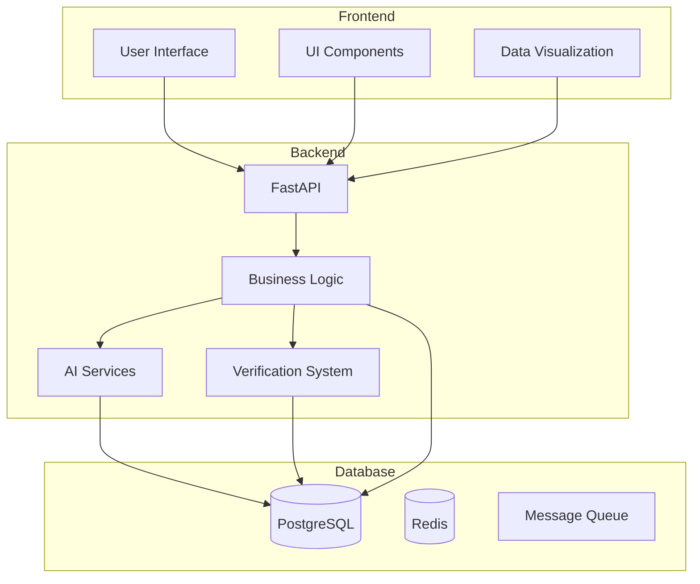
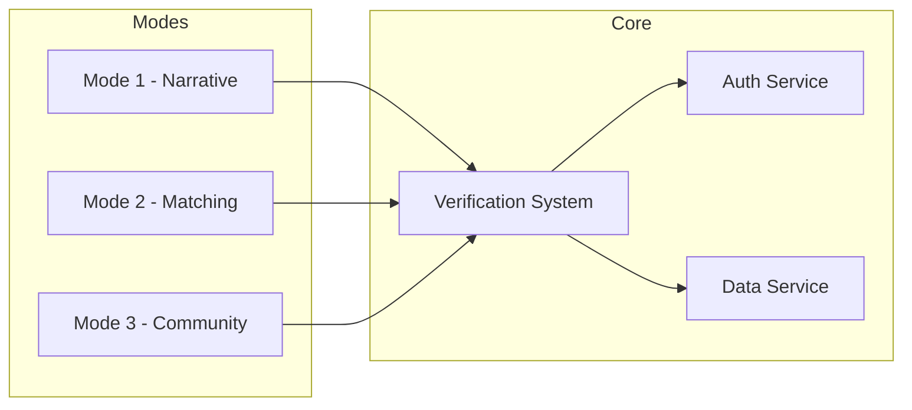
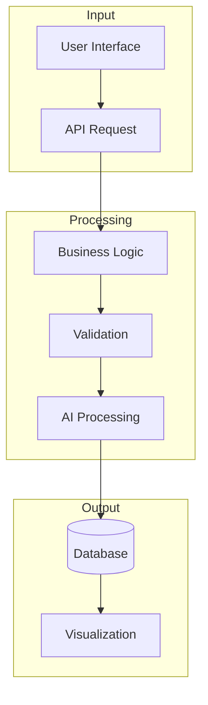
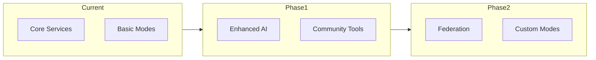

// filepath: C:\--ThinkAlike--\docs\architecture\architectural_overview.md
# Technical Architecture Specification

## 1. Introduction

This document outlines the major components, layers, and design principles that underpin the platform. It serves as an entry point to understanding the overall technical structure and provides links to more detailed specifications.

## 2. System Architecture

### 2.1 High-Level Overview

### 2.2 Component Architecture

## 3. Modular Design and Key Modules

### 3.1 Mode Modules
* Narrative Mode
* Matching Mode
* Community Mode

### 3.2 Verification System Module
Cross-cutting module for ethical integrity and transparency

### 3.3 UI Component Library Module
Reusable frontend components ensuring consistent design

### 3.4 API Module
Defines frontend-backend communication interfaces

## 4. Key Architectural Principles

* **Ethical by Design:** Ethics integrated from ground up
* **User-Centricity:** Prioritizes user needs and agency
* **Decentralization:** Especially in Community Mode
* **Transparency:** Supports radical transparency
* **Modularity:** Promotes maintainability
* **API-Driven:** Clear interface boundaries
* **Security First:** Integrated security at all layers

## 5. Data Flow and Processing

## 6. Scalability and Future Evolution

## 7. Further Documentation

* [API Documentation](../api/api_endpoints.md)
* [Database Schema](./database/unified_data_model_schema.md)
* [Security Plan](./security/security_and_privacy_plan.md)
* [Verification System](./verification_system/verification_system.md)

---
**Document Details**
- Title: Technical Architecture Specification
- Type: Technical Documentation
- Version: 1.0.0
- Last Updated: 2025-04-05
---
End of Technical Architecture Specification
---

