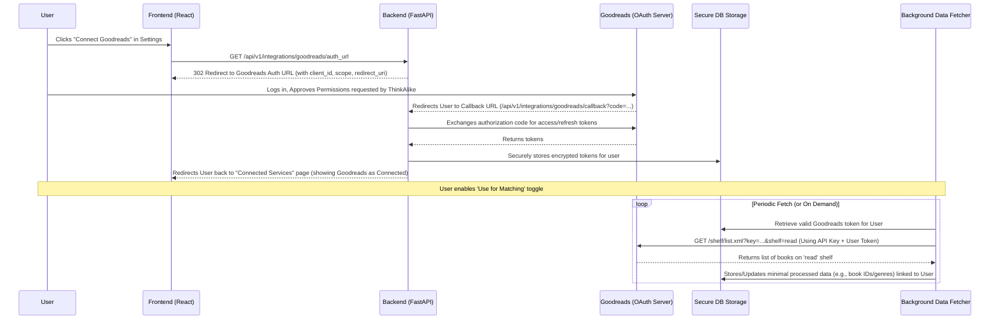

// filepath: C:\--ThinkAlike--\docs\architecture\data_integration_strategy.md
# Third-Party Data Integration Strategy

---

## 1. Introduction

This document outlines the strategy for integrating optional, user-consented data from third-party services (e.g., Goodreads, Spotify) into the ThinkAlike platform. The primary goal of this integration is to **enhance the user's ability to find meaningful connections (Mode 2) and relevant communities (Mode 3)** by providing supplementary signals related to values, interests, and cultural tastes, always under strict user control and adhering to ThinkAlike's core ethical principles.

This strategy explicitly prioritizes:

*   **User Sovereignty:** Users have absolute control over connecting/disconnecting services and approving data usage.
*   **Explicit Consent & Granularity:** Consent is required for each service connection and for specific ways the data is used within ThinkAlike (opt-in model).
*   **Data Minimization:** Only the minimum necessary data scopes are requested and fetched from third-party APIs.
*   **Transparency:** Users can clearly see which services are connected, what data is accessed, how it's used (via UI and traceability tools), and can easily revoke access.
*   **Purpose Limitation:** Harvested data is used *only* for the explicitly stated purposes of enhancing match/community discovery and profile richness, as approved by the user. It is not used for unrelated profiling or monetization.
*   **Ethical Utility:** Data integration must demonstrably serve the user's goal of finding value-aligned connections, supplementing, not replacing, the core value profiles derived from internal interactions (Mode 1).

---

## 2. Phased Implementation Approach

To manage complexity and ensure ethical considerations are addressed at each step, third-party integration will follow a phased approach:

*   **Phase 1: Foundational Framework & Proof of Concept (Goodreads):**
    *   Build the core UI ("Connected Services" panel) for managing connections and permissions.
    *   Implement backend infrastructure for secure OAuth handling and token storage.
    *   Integrate **one** initial service (Goodreads recommended) to prove the technical and ethical workflow.
    *   Focus on minimal data fetching (e.g., 'read' shelf, potentially genres) and basic storage.
*   **Phase 2: Data Utilization & Transparency Integration:**
    *   Integrate the harvested data (from Goodreads POC) as a *supplementary* signal into the Matching Algorithm and Community Recommendation logic.
    *   Ensure this integration is reflected transparently in `DataTraceability` and `AI Transparency Log`.
    *   Implement optional display of derived insights on user profiles (user-controlled).
*   **Phase 3: Framework Expansion & Additional Services:**
    *   Refactor backend services into a more generic, pluggable framework for adding new integrations.
    *   Incrementally add other high-value, ethically vetted services (e.g., Spotify), following the same principles of minimal scope, user consent, and transparency.
    *   **(Deferred Indefinitely):** Browser extension integration due to high privacy/security risks.

---

## 3. Core Components

*   **"Connected Services" UI Panel:** Central hub for users to manage third-party connections, view permissions, toggle data usage consents, and disconnect services. (See [`ConnectedServicesManager.md`](../../components/ui_components/ConnectedServicesManager.md) spec).
*   **Backend OAuth Handler:** Service responsible for managing the OAuth 2.0 authorization code or implicit grant flows for each third-party service.
*   **Secure Token Storage:** Encrypted database storage for user access and refresh tokens for connected services.
*   **Data Fetching Service:** Background tasks or scheduled jobs responsible for fetching authorized data from third-party APIs using stored tokens, respecting rate limits and user consent toggles.
*   **Data Processing/Mapping Logic:** Transforms raw data from third-party APIs into standardized formats or derived insights suitable for the Value Profile / Matching Algorithm.
*   **Data Usage Consent Enforcement:** Backend logic ensures harvested data is *only* used by algorithms or features if the corresponding user consent toggle is enabled.
*   **Data Deletion Service:** Handles the secure deletion of harvested data and tokens when a user disconnects a service or revokes consent.

---

## 4. Data Flow Overview (Example: Connecting Goodreads)

---

## 5. Consent and Control Mechanisms

*   **Initial Connection:** Requires standard OAuth consent screen presented by the third-party service, clearly showing requested permissions.
*   **ThinkAlike Data Usage Consent:** AFTER successful connection, the user must explicitly enable toggles within ThinkAlike's "Connected Services" panel to allow the platform to use the harvested data for specific purposes (matching, recommendations, profile display). Data is not used by default.
*   **Revocation:** Users can disconnect any service at any time via the UI panel. Disconnection triggers revocation of ThinkAlike's access at the third-party service (if API allows) and deletion of related harvested data and tokens from ThinkAlike's systems.

## 6. Security & Privacy Considerations

*   **Token Security:** Access and refresh tokens must be stored securely (encrypted at rest) with strict backend access controls. Follow OAuth 2.0 best practices (e.g., PKCE for public clients if applicable).
*   **Scope Minimization:** Request only the absolute minimum permission scopes needed from third-party APIs.
*   **Data Handling:** Adhere strictly to ThinkAlike's main Data Handling Policy Guide and Security & Privacy Plan for any harvested data.
*   **Third-Party API Changes:** Monitor third-party APIs for changes or deprecations. Handle errors gracefully.
*   **Rate Limiting:** Respect API rate limits of connected services.

## 7. Documentation Links

*   **Technical Implementation:** external_api_integration_guide.md
*   **User Guide:** connected_services_guide.md
*   **UI Component:** ConnectedServicesManager.md
*   **API Endpoints:** api_endpoints_integrations.md
*   **Data Model Updates:** unified_data_model_schema.md
*   **Ethical Rules:** ethical_guidelines.md

This strategy provides a roadmap for ethically integrating valuable external data while upholding ThinkAlike's commitment to user control and transparency. Success hinges on meticulous implementation of consent mechanisms and transparent data usage practices.

---
**Document Details**
- Title: Third-Party Data Integration Strategy
- Type: Architecture Documentation
- Version: 1.0.0
- Last Updated: 2025-04-05
---
End of Third-Party Data Integration Strategy
---

