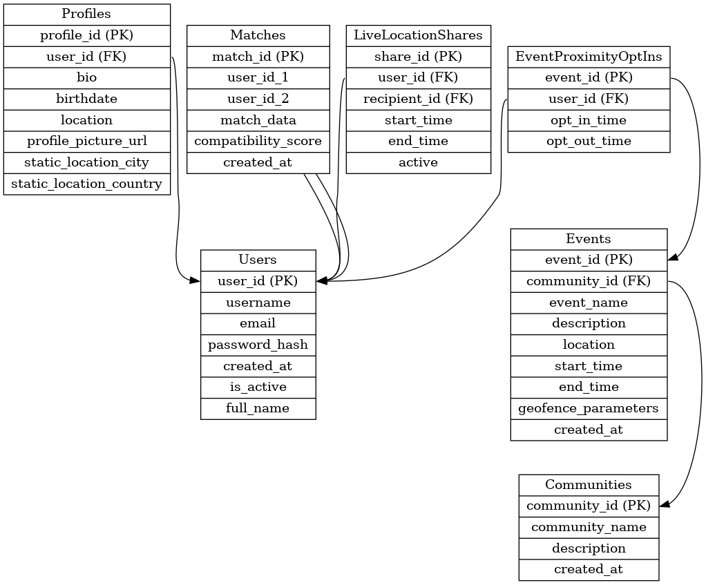

# ThinkAlike Data Model Schema

## Table of Contents

- [ThinkAlike Data Model Schema](#thinkalike-data-model-schema)
  - [Table of Contents](#table-of-contents)
  - [1. Introduction](#1-introduction)
  - [2. Entity Relationship Diagram (ERD)](#2-entity-relationship-diagram-erd)
  - [3. Data Dictionary](#3-data-dictionary)
    - [3.1 Users Table](#31-users-table)
    - [3.2 Profiles Table](#32-profiles-table)
    - [3.3 Communities Table](#33-communities-table)
    - [3.4 Matches Table](#34-matches-table)
    - [3.5 Interactions Table](#35-interactions-table)
    - [3.6 AI Models Table](#36-ai-models-table)
    - [3.7 Settings Table](#37-settings-table)
    - [3.8 UI Components Table](#38-ui-components-table)
    - [3.9 Events Table](#39-events-table)
    - [3.10 LiveLocationShares Table](#310-livelocationshares-table)
    - [3.11 EventProximityOptIns Table](#311-eventproximityoptins-table)
    - [3.12 EventAttendees Table](#312-eventattendees-table)
  - [4. Relationships](#4-relationships)
  - [5. Data Validation](#5-data-validation)
  - [6. Ethical Considerations](#6-ethical-considerations)

## 1. Introduction

This document describes the data models and database schema used in the ThinkAlike platform.

**Database:** PostgreSQL

**Note:** The examples below use PostgreSQL syntax. For SQLite (development), some data types might need slight adjustments (e.g., `TEXT` instead of `VARCHAR`).

## 2. Entity Relationship Diagram (ERD)

The ThinkAlike database architecture is predicated on a relational model, structured around several core entities that are interconnected to facilitate seamless data flow and maintain data integrity. These core entities, while not exhaustive, include:

* **Users:** Represents individual users registered on the ThinkAlike platform.
* **Profiles:** Stores comprehensive profile information associated with each user, encompassing personal attributes, preferences, and values.
* **Communities:** Represents user-generated groups organized around shared interests, values, and objectives.
* **Matches:** Tracks dyadic relationships between users, reflecting compatibility metrics derived from AI algorithms and user preferences.
* **Interactions:** Logs user interactions within the platform, capturing messages, actions, and system responses to facilitate data traceability and workflow analysis.
* **AI Models:** Maintains a repository of AI algorithms implemented within the platform, documenting model parameters, versions, and ethical validation metrics.
* **Settings:** Keeps a record of user-driven configurations for each UI element for data handling, data security, and privacy options.
* **UI Components:** A novel entity within the data model, designed to track the utilization of reusable UI components as integral elements in architectural workflows and data validation implementation cycle.
* **Events:** Tracks community events, meetups, and gatherings within the platform.
* **LiveLocationShares:** Tracks live location sharing sessions between users or groups.
* **EventProximityOptIns:** Records user opt-ins for proximity sharing at specific events.
* **EventAttendees:** Tracks user attendance and RSVP status for events.

The inter-entity relationships are defined as follows:

* A User entity exhibits a one-to-one relationship with a Profile entity.
* A User entity maintains a many-to-many relationship with the Communities entity, representing user membership in multiple communities.
* A Community entity maintains a many-to-many relationship with the Users entity, reflecting the composition of user communities.
* A User entity can have multiple Matches with other User entities, representing potential or established interpersonal connections.
* An Interaction entity is associated with two User entities, capturing dyadic user interactions within the platform.
* An AI Model entity can be associated with multiple Workflows, reflecting the utilization of AI models across various platform functionalities.
* Each UI Component entity has a defined Data Type, linking UI elements to specific data points for enhanced traceability and validation.
* Each User entity possesses multiple Settings entities, capturing user-specific configuration preferences.
* Each UI Component entity is linked to reusable data implementation workflows and to a specific architectural requirement, emphasizing the UI's role in code and design validation.
* A Community entity can have multiple Events, enabling community gatherings and meetups.
* A LiveLocationShares entity tracks live location sharing sessions between users or groups.
* An EventProximityOptIns entity records user opt-ins for proximity sharing at specific events.
* An EventAttendees entity tracks user attendance and RSVP status for events.

## 3. Data Dictionary

This section provides a detailed data dictionary, delineating each table and its constituent columns, including data types, constraints, and intended purpose. Ethical considerations and UI validation are explicitly highlighted within the purpose descriptions for each column.

### 3.1 Users Table

* **user_id (UUID, Primary Key):** A unique identifier assigned to each user account.
  * _Purpose:_ To serve as the primary key for the Users table, enabling efficient and unambiguous identification of individual users within the system.
* **username (VARCHAR(255), NOT NULL, Unique):** The alphanumeric username chosen by the user during account creation, ensuring uniqueness across the platform.
  * _Purpose:_ To provide a unique and readily traceable identifier for user accounts, facilitating user login and platform navigation.
* **email (VARCHAR(255), NOT NULL, Unique):** The user's electronic mail address, also required to be unique within the system.
  * _Purpose:_ To serve as a unique identifier for user accounts and to facilitate communication, password recovery, and workflow validation procedures, with UI-driven data validation to ensure email format compliance.
* **password_hash (VARCHAR(255), NOT NULL):** A cryptographically hashed representation of the user's password, employing robust hashing algorithms for security.
  * _Purpose:_ To ensure secure user authentication through the storage of password hashes rather than plaintext passwords, mitigating the risk of unauthorized access. UI components provide feedback on password strength and encryption protocols to enhance user awareness of security measures.
* **created_at (TIMESTAMP, NOT NULL, DEFAULT CURRENT_TIMESTAMP):** A timestamp indicating the date and time of user account creation.
  * _Purpose:_ For system tracking of user account creation timestamps, enabling data-driven analysis of user registration patterns and contributing to performance and scalability assessments. UI components provide data visualization of user creation trends for administrative oversight and system optimization.
* **is_active (BOOLEAN, NOT NULL, DEFAULT TRUE):** A boolean flag indicating account activity status (active or disabled).
  * _Purpose:_ For account management purposes, enabling administrators to disable accounts for policy violations or security reasons. Account deactivation workflows are designed with clear UI components to inform users of account status and available actions, ensuring user transparency and control.
* **full_name (VARCHAR(100)):** A text field storing the user's full name, used for display purposes within the platform.
  * _Purpose:_ To capture user's full name for display purposes and to enhance user recognition within the platform. UI components clearly indicate where and how the full name is displayed, ensuring user awareness and control over the presentation of their identity.

### 3.2 Profiles Table

* **profile_id (UUID, Primary Key):** A unique identifier for each user profile entry.
  * _Purpose:_ To serve as the primary key for the Profiles table, enabling efficient tracking and retrieval of user profile data and facilitating relationships with other database entities. UI components are designed to provide clear traceability of profile IDs for data management and workflow validation purposes.
* **user_id (UUID, Foreign Key, References Users(user_id) ON DELETE CASCADE):** A foreign key referencing the `user_id` column in the Users table, establishing a one-to-one relationship between users and profiles.
  * _Purpose:_ To enforce referential integrity between the Users and Profiles tables, ensuring that each profile is associated with a valid user account. This relationship is also leveraged for UI-driven data integrity and security validation workflows, ensuring data consistency across related entities.
* **bio (TEXT):** A text field storing a short biographical narrative provided by the user.
  * _Purpose:_ For personalized profile implementation and architectural workflow validation parameters. It also tests if UI components enhance or limit the user when creating a free text profile. UI components implement input validation to manage data format limitations and sanitize input, mitigating potential security risks (e.g., XSS attacks). Users retain control over their bio content and can modify or delete it at will, reinforcing user agency. Character limits are enforced to manage storage and display considerations.
* **birthdate (DATE):** A date field storing the user's date of birth.
  * _Purpose:_ For data mapping, user preferences and to have a clear workflow for data handling validations. Also to test if UI elements correctly display that information. Birthdate data is collected to enhance user profiles and facilitate age-based matching functionalities. Data handling workflows adhere to stringent privacy policies, ensuring responsible and ethical use of sensitive personal information. UI components provide clear explanations regarding the purpose of birthdate data collection and offer users granular control over data visibility settings, aligning with data minimization and user autonomy principles. Age-related matching algorithms are designed to mitigate age-based bias and discrimination.
* **location (VARCHAR(255)):** A text field storing the user's geographical location.
  * _Purpose:_ To filter data based on region-specific interests or other types of user-driven preference validation patterns. Location data is collected to enable location-based matching and community discovery features. Privacy implications are carefully considered, with UI components providing granular controls over location visibility settings, allowing users to share location at varying levels of granularity (city, region, country) or opt-out entirely. Data handling workflows are designed to prevent location data misuse and protect user privacy, adhering to ethical data handling principles and user sovereignty.
* **profile_picture_url (VARCHAR(255)):** A text field storing a URL referencing a user-uploaded video profile.
  * _Purpose:_ To enhance user profiles with video data and to validate "video quality implementation workflow parameters" for each different type of content using UI driven testable parameters. Profile pictures enhance user profiles and facilitate visual identification within the platform. Profile pictures are stored securely, and UI components empower users to upload, modify, and delete their profile pictures, ensuring user control over their visual representation. Data handling workflows prevent unauthorized use or distribution of profile pictures, adhering to privacy and security best practices.
* **static_location_city (VARCHAR(255), nullable):** User-defined city-level location.
  * _Purpose:_ To provide users with the ability to specify a static city-level location for their profile, enhancing location-based features and personalization.
* **static_location_country (VARCHAR(255), nullable):** User-defined country-level location.
  * _Purpose:_ To provide users with the ability to specify a static country-level location for their profile, enhancing location-based features and personalization.
* **created_at (TIMESTAMP, NOT NULL, DEFAULT CURRENT_TIMESTAMP):** When the profile was created.
  * _Purpose:_ To track profile creation for auditing and administrative purposes.
* **updated_at (TIMESTAMP, NOT NULL, DEFAULT CURRENT_TIMESTAMP):** When the profile was last updated.
  * _Purpose:_ To track profile modifications for versioning and change history purposes.

### 3.3 Communities Table

* **community_id (UUID, Primary Key):** A unique identifier for each community group.
  * _Purpose:_ To track communities separately by ID and to link them with UI, AI, and other related data structures, always with clear reusable UI components for testing performance and data integrity, based on code workflow implementation validation standards and user freedom as a key parameter.
* **community_name (VARCHAR(255), NOT NULL, Unique):** A text field storing the name of the community, ensuring uniqueness across the platform.
  * _Purpose:_ For user identification during their self-discovery and community exploration workflows, with clear data validation parameters tested with reusable UI components that can also track code performance during all implementation cycles.
* **description (TEXT):** A text field storing a descriptive narrative outlining the community's values, goals, or purpose.
  * _Purpose:_ To clearly show what is the main interest of each community for user validation and self-exploration by clear textual UI components with data traceability implementations workflow based design implementations.
* **created_at (TIMESTAMP, NOT NULL, DEFAULT CURRENT_TIMESTAMP):** The date and time when the community was created.
  * _Purpose:_ For data validation for user action tracking and for system performance data-driven tests.
* **created_by (UUID, Foreign Key, References Users(user_id) ON DELETE SET NULL):** The user who created the community.
  * _Purpose:_ To track community creator for permissions and attribution purposes.
* **is_active (BOOLEAN, NOT NULL, DEFAULT TRUE):** Whether the community is currently active.
  * _Purpose:_ To enable deactivation of communities without deletion, preserving historical data.
* **privacy_type (VARCHAR(20), NOT NULL, DEFAULT 'public'):** The privacy setting for the community ('public', 'private', 'secret').
  * _Purpose:_ To control visibility and access to community content and membership.

### 3.4 Matches Table

* **match_id (UUID, Primary Key):** A unique identifier for each user-user match record.
  * _Purpose:_ To allow proper tracking of each user connection for AI integration and data validation purposes, while also testing for performance, security and traceability with data driven user feedback through reusable UI validation components.
* **user_id_1 (UUID, Foreign Key, References Users(user_id) ON DELETE CASCADE):** A foreign key referencing the `user_id` column in the Users table, identifying the first user in the dyadic match.
  * _Purpose:_ To establish referential integrity and track user-user match relationships.
* **user_id_2 (UUID, Foreign Key, References Users(user_id) ON DELETE CASCADE):** A foreign key referencing the `user_id` column in the Users table, identifying the second user in the dyadic match.
  * _Purpose:_ To establish referential integrity and track user-user match relationships, completing the dyadic user pairing for match records.
* **match_data (JSON):** A JSON field storing additional data pertaining to the user match, including AI-derived compatibility analyses and shared interests or values.
  * _Purpose:_ For data-driven analysis and UI workflow implementation guidelines to enhance transparency and ethical data handling at every design and code workflow implementation choice. UI components are designed to act as "testing frameworks" for validating data integrity and workflow implementation for match data.
* **compatibility_score (DECIMAL(5,2)):** A floating-point numerical value representing the compatibility score between matched users, typically ranging from 0 to 100, reflecting the degree of AI-assessed compatibility.
  * _Purpose:_ To quantify user compatibility based on AI-driven analysis, providing a numerical metric for evaluating match strength and informing user decision-making within the platform. UI components facilitate data visualization of compatibility scores, enabling users to understand and interpret match recommendations, while also serving as validation tools for AI model performance and ethical implementation.
* **status (VARCHAR(20), NOT NULL, DEFAULT 'pending'):** Status of the match ('pending', 'accepted', 'rejected', 'expired').
  * _Purpose:_ To track the current state of the match relationship between users.
* **created_at (TIMESTAMP, NOT NULL, DEFAULT CURRENT_TIMESTAMP):** The date and time when the match record was created.
  * _Purpose:_ To track match creation timestamps, enabling data-driven analysis of match formation patterns and contributing to system performance monitoring and workflow optimization.
* **updated_at (TIMESTAMP, NOT NULL, DEFAULT CURRENT_TIMESTAMP):** The date and time when the match was last updated.
  * _Purpose:_ To track when match status or data was last modified.

### 3.5 Interactions Table

* **interaction_id (UUID, Primary Key):** A unique identifier for each user-platform interaction record.
  * _Purpose:_ For system data tracking and to measure real user engagement with different workflow components. Also to track performance, data security and transparency of those interactions. UI components provide clear traceability of interaction IDs for data management and workflow validation purposes.
* **user_id_1 (UUID, Foreign Key, References Users(user_id) ON DELETE CASCADE):** A foreign key referencing the `user_id` column in the Users table, identifying the user initiating the interaction.
  * _Purpose:_ To track user-initiated interactions and establish user context for interaction records.
* **user_id_2 (UUID, Foreign Key, References Users(user_id) ON DELETE CASCADE):** A foreign key referencing the `user_id` column in the Users table, identifying the recipient user in the dyadic interaction.
  * _Purpose:_ To track dyadic user interactions and establish user context for interaction records, completing the user pairing for interaction events.
* **interaction_type (VARCHAR(255), NOT NULL):** A text field categorizing the type of user interaction (e.g., "message," "like," "game action"), facilitating data analysis and workflow classification.
  * _Purpose:_ To classify different workflows and to organize data for AI model processing and UI implementation by clear workflow implementation parameters that are always accessible to all users and developers.
* **interaction_data (JSON):** A JSON field storing additional data pertinent to the user interaction, including text messages, game choices, UI interactions, and workflow parameters, capturing nuanced details of user engagement.
  * _Purpose:_ For data implementation traceability for testing, UI feedback and AI validation, with UI components that show all relevant information in an organized and understandable way.
* **timestamp (TIMESTAMP, NOT NULL, DEFAULT CURRENT_TIMESTAMP):** A timestamp indicating the date and time of the user interaction event.
  * _Purpose:_ To track interaction timestamps, enabling temporal analysis of user behavior patterns and contributing to system performance monitoring and workflow optimization.

### 3.6 AI Models Table

* **model_id (UUID, Primary Key):** A unique identifier for each AI model implemented within the ThinkAlike platform.
  * _Purpose:_ To have data traceability over each model for testing, implementation, and design documentation, for clear workflow data traceability for architectural validations. UI components are designed to track and validate model IDs for data management and workflow analysis.
* **model_name (VARCHAR(255), NOT NULL):** A text field storing the descriptive name of the AI model (e.g., "Value-Based Matching Algorithm," "Video Profile Analysis Model").
  * _Purpose:_ To provide a readily identifiable name for each AI model, facilitating documentation, code management, and user-facing communication regarding AI functionalities. UI components display model names to enhance transparency and user understanding of AI-driven features.
* **version (VARCHAR(255), NOT NULL):** A text field specifying the version identifier of the AI model implementation.
  * _Purpose:_ To track AI model versions, enabling version control, facilitating A/B testing of different model iterations, and ensuring data traceability for model performance evaluations and workflow validations. UI components visually represent model versions, allowing developers to track changes and users to understand the evolution of AI implementations.
* **parameters (JSON):** A JSON field storing configurable parameters and hyperparameters associated with the AI model, enabling customization and performance tuning.
  * _Purpose:_ To document configurable parameters for each AI model, facilitating model optimization, experimentation, and transparency regarding AI model configurations. UI components provide interfaces for authorized users (e.g., developers, administrators) to access and potentially modify model parameters, while maintaining data integrity and user control through clearly defined access privileges and audit logs.
* **created_at (TIMESTAMP, NOT NULL, DEFAULT CURRENT_TIMESTAMP):** The date and time when that model version was implemented.
  * _Purpose:_ To have control over AI implementation cycles and for performance traceability, with real time data feedback for workflow implementation improvements with data driven results. UI components visualize model creation timestamps, enabling developers to track model evolution and correlate versioning with performance metrics and ethical validation results.

### 3.7 Settings Table

* **setting_id (UUID, Primary Key):** A unique identifier for each user-defined setting.
  * _Purpose:_ To track all settings changes and to test the performance of different approaches, from user action to implementation data workflow. UI components are designed to track and validate setting IDs for data management and workflow analysis related to user preferences.
* **user_id (UUID, Foreign Key, References Users(user_id) ON DELETE CASCADE):** The user for whom setting information is being stored.
  * _Purpose:_ To track each data point for a specific user and to validate UI workflow and AI responses using that data. User-specific settings are crucial for personalization and user empowerment, and this field ensures data is correctly attributed and accessible within user-specific contexts.
* **category (VARCHAR(255), NOT NULL):** Type of setting (UI style, data privacy, notification preferences etc.) that the user is setting up.
  * _Purpose:_ To organize data for UI workflows implementation and data access permissions, and also to create categories that are clearly identifiable for data handling, test validation and security workflow implementation requirements. UI components utilize categories to present settings in a structured and user-friendly manner, enabling intuitive user configuration and management of platform preferences.
* **setting_parameters (JSON):** Parameters for the chosen setting, with dynamic UI components to also manage data security and access control protocols for that specific user preference.
  * _Purpose:_ Data traceability for UI and data workflows and user freedom to choose their best interaction experience with technology, while also testing what data parameters are the most important for different UI interaction settings workflows. UI components dynamically adjust based on setting parameters, providing real-time feedback on configuration changes and validating user-defined preferences within the platform.

### 3.8 UI Components Table

* **ui_component_id (UUID, Primary Key):** A unique identifier for each UI reusable component.
  * _Purpose:_ To track each reusable UI element to validate if it is performing its workflow as designed and if its reusable attributes are being properly implemented during code architecture validations. UI component IDs facilitate data-driven analysis of component usage patterns and performance metrics across the platform.
* **component_name (VARCHAR(255), NOT NULL):** Name of the UI reusable component (button, form, chart, etc.).
  * _Purpose:_ To generate a clear and organized structure of components to be used during data workflow implementations. Component names provide a readily identifiable reference for developers and designers, facilitating communication and collaboration during UI development and testing.
* **data_type (VARCHAR(255), NOT NULL):** Type of data that the component should handle (text, numeric, image, video, etc.) and specific parameters for implementation details with security and data integrity workflow validations by UI feedback.
  * _Purpose:_ To clearly track if the component is being used with a data type that fits its intended goal to perform a proper action (or validation workflow) based on the implemented design approach. Data type specifications ensure data integrity and facilitate UI component reusability across diverse data handling workflows.
* **workflow_implementation (TEXT):** Workflow implementation details or UI parameters for that specific architectural purpose that the component must validate or perform by coding logic and UI data workflow, that must always be implemented to "show its intended design purpose".
  * _Purpose:_ To create actionable validation workflow parameters that test UI component behaviors during a real-time, data-driven interaction with users and code. Workflow implementation details provide clear guidelines for developers and testers, ensuring consistent and predictable component behavior across various use cases.
* **access_control (VARCHAR(50), NOT NULL):** The level of access control to that component during different UI workflow implementation steps.
  * _Purpose:_ To enhance transparency and security while implementing different workflows through the platform data architecture design implementation parameters. Access control specifications ensure that UI components are appropriately secured and that user access privileges are enforced throughout data handling workflows.
* **created_at (TIMESTAMP, NOT NULL, DEFAULT CURRENT_TIMESTAMP):** The date and time when the component was created.
  * _Purpose:_ To keep track of development cycles and also to test how new components perform, in comparison with older implementations, during data handling cycles. Component creation timestamps enable tracking of UI development history and facilitate performance comparisons between different component versions, supporting iterative UI improvement and optimization.

### 3.9 Events Table

* **event_id (UUID, Primary Key):** A unique identifier for each event.
  * _Purpose:_ To serve as the primary key for the Events table, enabling efficient tracking and retrieval of event data and facilitating relationships with other entities.
* **community_id (UUID, Foreign Key, References Communities(community_id) ON DELETE CASCADE):** A foreign key referencing the community hosting the event.
  * _Purpose:_ To establish which community is hosting or organizing the event, maintaining referential integrity between Events and Communities tables.
* **event_name (VARCHAR(100), NOT NULL):** The name or title of the event.
  * _Purpose:_ To provide a clear, identifiable name for the event that can be displayed to users and used in search functionality.
* **description (TEXT):** A detailed description of the event, its purpose, and activities.
  * _Purpose:_ To inform users about the event details, helping them decide whether to participate.
* **location (VARCHAR(255)):** The physical location where the event will take place.
  * _Purpose:_ To inform users where they need to go to attend the event in person.
* **location_coordinates (POINT, nullable):** Geographic coordinates for the event location.
  * _Purpose:_ To provide precise geographic positioning for mapping and proximity calculations.
* **start_time (TIMESTAMP, NOT NULL):** When the event begins.
  * _Purpose:_ To specify the start time of the event for scheduling and notification purposes.
* **end_time (TIMESTAMP, NOT NULL):** When the event ends.
  * _Purpose:_ To specify the end time of the event for scheduling and duration calculation.
* **geofence_parameters (JSONB, nullable):** Optional JSON object containing geofence coordinates for location-based features.
  * _Purpose:_ To define the geographical boundaries within which proximity features are active for the event.
* **created_at (TIMESTAMP, NOT NULL, DEFAULT CURRENT_TIMESTAMP):** When the event was created in the system.
  * _Purpose:_ To track when events are added to the platform for auditing and chronological ordering.
* **created_by (UUID, Foreign Key, References Users(user_id) ON DELETE SET NULL):** User who created the event.
  * _Purpose:_ To track which user created the event for accountability and permissions management.
* **is_active (BOOLEAN, NOT NULL, DEFAULT TRUE):** Whether the event is active or cancelled.
  * _Purpose:_ To allow events to be cancelled or deactivated without deleting them from the database.

### 3.10 LiveLocationShares Table

* **share_id (UUID, Primary Key):** Primary key for tracking individual sharing sessions.
  * _Purpose:_ To uniquely identify each live location sharing session, enabling efficient tracking and retrieval of sharing data.
* **user_id (UUID, Foreign Key, References Users(user_id) ON DELETE CASCADE, NOT NULL):** Who is sharing their location.
  * _Purpose:_ To establish referential integrity and track the user initiating the live location sharing session.
* **recipient_id (UUID, NOT NULL):** Who can see the location.
  * _Purpose:_ To identify the recipient of the location sharing, which could be a user or a community.
* **recipient_type (VARCHAR(10), NOT NULL):** Type of recipient ('user' or 'community').
  * _Purpose:_ To distinguish between user and community recipients, enabling appropriate access control and display.
* **start_time (TIMESTAMP, NOT NULL, DEFAULT CURRENT_TIMESTAMP):** When sharing began.
  * _Purpose:_ To record the start time of the live location sharing session, enabling temporal analysis and tracking.
* **end_time (TIMESTAMP, NOT NULL):** When sharing ends.
  * _Purpose:_ To record the end time of the live location sharing session, enabling temporal analysis and tracking.
* **active (BOOLEAN, NOT NULL, DEFAULT TRUE):** Indicates if the share is currently live.
  * _Purpose:_ To track the current status of the live location sharing session, enabling real-time updates and monitoring.
* **created_at (TIMESTAMP, NOT NULL, DEFAULT CURRENT_TIMESTAMP):** When the sharing relationship was created.
  * _Purpose:_ To track creation time for auditing and administration purposes.

### 3.11 EventProximityOptIns Table

* **event_id (UUID, Foreign Key, References Events(event_id) ON DELETE CASCADE, NOT NULL):** The specific event.
  * _Purpose:_ To establish referential integrity and track the event associated with the proximity sharing opt-in.
* **user_id (UUID, Foreign Key, References Users(user_id) ON DELETE CASCADE, NOT NULL):** User who opted in to proximity sharing.
  * _Purpose:_ To establish referential integrity and track the user opting into proximity sharing for the event.
* **opt_in_time (TIMESTAMP, NOT NULL, DEFAULT CURRENT_TIMESTAMP):** When the user opted in.
  * _Purpose:_ To record the opt-in time for proximity sharing, enabling temporal analysis and tracking.
* **opt_out_time (TIMESTAMP, nullable):** When the user opted out.
  * _Purpose:_ To record the opt-out time for proximity sharing, enabling temporal analysis and tracking, providing a complete history of user consent.
* **PRIMARY KEY (event_id, user_id):** Composite primary key ensuring each user can only have one opt-in record per event.
  * _Purpose:_ To enforce data integrity by preventing duplicate opt-in records.

### 3.12 EventAttendees Table

* **event_id (UUID, Foreign Key, References Events(event_id) ON DELETE CASCADE, NOT NULL):** The event being attended.
  * _Purpose:_ Part of the composite primary key that links this record to a specific event.
* **user_id (UUID, Foreign Key, References Users(user_id) ON DELETE CASCADE, NOT NULL):** The user attending the event.
  * _Purpose:_ Part of the composite primary key that links this record to a specific user.
* **rsvp_status (VARCHAR(20), NOT NULL, DEFAULT 'attending'):** The user's RSVP status ('attending', 'maybe', 'not_attending').
  * _Purpose:_ To track user's stated intention to attend, enabling event planning and attendance forecasting.
* **registration_time (TIMESTAMP, NOT NULL, DEFAULT CURRENT_TIMESTAMP):** When the user registered for the event.
  * _Purpose:_ To track when users register, useful for analytics and sorting attendee lists.
* **check_in_time (TIMESTAMP, nullable):** When the user checked in to the event.
  * _Purpose:_ To track actual attendance at the event, as opposed to just registration.
* **PRIMARY KEY (event_id, user_id):** Composite primary key ensuring each user can only have one attendance record per event.
  * _Purpose:_ To enforce data integrity by preventing duplicate attendance records.

## 4. Relationships

The relationships between tables are meticulously implemented with clear SQL logic for reusable components and with UI data workflow visualization to be fully traceable, by highlighting those relationships between tables for data access and validation workflow implementations. These relationships are crucial for maintaining data integrity, enforcing referential constraints, and enabling efficient data retrieval across the ThinkAlike platform.

* **One-to-One:** A User entity exhibits a one-to-one relationship with a Profile entity, ensuring each user has a single, associated profile containing detailed user information.
* **Many-to-Many:** User entities maintain a many-to-many relationship with Community entities, reflecting the capacity for users to join multiple communities and communities to encompass diverse user memberships.
* **Many-to-Many:** User entities can have multiple Matches with other User entities, representing the complex web of interpersonal connections facilitated by the platform.
* **One-to-Many:** A User entity can initiate numerous Interactions, capturing the breadth of user engagement within the ThinkAlike ecosystem.
* **One-to-Many:** A User entity can configure multiple Settings, reflecting user-specific customization options and preferences.
* **One-to-Many:** An AI Model entity can be utilized by multiple Workflows, indicating the reusability and modularity of AI components across various platform functionalities.
* **One-to-Many:** UI Components are linked to reusable workflow implementation guidelines, ensuring consistent application of data validation rules and testing protocols across the UI architecture.
* **One-to-Many:** A Community entity can have multiple Events, enabling community gatherings and meetups.
* **One-to-Many:** A User entity can share their location with multiple recipients via the LiveLocationShares entity.
* **Many-to-Many:** Users can opt into proximity sharing for multiple events, and events can have multiple users opted in through the EventProximityOptIns entity.
* **Many-to-Many:** Users can attend multiple events, and events can have multiple attendees through the EventAttendees entity.

## 5. Data Validation

Data integrity is paramount within ThinkAlike. Robust data validation mechanisms are implemented at multiple levels:

* **Frontend Validation:** Client-side validation is implemented within React components to ensure data conforms to expected formats and constraints _before_ transmission to the backend, enhancing user experience and reducing server-side processing overhead. UI components provide immediate and clear feedback to users regarding data validity, guiding input and preventing data entry errors.
* **Backend Validation:** Server-side validation is rigorously enforced within FastAPI endpoints, utilizing Pydantic models to define data schemas and validate incoming data against predefined criteria. Backend validation is essential for security and data integrity, ensuring that only valid and authorized data is persisted within the system.
* **Database Constraints:** Database-level constraints (e.g., `NOT NULL`, `UNIQUE`, `CHECK` constraints) are employed to enforce data integrity at the database level, providing a final layer of data validation and preventing data inconsistencies or corruption.

## 6. Ethical Considerations

Ethical considerations are not merely supplementary guidelines but are deeply embedded within the ThinkAlike data model schema, influencing every aspect of data design and handling. Key ethical considerations include:

* **Data Minimization:** The database schema is designed to collect only data that is strictly necessary for core platform functionalities, minimizing the collection of superfluous personal information and adhering to data minimization principles.
* **Transparency and User Control:** UI components are meticulously designed to provide users with transparent visibility into data handling processes, empowering them to understand what data is collected, how it is utilized, and to exercise granular control over their personal information.
* **Security and Privacy by Design:** Security and privacy are architecturally integrated into the data model schema, with data encryption protocols, access control mechanisms, and data anonymization strategies implemented to safeguard user data and uphold privacy best practices.
* **Bias Mitigation and Fairness:** Data validation workflows and AI model testing procedures are designed to proactively detect and mitigate potential biases within data and algorithms, ensuring fairness and equity for all users within the ThinkAlike ecosystem.
* **Transparency and Accountability:** The data model schema is designed to be transparent, with clear documentation and metadata associated with each table and column, providing users with the ability to understand the data they are interacting with and the processes that shape it. The platform is designed to be accountable, with clear data usage policies, audit trails, and transparency in data handling practices, ensuring that users can trust the platform's data handling processes.
