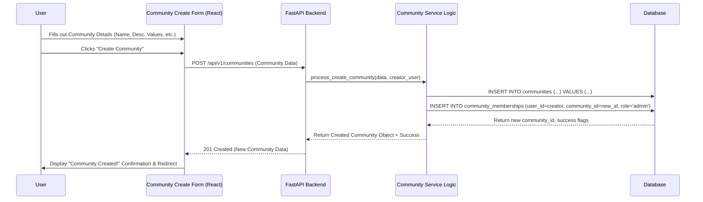

## 1. Introduction & Vision

* *Community Mode (Mode 3)** embodies the **Positive Anarchism** principle of ThinkAlike's [Enlightenment 2.0

Philosophy](../../../core/enlightenment_2_0/enlightenment_2_0_principles.md). It provides users with the infrastructure
and tools to create, discover, join, manage, and participate in **decentralized, self-governing, value-aligned
communities**.

Unlike traditional groups on centralized platforms, ThinkAlike communities aim for:

* **User Ownership & Autonomy:** Communities are created and governed primarily by their members, minimizing top‑down

platform control.

* **Value Alignment:** Communities are formed around explicitly stated shared values, interests, or goals, fostering

deeper cohesion.

* **Collaborative Action:** Tools are provided to facilitate discussion, resource sharing, project management, and

potentially real‑world coordination.

* **Ethical & Transparent Governance:** Encouraging transparent moderation and offering optional tools for participatory

decision‑making (Direct/Liquid Democracy).

Mode 3 serves as the "Output Layer" or "Collective Intelligence" hub of the ThinkAlike ecosystem, allowing connections
formed in Modes 1 & 2 to flourish into collaborative action and shared identity. Refer to the [Modes
Overview](./modes_overview.md).

* --

## 2. Core Functionality & Features

### 2.1 Community Discovery & Joining

* **Community Directory:** A searchable/filterable central listing of **public** ThinkAlike communities accessible

within Mode 3.

* **Search/Filtering:** Users can find communities based on:
  * Keywords (Name, Description, Values).
  * Value Tags (Aligned with user's [Value Profile](../../../vision/core_concepts.md)).
  * Interest Tags.
  * (Optional) Static Location data ([Data Integration Strategy](../../data_integration_strategy.md)).
* **AI Recommendations:** The platform suggests relevant communities based on user Value Profile, interests, and

potentially activity/connections (requires user consent, logged via [AI Transparency
Log](../../../guides/developer_guides/ai/ai_transparency_log.md)).

* **Community Profiles:** Each community has a profile page displaying: Name, Description, Tagline, Core

Values/Guidelines, Privacy (Public/Private), Governance Model Summary, Member Count, and Recent Activity Snippet.

* **Joining Mechanism:**
  * **Public Communities:** Direct "Join" button.
  * **Private Communities:** "Request to Join" button, which triggers an approval workflow managed by community

admins/moderators (potentially with AI assistance based on value alignment). May involve [Narrative Compatibility
Tests](../../../core/master_reference.md) similar to Mode 2 if configured by the community.

### 2.2 Community Creation & Management (User-Led)

* **User Creation:** Any authenticated user can initiate the creation of a new community.
* **Setup Wizard:** A guided UI flow ([UserForm](../../../components/ui_components/user_form_spec.md)) prompts the

creator for:
  * `communityName` (Unique), `description`, `tagline`.
  * `privacySettings` ('public' or 'private').
  * Selection/Definition of core `valuesTags`.
  * Initial `guidelines` (Text).
  * Selection of initial `governanceModel` ('informal', 'direct_democracy_basic', etc.).
  * Optional `profileImageUrl`.
* **Creator as Initial Admin:** The user creating the community is assigned the initial admin role.
* **Admin/Moderator Tools Panel:** Designated admins/mods have access to a management interface to:
  * Edit community profile details, values, guidelines.
  * Manage membership (approve/reject requests for private communities, assign roles, remove/ban members).
  * Configure community features (e.g., enable/disable specific forum channels, governance tools).
  * Define moderation policies and view moderation logs (potentially integrated with the [Verification

System](../../verification_system/verification_system.md)).

### 2.3 Core Interaction Features within a Community

* **Asynchronous Forums/Discussions:**
  * Structured discussion areas, potentially with customizable channels/topics defined by admins/mods.
  * Supports posts, replies, threading, and basic formatting.
  * Content can be validated against community guidelines via the `CoreValuesValidator`

([Spec](../../../components/ui_components/core_values_validator_spec.md)).
* **Member Directory:** View the list of community members and access their (privacy-permitting) profiles.
* **Resource Sharing:** A simple mechanism for members to share links, documents, or other resources within the

community space.

* **(Future) Project Collaboration Tools:** Dedicated spaces for organizing tasks and tracking progress on community

projects.

* **(Future) Event Scheduling:** Tools for organizing online or real‑world community events.

### 2.4 Decentralized Governance & Moderation (Optional Tools)

* **Community-Defined Rules:** Each community operates under its own guidelines, defined and modifiable by its

members/admins (process depends on the chosen governance model).

* **Community Moderation:** Admins can assign moderator roles. Moderation actions (content removal, user warnings/bans)

follow community guidelines. The platform provides tools while the community enforces rules.

* **Optional Governance Tools (Enabled by Admins):**
  * **Simple Polls:** Admins/Mods can create polls for informal feedback or simple decisions.
  * **(Future) Proposal System:** A formal mechanism for submitting proposals for changes (rules, projects) with

discussion and voting phases.
  * **(Future) Liquid/Direct Democracy:** More advanced voting/delegation mechanisms if a community opts for higher

formality.

### 2.5 AI-Assisted Governance & Deliberation (Optional & Transparent)

To enhance community self-governance without replacing human judgment, ThinkAlike plans to offer optional, transparent
AI assistance tools that communities can choose to enable:

* **AI Deliberation Aids:** Tools to help process and understand discussions within community forums:
  * *Argument Summarization:* AI generates concise summaries of long threads upon request, helping members grasp key

points quickly. (Requires NLP models, results clearly labeled as AI-generated).
  * *Perspective Mapping:* AI analyzes arguments (not user sentiment) to create visual maps of different viewpoints on a

proposal, fostering better understanding of the conversational landscape. (Transparency on analysis method is key).

* **AI Moderation Assistance:**
  * *Content Flagging:* AI models (trained on general hate speech/spam and potentially fine-tuned with
* community-specific* guidelines) can automatically flag content that *potentially* violates rules for **human moderator

review**. AI *never* takes automated censorship actions. Flagging logic and thresholds should be transparent to the
community moderators.
  * *Requires:* Clear appeals process, human moderators retain final decision-making power, regular audits for AI bias

([AI Ethical Testing Guide](../../../guides/developer_guides/ai/ai_ethical_testing_guide.md)).
* **AI Proposal Assistance (Future):** AI could help members format governance proposals or check them against existing

community rules before submission.

* **Resource Simulation (Advanced Future):** For communities managing resources, AI might simulate outcomes of different

allocation proposals based on community-defined goals, presenting scenarios to inform *human* decision-making via polls
or voting.

* *Ethical Imperatives:** All AI governance tools must be strictly **opt-in** at the community level, operate with
* *maximum transparency** (logged via [AI Transparency Log](../../../guides/developer_guides/ai/ai_transparency_log.md),

explained in UI), be regularly audited for **bias**, and always **support, not supplant, human deliberation and
decision-making.**

* --

## 3. User Flows (High-Level Examples)

* **Discovery & Joining:**

  User enters Mode 3 → Browses/Searches Directory → Views Community Profile → Clicks Join (Public) or Request to Join
(Private) → (If Private) Waits for Approval or Completes Narrative Gate → Gains Access.
* **Creation:**

  User enters Mode 3 → Clicks "Create Community" → Completes Setup Wizard → Community Launched → User becomes Admin.
* **Participation:**

  User selects a joined community → Browses forum → Reads/creates posts → Replies to threads → Views member directory →
(Optional) Views/contributes to projects/resources.
* **Management (Admin/Mod):**

  Admin/mod enters community → Accesses Admin Panel → Approves member requests / Edits guidelines / Creates polls /
Moderates content.

### 3.1 Workflow Diagram

Below is a Mermaid sequence diagram illustrating a high-level community creation workflow:

* --

## 4. Data Model Considerations

Community Mode requires extensions to the [Unified Data Model Schema](../../database/unified_data_model_schema.md):

* **`Communities` Table:** Stores core profile info, settings, and creator ID.
* **`CommunityMemberships` Table:** Junction table linking `Users` and `Communities`, storing role (e.g., 'member',

'moderator', 'admin') and status (e.g., 'active', 'pending', 'banned').
* **`CommunityContent` / `Posts` / `Comments` Tables:** To store forum discussions (linked to community and user).
* **`CommunityResources` Table:** To store shared links/documents.
* **(Future) `Proposals`, `Votes` Tables:** For formal governance features.

* --

## 5. UI Components

Key frontend components needed for Community Mode include:

* `CommunityDirectory` / `CommunityList`
* `CommunityCard` (for summary view)
* `CommunityProfilePage` (for detailed view)
* `CommunityCreationForm` (derived from `UserForm`)
* `CommunityAdminPanel`
* `ForumChannelView`, `PostThreadView`, `CreatePostForm`
* `MemberDirectoryList`, `MemberCard`
* `ResourceList`, `AddResourceForm`
* (Future) `PollingComponent`, `ProposalComponent`, `VotingInterface`

* --

## 6. API Endpoints

Dedicated backend endpoints (typically under `/api/v1/communities/`) should cover:

* `GET /communities`: List public communities (with optional value‑based recommendations).
* `POST /communities`: Create a new community (requires authentication).
* `GET /communities/{communityId}`: Retrieve community details.
* `PUT /communities/{communityId}`: Update community profile (admin-only).
* `DELETE /communities/{communityId}`: Delete a community (admin-only).
* `GET /communities/{communityId}/members`: List community members (with filtering/pagination).
* `POST /communities/{communityId}/join`: Request or join a community.
* `POST /communities/{communityId}/leave`: Leave a community.
* Additional endpoints for membership management, forum content CRUD, and (future) governance tools.

* --

## 7. Ethical Considerations & Verification

* **Freedom of Association vs. Safety:** Balance community autonomy with platform‑wide safety standards ([Ethical

Guidelines](../../../core/ethics/ethical_guidelines.md)). The [Verification
System](../../verification_system/verification_system.md) may help flag harmful patterns, though moderation is primarily
community‑led.

* **Governance Transparency:** Communities should be encouraged to make their rules and moderation logs transparent.

Platform tools must facilitate this.

* **Inclusivity:** Ensure tools are accessible (see [Accessibility

Guide](../../../guides/developer_guides/accessibility_guide.md)) and foster inclusive environments.

* **Preventing Echo Chambers:** Consider, optionally, mechanisms to expose members to diverse perspectives within or

between communities.

* --

## 8. Future Enhancements

* Advanced governance tools (e.g., liquid democracy, ranked‑choice voting).
* Project management features.
* Event scheduling.
* Cross‑community interaction/federation mechanisms.
* AI‑driven moderation assistance (ethically implemented).
* Integration with real‑world mutual aid networks.

* --

## References

* [Mode 1 Spec](../narrative_onboarding_mode/mode1_narrative_onboarding_spec.md)

* [Mode 2 Spec](../mode2_profile_discovery_spec.md)
* [Ethical Guidelines](../../../core/ethics/ethical_guidelines.md)

* [Master Reference](../../../core/master_reference.md)

Community Mode is where ThinkAlike's vision for decentralized, value‑driven collaboration truly takes shape. Its success
depends on empowering users with effective tools while upholding our core ethical principles.
