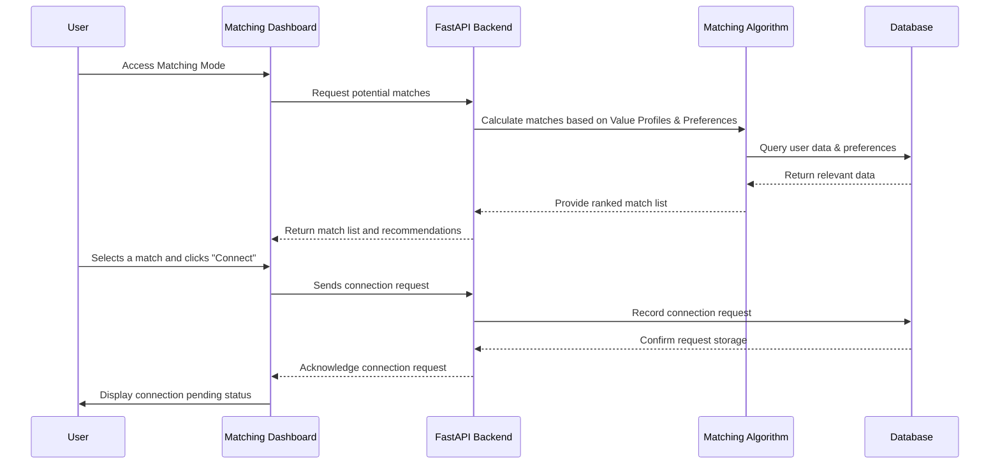

# Matching Mode Specification - Project

* *Document Purpose:**

This document provides a **detailed specification for Matching Mode** within the ThinkAlike project. It outlines the
functionality, features, user flows, data models, algorithms, and technical considerations for implementing Matching
Mode, which is responsible for connecting users based on shared values and fostering authentic relationships.

* *I.  Core Functionality and Features:**

Matching Mode is designed to facilitate value-based connections between ThinkAlike users, prioritizing authentic
relationships over superficial matching criteria. Key features include:

1. **Value-Based Matching Algorithm:**

    * **Ethically Weighted Matching:** Employs a sophisticated algorithm that prioritizes matches based on shared

ethical values (as defined in Enlightenment 2.0 principles and user narratives).  The algorithm incorporates "Ethical
Weighting" to favor ethically aligned connections.
    * **User-Controlled Value Profiles:**  Leverages user-defined "Value Profiles" created in Narrative Mode, allowing

users to articulate their core values and principles. Users have control over which values are emphasized and how they
are weighted in the matching process.
    * **Transparent Matching Rationale:**  Provides users with clear and understandable explanations of why they are

matched with specific individuals, highlighting shared values and connection paths visualized in `DataTraceability.jsx`.
    * **Configurable Matching Preferences:**  Allows users to configure their matching preferences, specifying the types

of connections they are seeking (friendship, collaboration, romantic, etc.) and the relative importance of different
values in their matches.
    * **Iterative Algorithm Refinement:**  The matching algorithm is designed to be iteratively refined and improved

over time, based on user feedback, ethical reviews, and ongoing data analysis (with changes tracked and verified by the
Verification System).

1. **Value-Centric Profile Exploration:**

    * **Profile Cards with Value Highlights:** Presents user profiles in a "card" format that prominently highlights

their personal narratives, core values, and shared interests, making these the central focus of profile exploration.
    * **Value-Based Filtering and Search:**  Allows users to filter and search for other users based on specific values,

interests, or keywords within their narratives.
    * **"Shared Values" Visualization:**  Visually indicates shared values between users in profile cards and match

lists, making value alignment immediately apparent.
    * **"DataTraceability.jsx" Integration for Visual Exploration:** Integrates with the `DataTraceability.jsx`

component to provide a visual graph representation of user connections and shared values, allowing for deeper
exploration of potential matches.

1. **Direct Connection and Communication Initiation:**

    * **"Connect" Feature:**  Provides a clear "Connect" button or action on user profiles to allow users to initiate

direct connection requests with potential matches.
    * **Connection Request System:**  Implements a system for sending and receiving connection requests, allowing users

to manage their connection invitations and accept or decline requests.
    * **Direct Messaging/Chat:**  Enables secure and private direct messaging/chat functionality between connected users

to facilitate further communication and relationship building.
    * **Privacy Controls for Communication:**  Provides users with privacy controls over their communication settings,

allowing them to manage who can message them and adjust notification preferences.

* *II.  User Flows and Interactions:**

1. **Accessing Matching Mode:**

    * Users navigate to "Matching" tab or section in the main ThinkAlike UI.
    * Matching Mode dashboard is displayed, potentially showing:
        * "Potential Matches" list (initially based on default algorithm settings or user-defined preferences).
        * Search and filter options for user profiles.
        * Link to "DataTraceability Visualization" for deeper exploration.
        * Link to "Matching Preferences" settings.

1. **Exploring User Profiles and Discovering Matches:**

    * Users can browse "Potential Matches" list, which displays profile cards with value highlights and "Shared Values"

indicators.
    * Users can use search and filter options to refine their profile exploration (e.g., filter by value, interest,

keyword).
    * Clicking on a profile card opens a full user profile view, showcasing their narrative, values, interests, and

potentially a `DataTraceability.jsx` visualization of their connections.
    * Users can initiate a "Connect" request directly from a profile card or full profile view.

1. **Managing Connection Requests and Communication:**

    * Users receive notifications for new connection requests.
    * Users can access a "Connections" or "Inbox" section to manage connection requests:
        * View pending requests (sent and received).
        * Accept or decline received requests.
        * Withdraw sent requests.
    * Once connected, users can initiate direct messaging/chat with their connections.
    * Users can manage their connections list and remove connections as needed.

1. **Customizing Matching Preferences:**

    * Users can access "Matching Preferences" settings from the Matching Mode dashboard or their profile settings.
    * Matching Preferences settings allow users to:
        * Define the relative importance of different values in matching.
        * Specify the types of connections they are seeking (friendship, collaboration, romantic, etc.).
        * Potentially adjust other algorithm parameters or filtering criteria (future enhancement, with careful

consideration of ethical implications and transparency).
        * View explanations and tooltips about each preference setting to ensure user understanding and control.

* *III. Data Model (Example - Conceptual):**

UserProfile {
userId: UUID (Foreign Key to User Account)
narrative: UserNarrative (Embedded or Linked Document - from Narrative Mode)
valueProfile: ValueProfile (Embedded Document - User-defined value weights and preferences)
interests: [InterestNodeId] // Links to Interest Nodes
skills: [SkillNodeId] // Links to Skill Nodes
connections: [ConnectionId] // List of User IDs of connected users
connectionRequestsSent: [ConnectionRequestId]
connectionRequestsReceived: [ConnectionRequestId]
matchingPreferences: MatchingPreferences (Embedded Document - User-defined matching settings)
// ... other user profile data (privacy settings, etc.)
}

ValueProfile {
valueWeights: Map<ValueNodeId, Float> // User-defined weights for different Value Nodes (importance in matching)
connectionTypesSeeking: [Enum ['friendship', 'collaboration', 'romantic', ...]] // Types of connections user is
interested in
// ... other matching preference settings
}

Connection {
connectionId: UUID (Unique Identifier)
user1Id: UUID (Foreign Key to User Profile)
user2Id: UUID (Foreign Key to User Profile)
connectionStatus: Enum ['pending', 'active', 'removed']
startTimestamp: Timestamp
// ... other connection metadata
}

ConnectionRequest {
requestId: UUID (Unique Identifier)
senderId: UUID (Foreign Key to User Profile)
recipientId: UUID (Foreign Key to User Profile)
requestStatus: Enum ['pending', 'accepted', 'declined', 'withdrawn']
requestTimestamp: Timestamp
// ... other request metadata
}

* *IV. UI Components (Specific to Matching Mode):**

* `MatchDashboard`:  Main dashboard component for Matching Mode, displaying match lists, search/filter options, and

links to related features.

* `ProfileCard`: Reusable component for displaying user profiles in a compact card format, highlighting key values and

shared interests.

* `UserProfileView`:  Detailed view of a user profile, showcasing full narrative, values, interests,

`DataTraceability.jsx` visualization, and "Connect" action.

* `MatchList`: Component for displaying lists of potential matches, ranked by similarity score and potentially

filtered/sorted by user preferences.

* `ConnectionRequestList`: Component for displaying and managing connection requests (sent and received).
* `MatchingPreferencesForm`: Form component for users to customize their matching preferences, define value weights, and

specify connection types seeking.

* *V. API Endpoints (Backend - Examples):**

* `/api/match/potential-matches`: (Authenticated)
  * `GET`: Returns a list of potential matches for the current user, based on the value-based matching algorithm and

user preferences.  Includes data for `DataTraceability.jsx` visualization.

* `/api/match/user-profile/{userId}`: (Authenticated)
  * `GET`: Returns the full user profile data for a specific `userId`, including narrative, values, interests, and

connections.

* `/api/match/search-users`: (Authenticated)
  * `GET`:  Allows searching and filtering users based on values, interests, keywords, and other criteria.
* `/api/connections`: (Authenticated)
  * `GET`: Returns the current user's list of active connections.
  * `POST`: Sends a connection request to another user.
* `/api/connection-requests`: (Authenticated)
  * `GET`: Returns the current user's list of pending connection requests (sent and received).
  * `POST/{requestId}/accept`: Accepts a received connection request.
  * `POST/{requestId}/decline`: Declines a received connection request.
  * `DELETE/{requestId}`: Withdraws a sent connection request.
* `/api/matching-preferences`: (Authenticated)
  * `GET`: Returns the current user's matching preferences.
  * `PUT`: Updates the current user's matching preferences.

* *VI. Technical Considerations:**

* **Matching Algorithm Complexity and Performance:**  The value-based matching algorithm needs to be efficient and

scalable to handle a growing user base. Consider algorithm optimization techniques and database indexing for
performance.

* **Ethical Weighting Implementation:**  Carefully implement the "Ethical Weighting" mechanism in the algorithm,

ensuring it is transparent, auditable, and avoids unintended biases or discriminatory outcomes.

* **Data Privacy in Matching:**  Design the matching process to be privacy-preserving, minimizing data exposure and

ensuring user data is only used for matching purposes with appropriate security measures.

* **Real-time Updates and Notifications:**  Implement real-time updates for match lists, connection requests, and

messages to provide a dynamic and engaging user experience (consider using WebSockets or similar technologies).

* **Integration with DataTraceability.jsx:**  Ensure seamless integration between the matching algorithm and the

`DataTraceability.jsx` component, passing the necessary data for visualization and user exploration of connections.

* *VII. Future Enhancements:**

* More sophisticated matching algorithms incorporating machine learning and user feedback for continuous improvement.
* Advanced filtering and sorting options for match lists, allowing users to refine their search for connections.
* Group matching features for community formation or collaborative projects.
* Integration with external data sources or APIs to enrich user profiles and matching criteria (with user consent and

transparency).

* Gamification elements to encourage value-based connection and meaningful interaction (e.g., badges for ethical

engagement, points for contributing to value-aligned communities, etc. - to be carefully considered for ethical
implications and to avoid gamifying genuine connection in a superficial way).

* Integration with Mode 3: Community Mode to suggest relevant communities to users based on their matches and value

alignments.

* User feedback mechanisms to continuously improve the matching algorithm and user experience.
* Advanced privacy features, such as differential privacy or federated learning, to further enhance data protection in

the matching process (future research and development).

* *VII. Verification System Integration:**

The Matching Mode and its core matching algorithm are deeply integrated with the **Verification System** to ensure
ethical accountability and transparency:

* **Ethical Rationale Verification:** The ethical rationale behind the value-based matching algorithm, including the

weighting mechanisms for ethical values and the strategies for bias mitigation, is formally documented and verified
within the Verification System.

* **Algorithm Auditability:** The code and logic of the matching algorithm are auditable through the Verification

System, allowing for independent review and scrutiny of its implementation and ethical alignment.

* **Data Traceability for Matching Process:** The data flow within the matching process is traceable through the

Verification System and visualized in `DataTraceability.jsx`, allowing users to understand how their data is used in
matching and ensuring transparency.

* **Continuous Ethical Monitoring and Review:** The Verification System will be used for continuous monitoring and

ethical review of the matching algorithm's performance and impact, ensuring ongoing adherence to Ethical Guidelines and
allowing for iterative refinement and improvement with ethical considerations at the forefront.

* **User Feedback Integration for Algorithm Improvement:** User feedback on match quality and algorithm transparency,

collected through platform mechanisms, will be integrated into the Verification System's review process to inform
iterative improvements to the matching algorithm and enhance its ethical effectiveness.

* *VIII. Sequence Diagram for Profile Discovery Mode:**



* --

## Document Details

* Title: Matching Mode Specification - Project

* Type: Architecture Documentation

* Version: 1.0.0

## - Last Updated: 2025-04-05

## End of Matching Mode Specification - Project

````markdown
