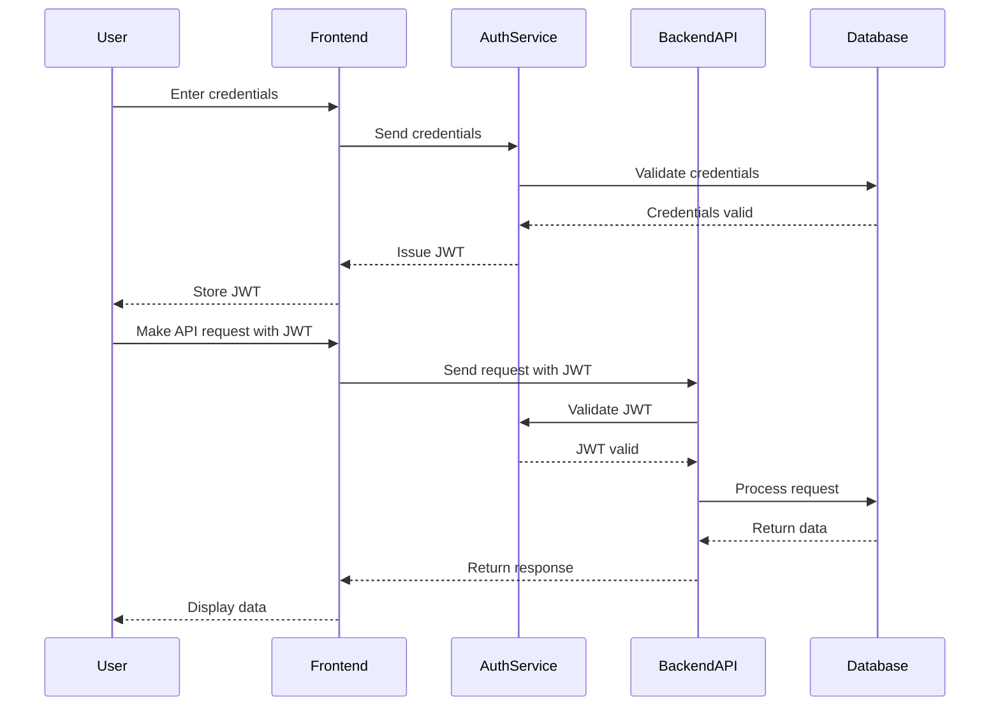

# Security Architecture Deep Dive

* --

## 1. Introduction

This document provides a detailed technical exploration of ThinkAlike's security architecture, controls, and processes.
It expands upon the foundational policies outlined in the
[`security_and_privacy_plan.md`](../security/security_and_privacy_plan.md) and aligns with the
[`ethical-guidelines.md`](../core/ethics/ethical-guidelines.md). The goal is to detail the specific mechanisms employed
to protect user data, ensure system integrity, and build trust through robust, transparent security practices.

Security in ThinkAlike is not an afterthought but a core design principle, integrating "Security by Design" and "Privacy
by Design" throughout the application lifecycle. We also embrace "Security by Transparency" where appropriate, making
our approaches (though not sensitive keys or configurations) understandable.

* --

## 2. Security Principles Revisited

Our technical security architecture adheres to these guiding principles:

* **Defense in Depth:** Multiple, overlapping layers of security controls (network, application, data). A breach in one

layer should be contained or detected by another.

* **Least Privilege:** Users, services, and API endpoints operate with the minimum permissions required for their

function. Avoid overly broad access.

* **Secure Defaults:** Out-of-the-box configurations prioritize security. Opt-in for less secure options only where

necessary and justified.

* **Zero Trust (Aspirational Goal):** While full implementation may be complex, we adopt a Zero Trust mindset – never

trust, always verify. Authenticate and authorize requests rigorously, even between internal components where feasible.

* **Fail Secure:** Components should default to a secure state in case of failure (e.g., deny access if an authorization

check fails unexpectedly).

* **Transparency & Auditability:** Security controls and events should be logged and auditable (within operational

security constraints). Components like the
[`security-status-indicator.md`](../components/ui_components/security-status-indicator.md) provide user-facing
transparency.

* --

## 3. Threat Model Overview & Mitigations

This section outlines major threat categories and the primary technical controls used for mitigation. *(Note: This is
illustrative; a formal, continuous threat modeling process is required).*

| Threat Category                 | Description                                                                 |
Primary Mitigations                                                                                                     
                                                                                                                      |
Supporting Docs                                                                                                         
                              |
| :------------------------------ | :-------------------------------------------------------------------------- |
:-----------------------------------------------------------------------------------------------------------------------

* -------------------------------------------------------------------------------------------------------------------- |

:-----------------------------------------------------------------------------------------------------------------------

* ---------------------------- |

| **Authentication Bypass**       | Attacker gains access without valid credentials.                            | Strong
password hashing (bcrypt/Argon2), secure JWT implementation (short expiry, HTTPS-only, refresh tokens), rate limiting on
login endpoints, MFA (recommended/required), secure session management (HttpOnly cookies for frontend sessions).      |
[`security_and_privacy_plan.md`](../security/security_and_privacy_plan.md) Sec 1                                        
                                              |
| **Authorization Escalation**    | Attacker gains privileges beyond their intended role.                       | Strict
Role-Based Access Control (RBAC) enforced at API level (FastAPI Dependencies), validating JWT claims against required
permissions for each endpoint, secure admin interfaces.                                                            |
[`security_and_privacy_plan.md`](../security/security_and_privacy_plan.md) Sec 2                                        
                                              |
| **Data Exposure (Transit)**     | Eavesdropping on data sent between client/server or internal services.      | TLS

1. 2+ (HTTPS) enforced for all external traffic, secure configuration (disabling weak ciphers), consideration of mTLS for

internal service-to-service communication if architecture becomes microservice-based.                            |
[`security_and_privacy_plan.md`](../security/security_and_privacy_plan.md) Sec 3                                        
                                              |
| **Data Exposure (At Rest)**     | Unauthorized access to data stored in databases, backups, or file storage.    |
Database-level encryption (PostgreSQL TDE or cloud provider equivalent), application-level encryption for highly
sensitive fields (TBD), encryption of backups, secure key management (Vault/KMS), strict database access controls.      
           | [`security_and_privacy_plan.md`](../security/security_and_privacy_plan.md) Sec 3,
[`unified-data-model-schema.md`](../database/unified-data-model-schema.md)                     |
| **Injection Attacks (SQLi, XSS)** | Malicious code/queries injected via user input to compromise data/sessions. |

* *Backend:** Parameterized queries (via SQLAlchemy ORM), rigorous input validation (Pydantic models), context-aware

output encoding. **Frontend:** Framework-level XSS protection (React default encoding), Content Security Policy (CSP)
header. | [`security_and_privacy_plan.md`](../security/security_and_privacy_plan.md) Sec 4,
[`code-style-guide.md`](../guides/developer_guides/code-style-guide.md)               |
| **Denial of Service (DoS/DDoS)** | Overwhelming system resources to cause unavailability.                      | Cloud
provider DDoS mitigation (Render), API Rate Limiting (e.g., using `slowapi` for FastAPI), efficient resource usage
(optimized queries, async processing), potential CDN use for frontend assets.                                           
 | [`security_and_privacy_plan.md`](../security/security_and_privacy_plan.md) Sec 4                                     
                                                 |
| **Insecure Dependencies**       | Exploiting known vulnerabilities in third-party libraries.                  |
Regular dependency scanning (`pip-audit`, `npm audit`, Dependabot/Snyk), prompt patching/updating of vulnerable
packages, software composition analysis (SCA).                                                                         |
SDL Practices (Sec 5 below)                                                                                             
                              |
| **Verification System Bypass**  | Tampering with ethical checks or audit logs.                                | Secure
API endpoints for Verification System, integrity checks on logged data, RBAC limiting access to verification
configuration/logs, monitoring for anomalous verification results.                                                     
| [`verification-system.md`](../verification_system/verification-system.md),
[`verification-system-data-models.md`](../verification_system/verification-system-data-models.md) |
| **Insecure Configuration**      | Misconfiguration of servers, databases, cloud services, or frameworks.      |
Infrastructure as Code (IaC) where possible, configuration reviews, security linters, adherence to security benchmarks
(e.g., CIS).                                                                                                         |
SDL Practices (Sec 5 below)                                                                                             
                              |

* --

## 4. Key Technology Implementations

### 4.1 Backend (FastAPI) Security

* **Authentication:** Use `python-jose` for JWT creation/validation, `passlib` for password hashing (with bcrypt

context). Implement OAuth2 password flow (`OAuth2PasswordBearer`, `OAuth2PasswordRequestForm`).

* **Authorization:** Custom FastAPI dependencies to verify JWT scope/roles against endpoint requirements. Example:

      ```python

      # Example Dependency

      from fastapi import Depends, HTTPException, status
      from fastapi.security import OAuth2PasswordBearer
      # ... import JWT functions, user service ...

      oauth2_scheme = OAuth2PasswordBearer(tokenUrl="/api/v1/auth/token") # Adjust token URL

      async def get_current_active_user(token: str = Depends(oauth2_scheme)):
          credentials_exception = HTTPException(
              status_code=status.HTTP_401_UNAUTHORIZED,
              detail="Could not validate credentials",
              headers={"WWW-Authenticate": "Bearer"},
          )
          try:
              payload = decode_access_token(token) # Your JWT decode function

              username: str = payload.get("sub")
              if username is None:
                  raise credentials_exception
              token_data = TokenData(username=username, scopes=payload.get("scopes", []))
          except JWTError:
              raise credentials_exception
          user = get_user(username=token_data.username) # Your user lookup function

          if user is None or not user.is_active:
              raise credentials_exception
          return user # Returns the user model

      def require_role(role: str):
          async def role_checker(current_user: User = Depends(get_current_active_user)):
              if role not in current_user.roles: # Assumes user model has roles

                   raise HTTPException(status_code=status.HTTP_403_FORBIDDEN, detail="Operation not permitted")
              return current_user
          return role_checker

      # Usage in endpoint

      # @router.delete("/admin/users/{user_id}", dependencies=[Depends(require_role("admin"))])

      ```

* **Input Validation:** Leverage Pydantic models extensively for request body and query parameter validation. Use custom

validators for complex rules.

* **CORS:** Configure `CORSMiddleware` strictly with allowed origins from environment variables.
* **Rate Limiting:** Integrate a library like `slowapi`.
* **Dependencies:** Use `Depends()` for injecting dependencies like database sessions and current user, simplifying

testing and logic separation.

### 4.2 Frontend (React) Security

* **Authentication:** Securely store JWTs (e.g., `localStorage` requires XSS protection, `HttpOnly` cookies managed by

backend offer better protection against XSS but require CSRF handling). Implement token refresh logic.

* **API Interaction:** Use HTTPS exclusively. Handle API errors gracefully. Clear sensitive data on logout.
* **XSS Prevention:** Rely on React's default JSX encoding. Be extremely cautious if using `dangerouslySetInnerHTML`.

Sanitize any user-generated content rendered directly as HTML (use libraries like `DOMPurify`).

* **CSRF Protection:** If using cookie-based sessions, implement CSRF protection (e.g., double-submit cookie pattern,

synchronizer token pattern – often handled by backend framework integrations). JWT Bearer tokens are generally immune to
traditional CSRF if stored correctly (not in cookies accessible across origins).

* **Dependency Security:** Use `npm audit` or `yarn audit` regularly.

### 4.3 Database (PostgreSQL) Security

* **Access Control:** Use unique, strong passwords for database users. Grant minimal necessary privileges (e.g.,

read-only for certain services). Use Render's trusted sources feature if applicable.

* **Encryption:** Enable TDE (if available on Render plan) or use `pgcrypto` extension for specific column encryption.

Ensure connection strings use SSL (`sslmode=require` or stronger).

* **Auditing:** Configure database logging (e.g., `log_statement = 'ddl'`) to track schema changes or sensitive

operations if needed.

* **Backups:** Ensure regular, encrypted backups are configured via Render.

* --

## 5. Secure Development Lifecycle (SDL) Practices

* **Threat Modeling:** Conducted during design phases for new epics/features.
* **Static Analysis (SAST):** Integrate linters with security rules (e.g., `bandit` for Python, ESLint security plugins

for JS/TS) into CI pipeline.

* **Dependency Scanning:** Automated checks in CI (Dependabot/Snyk).
* **Code Review:** Mandatory security focus in PR reviews. Use checklists for common vulnerabilities (OWASP Top 10).
* **Secrets Management:** No secrets committed to Git. Use environment variables injected by Render or a dedicated

secrets manager.

* **Testing:** Security-focused unit tests (auth logic), integration tests (permission checks), and potentially DAST

scans in staging environments. Periodic manual penetration testing.

* --

## 6. Monitoring & Incident Response

* **Key Metrics:** Monitor login failures, authorization failures, API error rates (4xx/5xx), resource utilization,

Verification System alerts.

* **Alerting:** Configure alerts for critical thresholds (e.g., spike in 401/403 errors, unusual traffic patterns, high

resource usage).

* **Incident Response:** Follow the documented Incident Response Plan (to be fully developed), emphasizing quick

containment, thorough analysis, responsible disclosure (if user data impacted), and post-mortem improvements.

* --



This deep dive provides a technical foundation. Continuous vigilance, regular updates, and adaptation to new threats are
essential for maintaining ThinkAlike's security posture.
