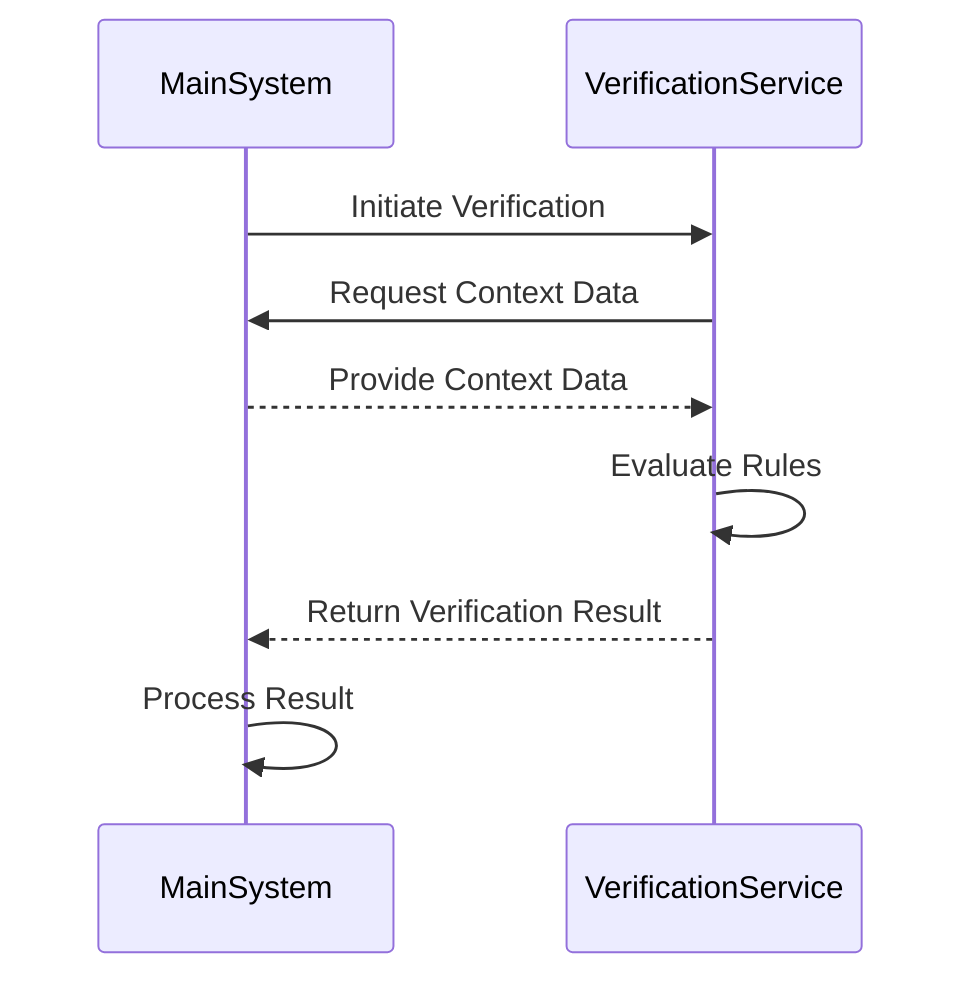

# Verification System: Deep Dive

This document provides a deeper architectural and implementation concept for the ThinkAlike Verification System, expanding on the [Verification System Overview](./verification_system.md). It outlines the system’s purpose, proposed architecture, rule definitions, interaction patterns, and key considerations for developers.

## 1. Purpose & Vision

The Verification System is a cornerstone of ThinkAlike’s commitment to its [Ethical Guidelines](../../core/ethics/ethical_guidelines.md) and operational integrity. It is **not** merely a set of validation rules but an **active, integrated component** designed to:

- **Enforce Ethical Boundaries:** Programmatically check actions and data against defined ethical rules (e.g., content policies, data usage constraints).
- **Ensure Functional Consistency:** Validate data integrity, state transitions, and adherence to core application logic.
- **Provide Verifiable Compliance:** Generate detailed audit logs demonstrating adherence to rules and supporting transparency.
- **Decouple Rules from Core Logic:** Allow ethical rules and core validation logic to evolve independently of primary application features.

## 2. Proposed Architecture

*(This is a conceptual proposal; implementation details may vary.)*

We propose a **dedicated backend service or an isolated module** within the main FastAPI backend, comprising:

- **API Endpoints:** Trigger verification on specific requests.
- **Business Logic Services:** Call the Verification API as needed.
- **Database Access:** Provide contextual data for rule evaluation.
- **Verification Service Module:**
  - **Rule Engine:** Loads and evaluates rules from the Rule Store.
  - **Rule Store:** Persistent storage for verification rules (e.g., dedicated DB table or configuration files).
  - **Internal Verification API:** Exposes a Python interface or HTTP API for other components to trigger rule evaluations.
  - **Audit Logger:** Records verification requests, triggered rules, outcomes (pass/fail/modify), and context for transparency.

Below is an example [Mermaid diagram](https://mermaid.js.org) illustrating the architecture:

```mermaid
graph LR
    subgraph MainBackend [Main Backend (FastAPI)]
        API[API Endpoints]
        SVC[Business Logic Services]
        DB[Database Access]
    end

    subgraph Verification [Verification System Module]
        RE[Rule Engine]
        RS[(Rule Store)]
        VIA[Internal Verification API]
        AL[Audit Logger]
    end

    API -- Triggers Verification --> VIA
    SVC -- Triggers Verification --> VIA
    VIA --> RE
    RE -- Reads Rules --> RS
    RE -- Context Data --> DB
    VIA -- Logs Results --> AL
```

## 3. Defining Verification Rules

A critical aspect is defining flexible and maintainable rules. Possible approaches include:

- **Configuration-Based Rules (YAML):** For simpler checks.

  *Example:*

  ```yaml
  rules:
    - id: CONTENT_POLICY_NO_HATE_SPEECH
      description: "Check text content against hate speech definitions."
      trigger: ["create_narrative", "update_profile_description", "post_community_message"]
      type: content_analysis
      parameters:
        sensitivity: high
        model_ref: "hate_speech_classifier_v1.2"
      action_on_fail: block
  ```

- **Python-Based Rules:** Define rules as functions or classes for complex logic.

  *Example:*

  ```python
  from backend.models import User
  from backend.services.consent_service import has_consent

  def check_profile_matching_consent(context: dict, db_session) -> bool:
      user_id = context.get("user_id")
      user = db_session.get(User, user_id)
      if not user:
          return False
      return has_consent(user, "consent_profile_matching_v1")
  ```

- **Domain Specific Language (DSL):** A custom approach that may be more powerful but complex to implement initially.

**Recommendation:** Start with a hybrid approach combining YAML/JSON for common rule types and Python functions for complex, custom validations.

## 4. Interaction Patterns

Components interact with the Verification System via:

- **API Middleware:** FastAPI middleware intercepts requests for pre-validation or post-validation auditing.
- **Direct Service Calls:** Business logic functions trigger verification at critical points (e.g., before saving sensitive data).
- **UI Validation Backend:** UI components (e.g., CoreValuesValidator) may invoke dedicated endpoints to perform server-side content analysis.

## 5. Developer Interaction

Developers should:

- **Identify Critical Operations:** Document operations that require verification (e.g., user data creation, content submission, permissions changes) in PR checklists or feature documentation.
- **Provide Adequate Context:** Ensure that calls to the Verification API include sufficient context (user ID, data, action type) for accurate rule evaluation.
- **Handle Outcomes Appropriately:** Update business logic to handle outcomes from the Verification API (e.g., block actions, flag for review, return user-friendly error messages).
- **Test Thoroughly:** Write unit and integration tests that mock Verification API calls and validate middleware behavior.

## 6. Considerations & Future Enhancements

- **Performance:** The Verification System adds overhead. Optimize rule evaluation and API calls; consider asynchronous verification for non-blocking checks.
- **Rule Management:** Establish a clear process for creating, updating, versioning, and testing rules.
- **Explainability:** Ensure audit logs are detailed enough to explain why a verification check passed or failed.
- **User Feedback:** Provide clear, user-friendly error messages so users can understand if and why an action was blocked.
- **Machine Learning Integration:** If rules trigger ML models (e.g., content classifiers), verify that these models align with ethical guidelines. See the [AI Model Development Guide](ai_model_development_guide.md) for more details.

The Verification System is critical infrastructure for building trust and ensuring that ThinkAlike adheres to its ethical and operational principles. Its design requires careful consideration and iterative refinement as the platform evolves.


