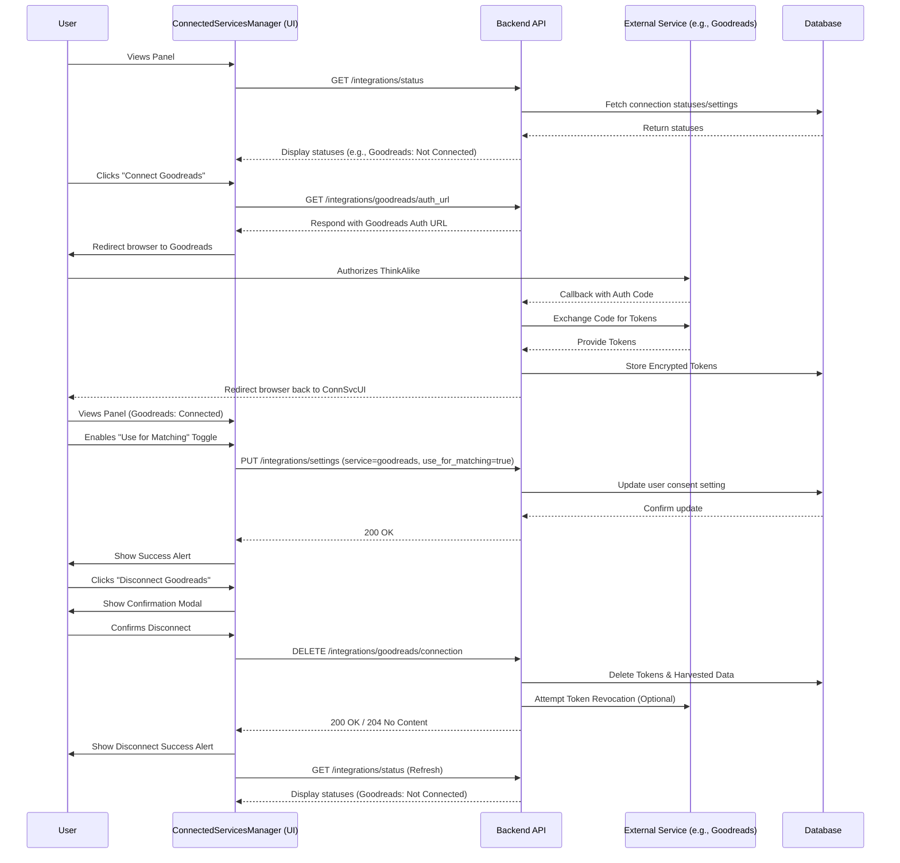

// filepath: C:\--ThinkAlike--\docs\components\ui_components\connected_services_manager.md

# UI Component Specification: ConnectedServicesManager

---

## 1. Introduction and Description

The **ConnectedServicesManager** is a dedicated UI component within ThinkAlike, typically residing in the user's main Settings or Profile section. Its primary purpose is to provide a centralized, clear, and actionable interface for users to manage connections to optional third-party services (e.g., Goodreads, Spotify).

This component is the primary user-facing element for the [Third-Party Data Integration Strategy](../architecture/data_integration_strategy.md) and directly enables the user control principles outlined in the [Connected Services User Guide](../guides/user_guides/connected_services_guide.md). It allows users to:

* View supported external services.

* Initiate the connection (OAuth) process for each service.

* View the connection status and permissions granted to ThinkAlike.

* Exercise **granular, opt-in control** over *how* data harvested from each service is used within ThinkAlike.

* Easily disconnect services and trigger data deletion.

---

## 2. UI Elements and Layout

The component typically renders as a panel or section containing a list of supported/connected services.

### 2.1 Service Listing Area

* **Layout:** A list or grid displaying each supported third-party service.

* **Per-Service Entry:** Each service entry includes:

  * **Service Icon/Logo:** Recognizable logo of the third-party service (e.g., Goodreads 'g', Spotify circle).

  * **Service Name:** Clear text label (e.g., "Goodreads", "Spotify").

  * **Connection Status Indicator:** Simple text or badge indicating "Connected" or "Not Connected".

  * **Action Button:**

    * If "Not Connected": Displays a prominent `ActionButton` labeled "Connect".

    * If "Connected": Displays a prominent `ActionButton` (potentially styled differently, e.g., secondary or danger) labeled "Disconnect".

  * **Expand/Details Toggle (Optional):** An icon (e.g., `>` or `+`) to expand the entry and show detailed controls (Permissions, Usage Toggles, Last Synced).

### 2.2 Detailed Service View (Expanded State)

When a user expands a connected service entry:

* **Permissions Granted Display:**

  * **Component:** Uses `DataDisplay` components or a simple list.

  * **Content:** Clearly lists the specific permissions ThinkAlike was granted access to via the OAuth flow (e.g., "Read your 'read' book shelf", "Access your top artists"). This data should be fetched from the backend based on the stored token's scope.

* **Data Usage Toggles:**

  * **Component:** Uses a series of labeled `Checkbox` or `ToggleSwitch` components.

  * **Content:** Presents the specific, granular opt-in choices for data usage, e.g.:

    * `[ ] Use Goodreads data for Match Discovery?`

    * `[ ] Use Goodreads data for Community Recommendations?`

    * `[ ] Display Goodreads insights on my Profile?`

  * **State:** Reflects the user's current saved preferences (fetched from backend). Defaults to OFF. Changes trigger API calls to update settings.

* **Last Synced Timestamp:**

  * **Component:** `DataDisplay`.

  * **Content:** Shows the date and time ThinkAlike last successfully fetched data from this service for the user (e.g., "Last synced: 2025-03-26 10:00 UTC"). Fetched from backend.

* **View Harvested Data Link:**

  * **Component:** Simple `<a>` tag or `LinkButton`.

  * **Action:** Navigates the user to the `Data Explorer Panel`, potentially pre-filtered to show data specifically from this connected service.

### 2.3 General Feedback Area

* **Component:** Uses the `Alert` component.

* **Purpose:** Display success messages (e.g., "Spotify connected successfully!", "Settings saved.") or error messages (e.g., "Failed to disconnect Goodreads. Please try again.", "API error saving settings.").

---

## 3. Data Flow and Interaction

1. **Load:** Component mounts, fetches list of supported services and user's current connection statuses/settings from backend API (e.g., `GET /api/v1/integrations/status`).
2. **Connect Action:** User clicks "Connect" for a service. Frontend calls backend endpoint (e.g., `GET /api/v1/integrations/{service}/auth_url`) which returns the OAuth URL. Frontend redirects user's browser to the external service.
3. **OAuth Callback:** User authorizes on external site, gets redirected back to ThinkAlike's callback URL handled by the backend. Backend exchanges code for tokens, stores them, and redirects user back to this "Connected Services" panel (potentially with a success query param).
4. **Panel Refresh:** Panel re-fetches status, now showing the service as "Connected" and revealing the Data Usage Toggles (defaulting to OFF).
5. **Toggle Usage Consent:** User flips a toggle (e.g., enables "Use Goodreads for Matching"). Frontend sends API request (`PUT /api/v1/integrations/settings` or similar) with updated consent state for that service/purpose. Backend saves the setting. UI shows confirmation (`Alert`).
6. **Disconnect Action:** User clicks "Disconnect". Frontend shows confirmation modal. If confirmed, frontend sends API request (`DELETE /api/v1/integrations/{service}/connection`). Backend revokes token (if possible via API), deletes stored token and harvested data, and returns success.
7. **Panel Refresh:** Panel re-fetches status, showing the service as "Not Connected".



## 4. Code Implementation Notes

Framework: React.

State Management: Requires managing the list of services, their connection status, and the state of usage toggles. Global state (Context/Zustand/Redux) is suitable if this status needs to be accessed elsewhere.

Component Composition: Build using reusable components: ActionButton, ToggleSwitch/Checkbox, DataDisplay, Alert, list/card components.

API Interaction: Implement robust API calls for fetching status, getting auth URLs, updating settings, and disconnecting. Use loading states (isLoading prop on ActionButton) and error handling (Alert component).

Security: Frontend never handles client secrets. OAuth flow relies on backend redirects.

Accessibility: Ensure toggles, buttons, and status indicators are accessible via keyboard and screen readers with proper ARIA attributes.

```javascript
// Example React Component Structure (Conceptual)

import React, { useState, useEffect } from 'react';
import apiClient from './services/apiClient'; // Your API client
import ActionButton from './ActionButton';
import ToggleSwitch from './ToggleSwitch'; // Your toggle component
import DataDisplay from './DataDisplay';
import Alert from './Alert';

function ConnectedServicesManager() {
  const [services, setServices] = useState([]); // { serviceId: 'goodreads', name: 'Goodreads', isConnected: false, permissions: [], usage: { matching: false, ... } }
  const [isLoading, setIsLoading] = useState(true);
  const [error, setError] = useState(null);
  const [successMessage, setSuccessMessage] = useState('');

  const fetchStatus = async () => {
    setIsLoading(true); setError(null); setSuccessMessage('');
    try {
      const response = await apiClient.get('/integrations/status');
      setServices(response.data.services || []);
    } catch (err) {
      setError('Failed to load connection statuses.');
      console.error(err);
    } finally {
      setIsLoading(false);
    }
  };

  useEffect(() => {
    fetchStatus();
  }, []);

  const handleConnect = async (serviceId) => {
    try {
      const response = await apiClient.get(`/integrations/${serviceId}/auth_url`);
      window.location.href = response.data.authUrl; // Redirect user
    } catch (err) {
      setError(`Failed to initiate connection for ${serviceId}.`);
    }
  };

  const handleDisconnect = async (serviceId) => {
     if (!window.confirm(`Are you sure you want to disconnect ${serviceId}? Harvested data will be removed.`)) return;
     try {
       await apiClient.delete(`/integrations/${serviceId}/connection`);
       setSuccessMessage(`${serviceId} disconnected successfully.`);
       fetchStatus(); // Refresh status
     } catch (err) {
       setError(`Failed to disconnect ${serviceId}.`);
     }
  };

  const handleToggleChange = async (serviceId, usageKey, newValue) => {
     // Optimistic update can be added here
     try {
        const currentService = services.find(s => s.serviceId === serviceId);
        const updatedUsage = { ...currentService.usage, [usageKey]: newValue };
        await apiClient.put(`/integrations/settings`, { serviceId, usage: updatedUsage });
        setSuccessMessage(`Usage setting for ${serviceId} updated.`);
        // Refresh state after successful update
        fetchStatus();
     } catch(err) {
        setError(`Failed to update setting for ${serviceId}.`);
        // Revert optimistic update if implemented
     }
  };

  if (isLoading) return <p>Loading connections...</p>;

  return (
    <div className="connected-services-manager">
      <h2>Connected Services & Data Sources</h2>
      {error && <Alert type="error" message={error} />}
      {successMessage && <Alert type="success" message={successMessage} />}

      {services.length === 0 && <p>No integration services configured yet.</p>}

      {services.map(service => (
        <div key={service.serviceId} className="service-entry">
          {/* Icon? */} <strong>{service.name}</strong>
          <span> ({service.isConnected ? 'Connected' : 'Not Connected'})</span>
          {!service.isConnected && (
            <ActionButton onClick={() => handleConnect(service.serviceId)}>Connect</ActionButton>
          )}
          {service.isConnected && (
            <>
              <ActionButton onClick={() => handleDisconnect(service.serviceId)} variant="danger">Disconnect</ActionButton>
              <div className="service-details">
                 <DataDisplay label="Permissions Granted" value={service.permissions?.join(', ') || 'N/A'} dataType="text" />
                 <DataDisplay label="Last Synced" value={service.lastSynced} dataType="date" />

                 <h4>Data Usage Consent:</h4>
                 {Object.entries(service.usage || {}).map(([key, value]) => (
                    <ToggleSwitch
                        key={key}
                        label={`Use ${service.name} data for ${key}?`} // Make labels clearer
                        isChecked={value}
                        onChange={(newValue) => handleToggleChange(service.serviceId, key, newValue)}
                        id={`${service.serviceId}-${key}-toggle`}
                    />
                 ))}
                 {/* Add Link to Data Explorer */}
                 <a href={`/app/data-explorer?source=${service.serviceId}`} target="_blank" rel="noopener noreferrer">View Harvested Data</a>
              </div>
            </>
          )}
        </div>
      ))}
    </div>
  );
}

export default ConnectedServicesManager;

```

## 5. Testing Instructions

Initial Load: Verify the component correctly fetches and displays the status of all supported services (Connected/Not Connected). Test loading and error states for the initial fetch.

Connect Flow: Click "Connect". Verify redirection to a mock/real OAuth URL. Simulate a successful callback and verify the UI updates to "Connected", showing default OFF toggles. Simulate a failed callback and verify an error is shown.

Disconnect Flow: Click "Disconnect". Verify confirmation modal appears. Confirm disconnect. Verify API call is made and UI updates to "Not Connected". Test error handling for disconnect failure.

Toggle Usage Consent: Toggle switches ON and OFF. Verify the UI updates (potentially optimistically). Verify the correct API call is made with the new state. Verify success/error messages are displayed. After refresh, verify the toggles reflect the saved state.

Permissions Display: Mock different permission scopes granted via OAuth. Verify the "Permissions Granted" section accurately displays the received scopes.

Data Explorer Link: Verify the "View Harvested Data" link navigates to the correct location (potentially with correct filters).

Accessibility: Test keyboard navigation for all buttons and toggles. Ensure labels are associated correctly. Check screen reader compatibility for status changes and toggle states.

## 6. Dependencies & Integration

Depends On:

* Backend APIs for status, auth URLs, settings updates, disconnect actions (api_endpoints_integrations.md).

* Reusable UI components: ActionButton, ToggleSwitch/Checkbox, DataDisplay, Alert.

* Global state management (potentially, for sharing connection status).

* ThinkAlike Style Guide.

Integrates With:

* User Settings / Profile section.

* Data Explorer Panel (via navigation link).

* Backend OAuth handling logic and token storage.

This component is central to providing users with meaningful control over third-party data integration, directly implementing ThinkAlike's core values of transparency and user sovereignty.

---

**Document Details**

* Title: UI Component Specification: ConnectedServicesManager

* Type: Component Specification

* Version: 1.0.0

* Last Updated: 2025-04-05

---

End of UI Component Specification: ConnectedServicesManager

---
