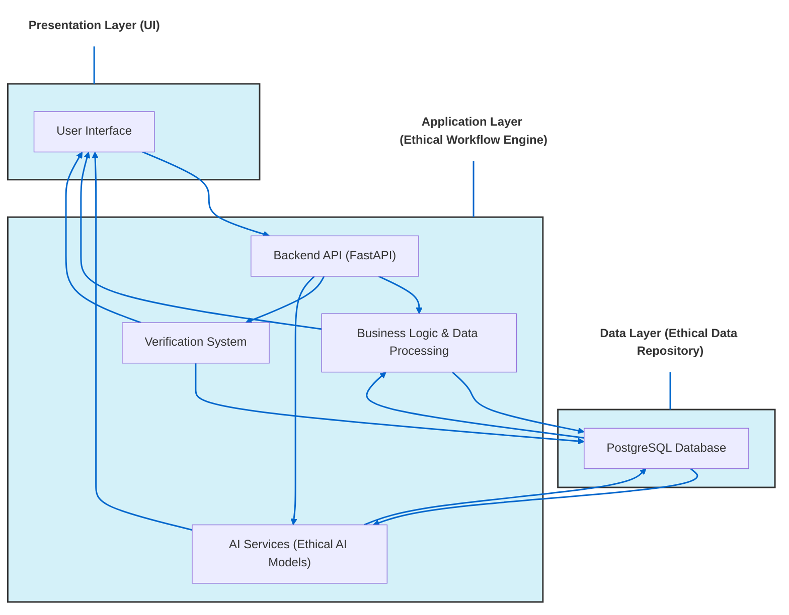

# Design Document: Corevaluesvalidator Ui Component

* --

# Design Document: Corevaluesvalidator Ui Component

* --

## 1. Introduction and Description

The **CoreValuesValidator** is a specialized, reusable React UI component central to ThinkAlike's **"UI as Validation
Framework"** and its commitment to **Ethical AI by Design**. Unlike general data or API validators, this component's
specific purpose is to **visualize and validate the alignment of specific platform actions, data processing steps, or AI
model outputs with ThinkAlike's defined core ethical values and principles**.

It translates abstract ethical guidelines into tangible, visual feedback within the UI, serving multiple purposes:

* **Ethical Transparency for Users:** In specific contexts (e.g., within the `AI Transparency Log` or `Data Explorer

Panel`), it can help users understand the ethical considerations applied to a process affecting them.

* **Developer/Tester Feedback:** Provides immediate visual feedback during development and testing on whether a feature

or workflow potentially deviates from or adheres to core ethical principles (e.g., user empowerment, data minimization,
transparency, bias mitigation).

* **Ethical Auditing:** Serves as a UI target for automated and manual ethical tests, allowing auditors to quickly

assess compliance points.

* **Reinforcing Values:** Acts as a constant visual reminder of the project's ethical commitments embedded directly

within the development and testing tools.

This component interfaces conceptually and potentially directly with the backend **Verification System** and relies
heavily on the principles defined in the [ThinkAlike Ethical
Guidelines](../../core/ethics/ethical_guidelines/ethical_guidelines.md) and the [Philosophical Manifesto of Eos
Lumina](../../core/manifesto/manifesto.md).

* --

## 2. UI Components / Elements

The `CoreValuesValidator` typically renders as a compact summary or a more detailed panel, depending on context and
configuration.

### 2.1 Ethical Alignment Score/Indicator

* **Purpose:** Provide an immediate, high-level assessment of ethical alignment for a specific context (e.g., an API

call's data usage, an AI recommendation's potential bias).

* **UI Elements:**
  * **Visual Score:** Could be a numerical score (e.g., 0-100), a qualitative rating (e.g., "High Alignment", "Potential

Concern", "Violation Detected"), or a graphical indicator (e.g., a gauge, a spectrum bar).
  * **Color-Coding:** Uses project-defined colors to signify alignment level:
    * *Green (or similar positive color):* Strong alignment with ethical principles.
    * *Amber/Yellow:* Potential ethical concerns identified, requires review.
    * *Neon Orange/Red:* Significant ethical violation detected or high risk identified.
  * **Iconography:** May use simple icons representing core values (e.g., eye for transparency, shield for privacy,

scales for fairness, person icon for empowerment) with status indicators.

### 2.2 Principle Breakdown (Detailed View)

* **Purpose:** Show how the specific action/data/output aligns with *individual* core ethical principles.

* **UI Elements:**
  * **List/Grid View:** Displays a list or grid of relevant core ethical principles (e.g., "Data Minimization", "User

Control", "Transparency", "Bias Mitigation", "Authenticity").
  * **Per-Principle Status:** For each principle, shows a specific status indicator (icon, color code, checkmark/cross)

indicating adherence or potential violation in the current context.
  * **Explanations/Rationale (On Hover/Click):** Provides brief, contextual explanations for the assessment of each

principle (e.g., "Data Minimization: OK - Only essential fields used", "Bias Mitigation: Warning - Potential skew
detected in recommendation diversity, see Bias Report #123", "User Control: OK - User preferences respected").

### 2.3 Identified Concerns/Violations Log

* **Purpose:** Clearly list any specific ethical concerns or violations flagged by the validation process.

* **UI Elements:**
  * **Log List:** A clear list detailing each identified issue.
  * **Severity Level:** Indicates the severity of the concern (e.g., Low, Medium, High, Critical).
  * **Description:** Explains the nature of the concern/violation.
  * **Recommendation/Action Link:** Provides suggested remediation steps or links to relevant documentation/reports

(e.g., link to a detailed bias audit report, link to relevant Ethical Guideline).

### 2.4 Link to Verification System / Evidence

* **Purpose:** Connect the UI validation display to underlying evidence or detailed reports from the backend

Verification System.

* **UI Elements:** A link or button labeled "View Details in Verification System" or "See Ethical Audit Trail".

* --

## 3. Data Flow and Interaction

1. **Context Provision:** The parent component rendering the `CoreValuesValidator` provides it with context about the

action, data, or AI output being evaluated (e.g., API call details, AI recommendation data, user workflow step).

1. **Validation Trigger:** Validation can be triggered:

    * **Frontend Heuristics:** Simple checks performed directly in the frontend based on data patterns or UI state

(e.g., checking if sensitive data is being displayed without masking).
  * **Backend Verification Call:** The frontend makes an API call to the backend Verification System (e.g., `POST

/api/verification/validate`) sending the relevant context.
  * **Pre-computed Data:** The necessary validation data/score might already be included in the response from the

primary API call being validated (e.g., an AI matching response includes ethical alignment scores).

1. **Data Processing:** The `CoreValuesValidator` receives validation results (scores, principle statuses, violation

details) either directly via props or from the Verification System API response.

1. **Rendering:** The component renders the appropriate visual elements (Score, Principle Breakdown, Concerns Log) based

on the received validation data.

1. **User Interaction:** Users can hover/click for details, view violation logs, and potentially link to the

Verification System for deeper dives.



## 4. Code Implementation Notes

* *Framework:** React.

* *Props:**

* **validationContext:** (Object) Data describing the item being validated (e.g., { type: 'AI_RECOMMENDATION', data: recommendationObject }, { type: 'DATA_HANDLING', workflow: 'profile_update', fields: ['email', 'password'] }).
* **validationResults:** (Object, Optional) Pre-computed results if validation happens elsewhere (e.g., { overallScore: 85, principles: { transparency: 'ok', bias: 'warning' }, concerns: [...] }). If not provided, the component might trigger its own backend call based on validationContext.
* **displayMode:** (Enum: 'compact', 'detailed') Controls rendering detail.

* *Logic:**

* Component logic maps validationResults data to the appropriate UI elements and styling.
* Handles fetching validation results from the backend if validationResults prop is not provided.
* Manages internal state for displaying detailed sections (e.g., expanding principle breakdowns).

* *Ethical Principle Mapping:** Requires a clear mapping (e.g., a configuration object) between principle IDs/names used in the validation data and their display labels and icons in the UI.

* *Integration with Verification API:** Define the request/response structure for interacting with the backend Verification System API.

* *Styling:** Use project styles (style_guide.md) for colors, icons, and typography, ensuring clear visual distinction between alignment levels.

```jsx

// Example React Component Structure (Conceptual)

import React from 'react';
// import { fetchEthicalValidation } from './apiService'; // Example API call
// Import ethical principle definitions/mapping

function CoreValuesValidator({ validationContext, validationResults, displayMode = 'compact' }) {
  const [results, setResults] = React.useState(validationResults);
  const [isLoading, setIsLoading] = React.useState(false);
  const [error, setError] = React.useState(null);

  React.useEffect(() => {
    // Fetch results from backend if not provided via props
    if (!validationResults && validationContext) {
      setIsLoading(true);
      // fetchEthicalValidation(validationContext)
      //   .then(data => { setResults(data); setIsLoading(false); })
      //   .catch(err => { setError(err); setIsLoading(false); });
       // Placeholder for fetch logic
       console.log("Placeholder: Fetching validation for context:", validationContext);
       setIsLoading(false);
       // Example static result for dev/testing
       setResults({ overallScore: 75, principles: { transparency: 'ok', bias: 'warning', userControl: 'ok' }, concerns:
[{severity: 'Medium', description: 'Recommendation diversity below threshold.'}] });
    } else {
        setResults(validationResults); // Use results passed via props
    }
  }, [validationContext, validationResults]); // Re-run if context or prop results change

  if (isLoading) return <div>Loading Ethical Validation...</div>;
  if (error) return <div className="error">Error fetching validation.</div>;
  if (!results) return null; // Nothing to display yet

  const getStatusColor = (score) => {
      if (score >= 80) return 'green';
      if (score >= 60) return 'orange'; // Using orange from palette
      return 'red'; // Use a suitable red/neon orange
  }

  return (
    <div className={`core-values-validator mode-${displayMode}`}>
      <div className={`ethical-score color-${getStatusColor(results.overallScore)}`}>
        Ethical Alignment: {results.overallScore}% {/* Or Qualitative */}
      </div>

      {displayMode === 'detailed' && (
        <>
          <div className="principle-breakdown">
            <h4>Principle Check:</h4>
            <ul>
              {Object.entries(results.principles || {}).map(([principle, status]) => (
                <li key={principle} className={`status-${status}`}>
                  {/* Icon? */} {principle}: {status.toUpperCase()}
                  {/* Add Tooltip/Popover with rationale here */}
                </li>
              ))}
            </ul>
          </div>
          {results.concerns && results.concerns.length > 0 && (
             <div className="concerns-log">
               <h4>Identified Concerns:</h4>
               <ul>
                 {results.concerns.map((concern, index) => (
                   <li key={index} className={`severity-${concern.severity?.toLowerCase()}`}>
                     [{concern.severity}] {concern.description}
                     {/* Link to report? */}
                   </li>
                 ))}
               </ul>
             </div>
           )}
           {/* Optional Link to Verification System */}
        </>
      )}
    </div>
  );
}

export default CoreValuesValidator;

```

## 5. Testing Instructions

* **Alignment State Rendering:** Provide mocked validationResults data representing high, medium, and low ethical alignment scores and various principle statuses (ok, warning, violation). Verify the component renders the correct colors, icons, scores, and status texts for each case.

* **Principle Breakdown Accuracy:** For detailed mode, verify that all principles passed in the validationResults.principles object are displayed correctly with their corresponding statuses and that hover/click reveals the correct rationale.

* **Concerns Log Display:** Provide mocked validationResults.concerns data with different severity levels. Verify the log displays correctly, lists all concerns, shows severity, and includes actionable links if provided.

* **Backend Integration (If applicable):** If the component fetches data, mock the fetchEthicalValidation API call. Test successful fetch, loading state, and error handling (displaying an error message if the API call fails).

* **Contextual Rendering:** Test rendering the component in both 'compact' and 'detailed' displayMode.

* **Integration with Parent Components:** Test rendering the CoreValuesValidator within parent components (like AI Transparency Log or a testing dashboard) ensuring validationContext or validationResults are passed correctly.

* **Accessibility:** Ensure colors have sufficient contrast, interactive elements are keyboard navigable, and ARIA attributes are used appropriately to convey status to screen readers.

## 6. UI Mockup Placeholder

Refer to the project's central design repository for visual mockups.

[Placeholder: Link or embed visual mockup of the CoreValuesValidator component in compact and detailed modes, showing different alignment states, here]

## 7. Dependencies & Integration

* *Depends On:**

* Data (validationContext or validationResults prop).
* Backend Verification System API (optional, if fetching results).
* Core Ethical Principle definitions (for mapping/display).
* ThinkAlike Style Guide (colors, icons, typography).

* *Integrates With:**

* Testing dashboards and developer tools.
* Potentially Data Explorer Panel or AI Transparency Log for user-facing ethical insights.
* Automated testing frameworks (asserting on the rendered status/scores).

## 8. Future Enhancements

More sophisticated visualization options for ethical alignment (e.g., radar charts).

Direct feedback mechanism within the component for users/testers to report inaccuracies in ethical validation.

Deeper integration with the Verification System to show audit trail snippets directly.

Configuration options to customize which principles are displayed or prioritized.

* --

## Document Details

* Title: Design Document: Corevaluesvalidator Ui Component

* Type: Component Specification

* Version: 1.0.0

## - Last Updated: 2025-04-05

## End of Design Document: Corevaluesvalidator Ui Component

* More sophisticated visualization options for ethical alignment (e.g., radar charts).
* Direct feedback mechanism within the component for users/testers to report inaccuracies in ethical validation.
* Deeper integration with the Verification System to show audit trail snippets directly.
* Configuration options to customize which principles are displayed or prioritized.
