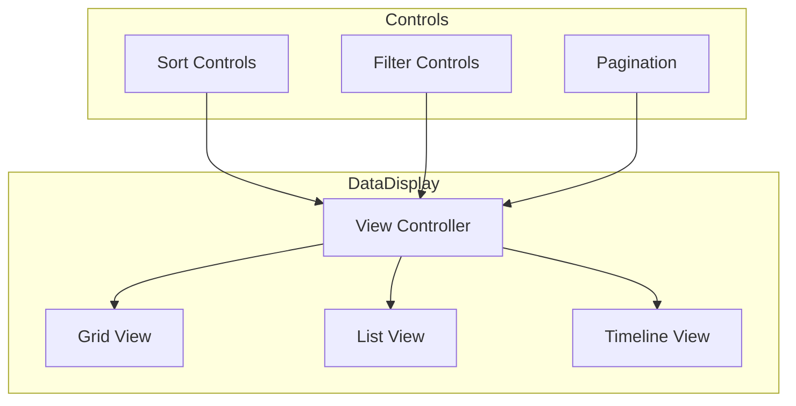

// filepath: C:\--ThinkAlike--\docs\components\ui_components\data_display.md
# Data Display Component Specification

## 1. Introduction

Defines the implementation of the data display component, a core UI element for visualizing and interacting with data across the platform.

## 2. Component Architecture

### 2.1 Component Structure



### 2.2 Interface Definition

```typescript
interface DataDisplayProps {
  data: DataItem[];
  viewType: 'list' | 'grid' | 'timeline';
  sortOptions?: SortOption[];
  filterOptions?: FilterOption[];
  onSort?: (option: SortOption) => void;
  onFilter?: (filters: FilterOption[]) => void;
  onItemSelect?: (item: DataItem) => void;
}
```

## 3. Implementation Details

### 3.1 View Types

```typescript
const DataDisplay: React.FC<DataDisplayProps> = ({
  data,
  viewType,
  sortOptions,
  filterOptions,
  onSort,
  onFilter,
  onItemSelect
}) => {
  const [currentView, setCurrentView] = useState(viewType);
  const [currentPage, setCurrentPage] = useState(1);

  // ...implementation details
};
```

## 4. Performance Optimization

### 4.1 Virtualization

```typescript
import { VirtualizedList } from '@/components/common/VirtualizedList';

const VirtualizedDataDisplay = () => {
  return (
    <VirtualizedList
      items={data}
      height={600}
      itemHeight={80}
      renderItem={(item) => (
        <DataItem key={item.id} {...item} />
      )}
    />
  );
};
```

## 5. Testing Strategy

### 5.1 Component Tests

```typescript
describe('DataDisplay', () => {
  it('renders correct view type', () => {
    const { container } = render(
      <DataDisplay
        data={mockData}
        viewType="grid"
      />
    );
    expect(container.querySelector('[data-testid="grid-view"]'))
      .toBeInTheDocument();
  });
});
```

## 6. Further Reference

* [Component Library](../common/README.md)
* [Performance Guidelines](../../guides/performance.md)
* [Testing Standards](../../guides/testing.md)

---
**Document Details**
- Title: Data Display Component Specification
- Type: Component Documentation
- Version: 1.0.0
- Last Updated: 2025-04-05
---
End of Data Display Component Specification
---


