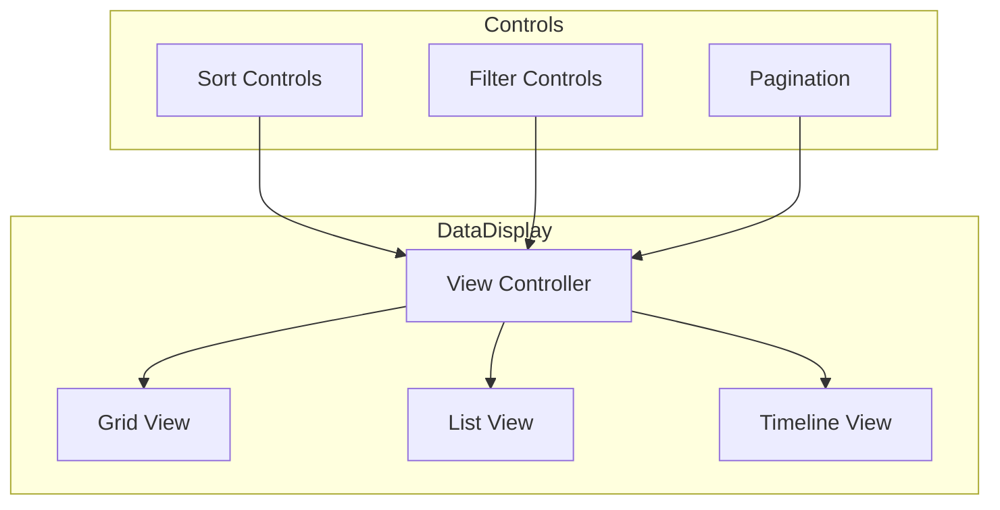

# Data Display Component Specification

## 1. Introduction

Defines the implementation of the data display component, a core UI element for visualizing and interacting with data
across the platform.

## 2. Component Architecture

### 2.1 Component Structure

This component standardizes how individual pieces of data (like user profile fields, configuration settings, AI model
parameters, or results from API calls) are shown, ensuring a cohesive user experience and providing a consistent target
for testing and validation workflows. It's a fundamental building block used within more complex components like Profile
Views, Settings Panels, and potentially the `Data Explorer Panel`.

* --

## 2. UI Components / Elements

The `DataDisplay` component adapts its rendering based on the `dataType` prop and the structure of the `data` prop.
Common elements include:

### 2.1 Label

* **Purpose:** Clearly identify the data being displayed.
* **UI Element:** A text label (e.g., `<strong>`, `<span>`) positioned typically above or beside the data value. Uses

fonts and styles defined in the [ThinkAlike Style Guide](../../guides/developer_guides/style_guide.md).

* **Content:** The human-readable name of the data field (e.g., "Username:", "Ethical Alignment Score:", "Last Login

Date:").

### 2.2 Value Display

* **Purpose:** Show the actual data value.
* **UI Element:** Varies based on `dataType`:
  * **Text/String:** Plain text (`<span>`, `<p>`). Long text might be truncated with an option to expand.
  * **Number:** Formatted numerical display.
  * **Boolean:** Displayed as "Yes"/"No", "True"/"False", or potentially a checkmark/cross icon.
  * **Date/Timestamp:** Formatted date/time string (e.g., "March 26, 2025 10:30 AM UTC").
  * **List/Array:** Rendered as a bulleted or numbered list, or comma-separated inline list depending on configuration.
  * **Object (Simple):** Rendered as key-value pairs (potentially using nested `DataDisplay` components). Avoid overly

complex object rendering; use specialized components for those.
  * **Masked:** For sensitive data (passwords, tokens), displays masked characters (e.g., "********").
* **Styling:** Adheres to standard text styles. May use specific styling for different data types (e.g., monospace for

code snippets if needed).

### 2.3 Tooltip for Traceability (Optional)

* **Purpose:** Provide contextual information about the data's origin or meaning, linking to the principle of Data

Traceability.

* **UI Element:** An info icon (ℹ️) next to the label or value, which reveals a tooltip on hover/click.
* **Content:** Displays metadata like:
  * `Data Source:` (e.g., "User Profile Input", "API: /api/users/me", "AI Model Output").
  * `Last Updated:` (Timestamp).
  * `Description:` Brief explanation of the data point's meaning or relevance.
  * Link to more detailed documentation or the `Data Explorer Panel`.

### 2.4 Validation Indicator (Optional)

* **Purpose:** Provide subtle visual cues about the validation status of the displayed data, linking to the "UI as

Validation Framework" principle.

* **UI Element:** A small icon or border color applied to the value display area.
  * *Default/Valid:* No specific indicator or a subtle confirmation (e.g., light green border on focus during validation

tests).
  * *Warning:* Yellow icon/border (e.g., data is present but potentially stale or unusual).
  * *Error:* Red icon/border (e.g., data failed validation checks, missing required data).
* **Interaction:** Hovering over the indicator could show a tooltip explaining the validation status/error (potentially

linking to `DataValidationError`).

* --

## 3. Data Flow and Interaction

1. **Data Input:** The parent component passes data to `DataDisplay` via props, including the `label`, `value`,

`dataType`, and optional `tooltipData` and `validationStatus`.

1. **Conditional Rendering:** The component internally determines how to render the `value` based on the `dataType`

prop.

1. **Formatting:** Applies necessary formatting (dates, numbers, masking).
2. **Tooltip Integration:** Renders the tooltip trigger and content if `tooltipData` is provided.
3. **Validation Styling:** Applies appropriate styling based on the `validationStatus` prop.
4. **Output:** Renders the formatted label and value with integrated tooltip and validation cues.



### 2.2 Interface Definition

```typescript

interface DataDisplayProps {
  data: DataItem[];
  viewType: 'list' | 'grid' | 'timeline';
  sortOptions?: SortOption[];
  filterOptions?: FilterOption[];
  onSort?: (option: SortOption) => void;
  onFilter?: (filters: FilterOption[]) => void;
  onItemSelect?: (item: DataItem) => void;
}

```

## 3. Implementation Details

### 3.1 View Types

```typescript

const DataDisplay: React.FC<DataDisplayProps> = ({
  data,
  viewType,
  sortOptions,
  filterOptions,
  onSort,
  onFilter,
  onItemSelect
}) => {
  const [currentView, setCurrentView] = useState(viewType);
  const [currentPage, setCurrentPage] = useState(1);

  // ...implementation details
};

```

## 4. Performance Optimization

### 4.1 Virtualization

```typescript

import { VirtualizedList } from '@/components/common/VirtualizedList';

const VirtualizedDataDisplay = () => {
  return (
    <VirtualizedList
      items={data}
      height={600}
      itemHeight={80}
      renderItem={(item) => (
        <DataItem key={item.id} {...item} />
      )}
    />
  );
};

```

## 5. Testing Strategy

### 5.1 Component Tests

```typescript

describe('DataDisplay', () => {
  it('renders correct view type', () => {
    const { container } = render(
      <DataDisplay
        data={mockData}
        viewType="grid"
      />
    );
    expect(container.querySelector('[data-testid="grid-view"]'))
      .toBeInTheDocument();
  });
});

```

## 6. Further Reference

* [Component Library](../common/README.md)
* [Performance Guidelines](../../guides/performance.md)
* [Testing Standards](../../guides/testing.md)

* --

## Document Details

* Title: Data Display Component Specification

* Type: Component Documentation

* Version: 1.0.0

## - Last Updated: 2025-04-05

## End of Data Display Component Specification
