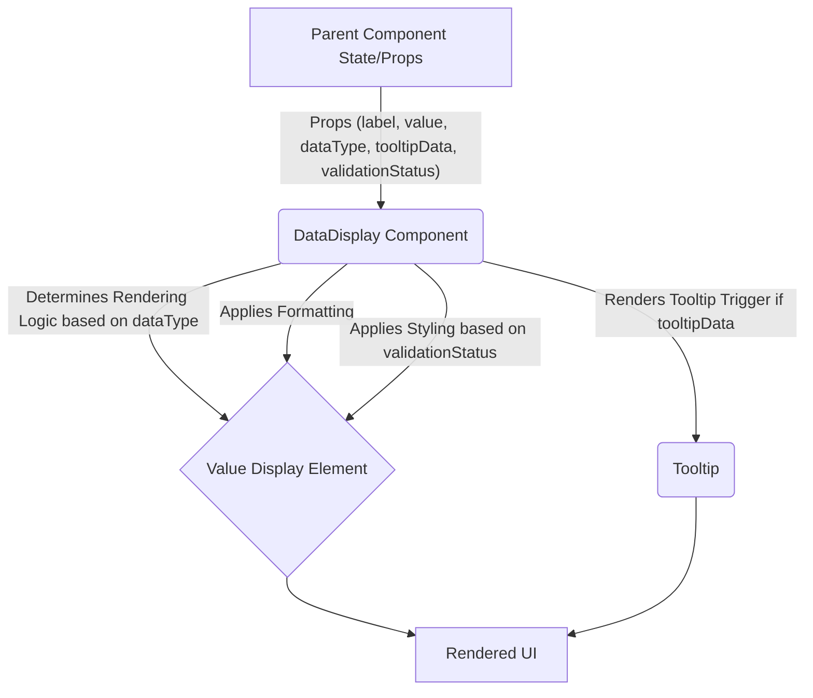

# Design Document: DataDisplay UI Component

---

## 1. Introduction and Description

The **DataDisplay** component is a foundational, reusable React UI component within ThinkAlike, designed for consistently rendering various types of data points and information snippets throughout the application. Its purpose extends beyond simple presentation; it integrates subtle validation cues and provides hooks for data traceability, reinforcing ThinkAlike's core principles of **Transparency** and **UI as a Validation Framework**.

This component standardizes how individual pieces of data (like user profile fields, configuration settings, AI model parameters, or results from API calls) are shown, ensuring a cohesive user experience and providing a consistent target for testing and validation workflows. It's a fundamental building block used within more complex components like Profile Views, Settings Panels, and potentially the `Data Explorer Panel`.

---

## 2. UI Components / Elements

The `DataDisplay` component adapts its rendering based on the `dataType` prop and the structure of the `data` prop. Common elements include:

### 2.1 Label

*   **Purpose:** Clearly identify the data being displayed.
*   **UI Element:** A text label (e.g., `<strong>`, `<span>`) positioned typically above or beside the data value. Uses fonts and styles defined in the [ThinkAlike Style Guide](../../guides/developer_guides/style_guide.md).
*   **Content:** The human-readable name of the data field (e.g., "Username:", "Ethical Alignment Score:", "Last Login Date:").

### 2.2 Value Display

*   **Purpose:** Show the actual data value.
*   **UI Element:** Varies based on `dataType`:
    *   **Text/String:** Plain text (`<span>`, `<p>`). Long text might be truncated with an option to expand.
    *   **Number:** Formatted numerical display.
    *   **Boolean:** Displayed as "Yes"/"No", "True"/"False", or potentially a checkmark/cross icon.
    *   **Date/Timestamp:** Formatted date/time string (e.g., "March 26, 2025 10:30 AM UTC").
    *   **List/Array:** Rendered as a bulleted or numbered list, or comma-separated inline list depending on configuration.
    *   **Object (Simple):** Rendered as key-value pairs (potentially using nested `DataDisplay` components). Avoid overly complex object rendering; use specialized components for those.
    *   **Masked:** For sensitive data (passwords, tokens), displays masked characters (e.g., "********").
*   **Styling:** Adheres to standard text styles. May use specific styling for different data types (e.g., monospace for code snippets if needed).

### 2.3 Tooltip for Traceability (Optional)

*   **Purpose:** Provide contextual information about the data's origin or meaning, linking to the principle of Data Traceability.
*   **UI Element:** An info icon (ℹ️) next to the label or value, which reveals a tooltip on hover/click.
*   **Content:** Displays metadata like:
    *   `Data Source:` (e.g., "User Profile Input", "API: /api/users/me", "AI Model Output").
    *   `Last Updated:` (Timestamp).
    *   `Description:` Brief explanation of the data point's meaning or relevance.
    *   Link to more detailed documentation or the `Data Explorer Panel`.

### 2.4 Validation Indicator (Optional)

*   **Purpose:** Provide subtle visual cues about the validation status of the displayed data, linking to the "UI as Validation Framework" principle.
*   **UI Element:** A small icon or border color applied to the value display area.
    *   *Default/Valid:* No specific indicator or a subtle confirmation (e.g., light green border on focus during validation tests).
    *   *Warning:* Yellow icon/border (e.g., data is present but potentially stale or unusual).
    *   *Error:* Red icon/border (e.g., data failed validation checks, missing required data).
*   **Interaction:** Hovering over the indicator could show a tooltip explaining the validation status/error (potentially linking to `DataValidationError`).

---

## 3. Data Flow and Interaction

1.  **Data Input:** The parent component passes data to `DataDisplay` via props, including the `label`, `value`, `dataType`, and optional `tooltipData` and `validationStatus`.
2.  **Conditional Rendering:** The component internally determines how to render the `value` based on the `dataType` prop.
3.  **Formatting:** Applies necessary formatting (dates, numbers, masking).
4.  **Tooltip Integration:** Renders the tooltip trigger and content if `tooltipData` is provided.
5.  **Validation Styling:** Applies appropriate styling based on the `validationStatus` prop.
6.  **Output:** Renders the formatted label and value with integrated tooltip and validation cues.



## 4. Code Implementation Notes

Framework: React.

Props:

label: (String, Required) The text label for the data.

value: (Any, Required) The actual data value to display.

dataType: (Enum: 'text', 'number', 'boolean', 'date', 'list', 'object', 'masked', Required) Specifies how to format and render the value.

tooltipData: (Object, Optional) Contains data for the traceability tooltip ({ source: string, lastUpdated: string, description: string, link?: string }).

validationStatus: (Enum: 'valid', 'warning', 'error', Optional) Determines the validation indicator style.

validationMessage: (String, Optional) Message displayed on hover/focus of the validation indicator.

className: (String, Optional) For additional CSS styling.

listFormat: (Enum: 'bullet', 'number', 'inline', Optional) How to display list data.

objectMaxDepth: (Number, Optional, Default: 1) Limit for rendering nested objects to prevent excessive complexity.

Implementation:

Use a switch statement or mapping object based on dataType to select the appropriate rendering function/sub-component for the value.

Employ helper functions for formatting dates, numbers, and masking sensitive strings.

Integrate a standard Tooltip component library (e.g., react-tooltip) or build a simple one.

Use conditional CSS classes or styled-components logic based on validationStatus.

Modularity: Keep the component focused on displaying individual data points. More complex structures should compose multiple DataDisplay instances or use specialized components.

```javascript
// Example React Component Structure (Conceptual)

import React from 'react';
// import ReactTooltip from 'react-tooltip'; // Example library
// import formatters from './formatters'; // Your formatting utils
// import ValidationIcon from './ValidationIcon';

function DataDisplay({
  label,
  value,
  dataType = 'text',
  tooltipData,
  validationStatus = 'valid',
  validationMessage,
  className,
  listFormat = 'inline',
  objectMaxDepth = 1
}) {

  const renderValue = () => {
    switch (dataType) {
      case 'number':
        return <span>{formatters.formatNumber(value)}</span>; // Example
      case 'boolean':
        return <span>{value ? 'Yes' : 'No'}</span>;
      case 'date':
        return <time dateTime={value}>{formatters.formatDateTime(value)}</time>; // Example
      case 'list':
        if (!Array.isArray(value)) return <span className="error">Invalid list data</span>;
        if (listFormat === 'inline') return <span>{value.join(', ')}</span>;
        const ListTag = listFormat === 'number' ? 'ol' : 'ul';
        return <ListTag>{value.map((item, i) => <li key={i}>{renderSimpleValue(item)}</li>)}</ListTag>; // Recursion for simple items
      case 'object':
         if (typeof value !== 'object' || value === null) return <span className="error">Invalid object data</span>;
         // Basic object rendering (use recursion carefully with depth limit)
         return <pre><code>{JSON.stringify(value, null, 2)}</code></pre>; // Simple JSON for example
      case 'masked':
        return <span>{'*'.repeat(String(value).length > 0 ? 8 : 0)}</span>;
      case 'text':
      default:
        return <span>{value}</span>;
    }
  };

  // Helper for simple values within lists/objects (prevents deep recursion issues)
  const renderSimpleValue = (itemValue) => {
      if (typeof itemValue === 'object') return '[Object]'; // Prevent deep render here
      return String(itemValue);
  }

  const validationClass = `validation-${validationStatus}`;

  return (
    <div className={`data-display ${validationClass} ${className || ''}`}>
      <strong className="data-label">
        {label}
        {tooltipData && (
           // Add data-tip attributes for react-tooltip or similar
          <span data-tip={JSON.stringify(tooltipData)} data-for={`tooltip-${label}`}> ℹ️</span>
        )}
      </strong>
      <div className="data-value" title={validationStatus !== 'valid' ? validationMessage : ''}>
        {renderValue()}
        {/* Or render ValidationIcon component here */}
      </div>
       {/* Tooltip Component instantiation if needed e.g., <ReactTooltip id={`tooltip-${label}`} getContent={(dataTip) => JSON.parse(dataTip)?.description } /> */}
    </div>
  );
}

export default DataDisplay;
```

## 5. Testing Instructions

Data Type Rendering: Test with various value props for each dataType ('text', 'number', 'boolean', 'date', 'list', 'object', 'masked'). Verify the output is correctly formatted and rendered. Test handling of null/undefined values.

List Rendering: Test listFormat prop ('bullet', 'number', 'inline') with array data. Verify correct list type and content.

Object Rendering: Test with simple objects. Verify basic key-value display or JSON output. Test objectMaxDepth if implemented.

Masking: Provide sensitive strings to value with dataType='masked'. Verify output is masked correctly (e.g., "********").

Tooltip Display: Provide tooltipData. Verify the info icon appears and hovering/clicking reveals a tooltip with the correct source, description, etc.

Validation Status Styling: Pass different validationStatus props ('valid', 'warning', 'error'). Verify the component applies the corresponding CSS class and/or renders the correct validation icon/border. Check validationMessage display on hover.

Accessibility: Test label association, tooltip accessibility (keyboard trigger, screen reader announcement), and color contrast for validation states.

Responsiveness: Ensure the component displays correctly on various screen sizes.

## 6. UI Mockup Placeholder

Refer to the project's central design repository for visual mockups.

[Placeholder: Link or embed visual mockup of the DataDisplay component showing different data types and validation states here]

## 7. Dependencies & Integration

Depends On:

ThinkAlike Style Guide (typography, colors).

Date/Number formatting utility functions.

Masking utility function.

Tooltip component library (optional).

Integrates With:

Almost any component needing to display labeled data (Profile Views, Settings, Dashboards, Data Explorer Panel, AI Transparency Log).

Potentially DataValidationError (tooltip could link to it).

Testing framework UI (used to display test parameters or results).

## 8. Future Enhancements

Support for more complex data types (e.g., currency, percentages).

Inline editing capabilities (optional prop).

Click-to-copy functionality for values.

More sophisticated object/nested data rendering options.

Integration with internationalization (i18n) libraries for labels and formatting.
