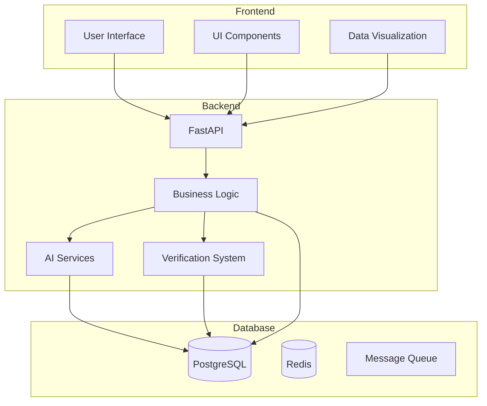
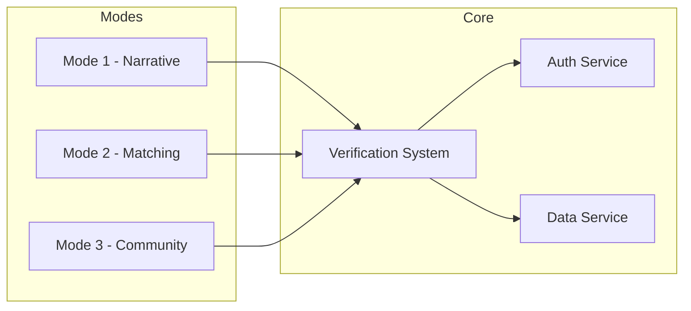
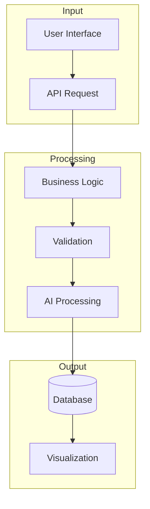
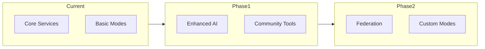

# Technical Architecture Specification

## Document Purpose

This document provides a **high-level overview of the ThinkAlike project's architecture.** It outlines the major
components, layers, and design principles that underpin the platform. This document serves as an entry point to
understanding the overall technical structure of ThinkAlike and provides links to more detailed architectural
specifications for specific modules and components.

## Three-Tier Architecture

### 2.1 High-Level Overview



1. **Frontend (Presentation Tier):**

    * **Technology:** React (JavaScript)
    * **Responsibility:** Handles the User Interface (UI), user interactions, and data visualization.
    * **Key Components:**
        * UI Component Library (`docs/components/ui_component_library/ui_component_library.md`): Reusable UI elements

and design system for consistent user experience.
        * Mode-Specific Components: Components for each of the 3 Modes (Narrative, Matching, Community), implementing

mode-specific functionalities and user workflows.
        * `DataTraceability.jsx` Component (`docs/components/datatraceability/datatraceability_component_spec.md`): For

visualizing data flows and algorithm processes, enhancing transparency.
        * API Client: Handles communication with the Backend API to fetch and submit data.

1. **Backend (Application Tier):**

    * **Technology:** Python (or similar - to be finalized)
    * **Responsibility:** Handles application logic, data processing, API endpoints, security, and interaction with the

database.
    * **Key Components:**
        * API Endpoints (`docs/architecture/api/api_endpoints.md`): Defines all API endpoints for frontend

communication, including endpoints for user authentication, data retrieval, matching algorithm execution, and community
management.
        * Matching Algorithm: Implements the value-based and ethically weighted matching logic for Mode 2.
        * Verification System Modules (`docs/architecture/verification_system/verification_system_spec.md`): Backend

components of the Verification System, handling ethical validation, data traceability, and audit logging.
        * Community Management Logic: Handles backend logic for Mode 3 community creation, management, and governance

features.
        * Security Modules (`docs/architecture/security/security_considerations.md`): Implements security measures for

authentication, authorization, data protection, and vulnerability prevention.

1. **Database (Data Tier):**

    * **Technology:** To be determined (e.g., PostgreSQL, MongoDB - to be finalized)
    * **Responsibility:** Persistent storage of all platform data, including user profiles, narratives, values,

community data, relationships, and system logs.
    * **Schema:** Defined in `docs/architecture/database/database_schema.md`, outlining data models, relationships, and

data integrity constraints.

## Modular Design and Key Modules

### 2.2 Component Architecture



## 3. Modular Design and Key Modules

1. **Mode Modules (Narrative, Matching, Community):** The core functional modules of the platform, each responsible for

a distinct set of features and user experiences, as detailed in `docs/architecture/modes/modes_overview.md` and
subfolders.

1. **Verification System Module:** A cross-cutting module integrated throughout the platform, responsible for ensuring

ethical integrity, transparency, and accountability (see
`docs/architecture/verification_system/verification_system_spec.md`).

1. **UI Component Library Module:** A reusable library of frontend components ensuring a consistent user interface and

design language across all parts of the platform (see `docs/components/ui_component_library/ui_component_library.md`).

1. **API Module:** Defines the communication interface between the frontend and backend, enabling modular development

and clear separation of concerns (see `docs/architecture/api/api_endpoints.md`).

## Key Architectural Principles

* **Ethical by Design:** Ethical considerations are baked into the architecture from the ground up, guided by the

Ethical Guidelines (`docs/core/ethics/ethical_guidelines.md`) and enforced by the Verification System.

* **User-Centricity:** The architecture prioritizes user needs, user empowerment, and user agency, ensuring the platform

serves users ethically and effectively.

* **Decentralization (Especially in Community Mode):** Mode 3 is architected for decentralization, empowering

communities and minimizing central platform control.

* **Transparency and Data Traceability:** The architecture supports radical transparency and data traceability, enabling

users and auditors to understand data flows and algorithm processes.

* **Modularity and Maintainability:** The modular design promotes code organization, maintainability, and scalability,

allowing for future feature additions and platform evolution.

* **API-Driven Communication:** Utilizing a well-defined API for frontend-backend communication ensures clear interfaces

and facilitates independent development of frontend and backend components.

* **Security First:** Security considerations are integrated into every layer of the architecture, ensuring user data

protection and platform resilience against vulnerabilities (see
`docs/architecture/security/security_considerations.md`).

* **Ethical by Design:** Ethical considerations are baked into the architecture from the ground up, guided by the

Ethical Guidelines (`docs/core/ethics/ethical_guidelines.md`) and enforced by the Verification System.

* **User-Centricity:** The architecture prioritizes user needs, user empowerment, and user agency, ensuring the platform

serves users ethically and effectively.

* **Decentralization (Especially in Community Mode):** Mode 3 is architected for decentralization, empowering

communities and minimizing central platform control.

* **Transparency and Data Traceability:** The architecture supports radical transparency and data traceability, enabling

users and auditors to understand data flows and algorithm processes.

* **Modularity and Maintainability:** The modular design promotes code organization, maintainability, and scalability,

allowing for future feature additions and platform evolution.

* **API-Driven Communication:** Utilizing a well-defined API for frontend-backend communication ensures clear interfaces

and facilitates independent development of frontend and backend components.

* **Security First:** Security considerations are integrated into every layer of the architecture, ensuring user data

protection and platform resilience against vulnerabilities (see
`docs/architecture/security/security_considerations.md`).

* **Human-Artificial Swarm Intelligence (HASI):** The architecture is designed to support a **Human-Artificial Swarm

Intelligence (HASI)** model, where user agency interacts with specialized AI services, facilitated by a central API and
governed by the Verification System, to achieve emergent outcomes. This decentralized and collaborative approach ensures
that human values and ethical principles remain at the core of all interactions while leveraging AI to augment human
capabilities.

## Data Flow and Processing

### 3.1 Mode Modules

* Narrative Mode
* Matching Mode
* Community Mode

### 3.2 Verification System Module

Cross-cutting module for ethical integrity and transparency

### 3.3 UI Component Library Module

Reusable frontend components ensuring consistent design

* **User Data Input:** Users input data through the Frontend UI in various Modes (Narrative creation, profile settings,

community interactions).

* **API Communication:** Frontend communicates with the Backend API to send user input, request data, and trigger

backend processes.

* **Backend Data Processing:** Backend processes user data according to application logic (e.g., matching algorithm,

community management logic), respecting user privacy and ethical guidelines.

* **Database Persistence:** Processed data and platform state are persistently stored in the Database.
* **Data Visualization (DataTraceability):** `DataTraceability.jsx` in the Frontend visualizes key data flows and

algorithm processes, enhancing transparency and user understanding.

## Scalability and Future Evolution

### 3.4 API Module

Defines frontend-backend communication interfaces

## 4. Key Architectural Principles

* **Ethical by Design:** Ethics integrated from ground up
* **User-Centricity:** Prioritizes user needs and agency
* **Decentralization:** Especially in Community Mode
* **Transparency:** Supports radical transparency
* **Modularity:** Promotes maintainability
* **API-Driven:** Clear interface boundaries
* **Security First:** Integrated security at all layers

* **Modular Design:** Modularity allows for independent scaling of different components as needed (e.g., scaling backend

API servers to handle increased user load).

* **Cloud-Ready Deployment:** The architecture is designed to be deployable on cloud platforms, leveraging cloud

infrastructure for scalability and resilience.

* **Open APIs and Extensibility:** Well-defined APIs and a modular design facilitate future extensibility, allowing for

the addition of new features, Modes, and integrations as the project evolves.

* **Community-Driven Development:** Open-source development and community contribution are encouraged to foster ongoing

innovation and adaptation to user needs and evolving technological landscapes.

## Further Documentation

## 5. Data Flow and Processing



## 6. Scalability and Future Evolution



## 7. Further Documentation

* [API Documentation](../api/api_endpoints.md)
* [Database Schema](./database/unified_data_model_schema.md)
* [Security Plan](./security/security_and_privacy_plan.md)
* [Verification System](./verification_system/verification_system.md)

* --

## Document Details

* Title: Technical Architecture Specification

* Type: Technical Documentation

* Version: 1.0.0

## - Last Updated: 2025-04-05

## End of Technical Architecture Specification

```mermaid

graph LR
    subgraph "User Interface (Browser)"
        direction TB
        User(👤 User) --> FrontendUI[React Frontend UI];
        FrontendUI -- API Calls (HTTPS/JWT) --> BackendAPI;
        subgraph "UI Components"
            direction TB
            DisplayComponents[Display Components (DataDisplay, etc.)]
            FormComponents[Input Components (UserForm, etc.)]
            ValidationUI[Validation UI Components <br>(APIValidator, CoreValuesValidator,<br>DataTraceability, SecurityStatusIndicator)]
        end
        FrontendUI --> DisplayComponents;
        FrontendUI --> FormComponents;
        FrontendUI --> ValidationUI;
        ValidationUI -- Displays Status/Data --> FrontendUI;
        style ValidationUI fill:#fce38a,stroke:#a37a00
        note right of ValidationUI : UI acts as Validation Framework
    end

    subgraph "Backend Application (Server)"
        direction TB
        BackendAPI[FastAPI Backend API Gateway];
        subgraph "Core Services / Logic"
            AuthService[Authentication Service];
            UserProfileService[User/Profile Service];
            Mode1Service[Mode 1 Service (Narrative)];
            Mode2Service[Mode 2 Service (Discovery/Connection)];
            Mode3Service[Mode 3 Service (Community)];
            IntegrationService[External Integration Service];
        end
        subgraph "AI Modules"
            NarrativeEngine[AI Narrative Engine];
            MatchingEngine[AI Matching Engine];
            CloneEngine[AI Clone Persona Engine <br>(Audiovisual Analysis)];
            VoiceEngine[AI Voice Profile Engine]; // Added based on clarification
            CommunityEngine[AI Community Engine (Future)];
        end
        VerificationSystem[Verification System <br>(Ethical/Functional Rules)];
        BackendAPI --> AuthService;
        BackendAPI --> UserProfileService;
        BackendAPI --> Mode1Service;
        BackendAPI --> Mode2Service;
        BackendAPI --> Mode3Service;
        BackendAPI --> IntegrationService;
        BackendAPI -- Request Validation --> VerificationSystem;

        AuthService <--> Database[(Database <br> PostgreSQL/SQLite)];
        UserProfileService <--> Database;
        Mode1Service <--> Database;
        Mode2Service <--> Database;
        Mode3Service <--> Database;
        IntegrationService <--> Database;
        VerificationSystem <--> Database;

        Mode1Service --> NarrativeEngine;
        Mode2Service --> MatchingEngine;
        UserProfileService -- Trigger --> CloneEngine;
        UserProfileService -- Trigger --> VoiceEngine; // Added
        IntegrationService --> ExternalAPIs[3rd Party Services <br>(Goodreads, Spotify API, etc.)];

        NarrativeEngine -- Interaction Data --> MatchingEngine;
        NarrativeEngine <--> Database; -- (Narrative State)
        MatchingEngine <--> Database; -- (Match Scores/Data)
        CloneEngine --> Database; -- (Store Visual Clone Params)
        VoiceEngine --> Database; -- (Store Voice Clone Params) // Added

        AuthService -- Validation Req --> VerificationSystem;
        UserProfileService -- Validation Req --> VerificationSystem;
        Mode1Service -- Validation Req --> VerificationSystem;
        Mode2Service -- Validation Req --> VerificationSystem;
        Mode3Service -- Validation Req --> VerificationSystem;
        IntegrationService -- Validation Req --> VerificationSystem;
        MatchingEngine -- Ethical Audit Req --> VerificationSystem;
        CloneEngine -- Ethical Audit Req --> VerificationSystem;
        VoiceEngine -- Ethical Audit Req --> VerificationSystem; // Added

        VerificationSystem -- Validation Result --> BackendAPI; // Or relevant Service
        VerificationSystem -- Logs --> AuditLogDB[(Verification Audit Log <br>in Database)];

        style VerificationSystem fill:#95e1d3,stroke:#0d5c4d
        style FrontendUI fill:#f9f,stroke:#333
        style BackendAPI fill:#ccf,stroke:#333
        style Database fill:#fcf,stroke:#333
        style AuditLogDB fill:#fcf,stroke:#333
        style ExternalAPIs fill:#f38181,stroke:#9a1f1f
    end

```
