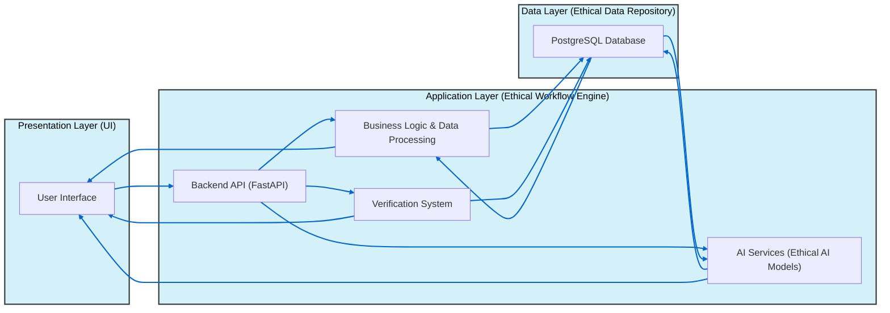

# ThinkAlike Onboarding Manual

**Welcome to the ThinkAlike project!**

This comprehensive guide provides a detailed overview of the ThinkAlike project, its revolutionary goals, core values, architectural design, and, most importantly, **how YOU can contribute to building a more ethical and human-centered digital world!**

Whether you are a seasoned developer, a passionate designer, a visionary AI researcher, or simply an individual who believes in a better digital future, this manual will provide you with the knowledge and resources to get started and become a vital part of the ThinkAlike movement.

**Read This Manual Carefully - It is Your Starting Point!** Following these instructions and immersing yourself in the ThinkAlike philosophy is crucial for aligning your contributions with the project's core vision and ensuring we build a truly revolutionary platform, together.

**Project Overview - Building a Humane Digital Future, Together**

ThinkAlike is not just another tech project; it is a **transformative, open-source platform** with a bold mission: to revolutionize human connection in the digital age. We are building a system that utilizes AI – not for manipulation or exploitation – but to **foster authentic human relationships based on shared values, interests, and a commitment to ethical technology.**

**Our Revolutionary Goals:**

*   **Discover Yourself (Narrative Mode):**  Embark on a journey of self-discovery within ThinkAlike's Narrative Mode, exploring your core values, beliefs, aspirations, and your vision for a better digital future.  Create your personal narrative and define your ethical compass within our platform.
*   **Connect with Like-Minded Individuals (Matching Mode):**  Utilize ThinkAlike's ethically weighted Matching Mode to discover and forge genuine connections with individuals who share your deeply held values and principles. Move beyond superficial interactions and build relationships that matter.
*   **Build Meaningful Real-World Relationships (Matching & Community Modes):**  Transition online interactions into authentic, meaningful relationships in the real world. ThinkAlike is designed to be a bridge, connecting like-minded individuals not just digitally, but in tangible, real-world communities.
*   **Contribute to a Better Future (All Modes & Community):** Become an active participant in a global community dedicated to building ethical AI and responsible technology. Your contributions to ThinkAlike, whether code, design, documentation, or community building, are direct actions towards creating a more humane digital world.
*   **Collaborate and Build Decentralized Communities (Community Mode):**  Empower the creation of self-governing, value-aligned communities within ThinkAlike's Community Mode.  Build new forms of decentralized, democratic organization, powered by technology that always respects user agency and freedom.

**Our Core Objective: High-Performance, Ethical, and User-Centered Technology**

ThinkAlike is not just about lofty ideals; it is about building concrete, high-performing technology that embodies those ideals in every line of code and every UI component. Our core objective is to demonstrate that technology can be:

*   **Human-Centered and Empowering:**  AI assists, not replaces, human agency. Technology empowers users to make informed choices and control their digital experiences, rather than being manipulated or controlled by algorithms.
*   **Ethically Sound and Transparent:**  Data is a tool for empowerment, not exploitation. Data workflows are transparent, auditable, and designed to enhance user agency, with UI validation components ensuring ethical data handling practices are rigorously implemented and visible.
*   **Architecturally Robust and User-Validated:**  The UI serves as a "validation framework component," ensuring that code implementation is directly aligned with real user experience and that architectural design choices are continuously validated through user feedback and data traceability.

ThinkAlike is more than just a platform; it is a **movement**. We are building a global community of contributors and users united by a shared vision: to reclaim the digital realm for humanity, to build technology that serves ethical values, and to forge genuine human connections in an increasingly digital world. Join us, comrade, and become part of the ThinkAlike Revolution!

---

## Table of Contents
1. [1.1. Core Goals for MVP Implementation](#11-core-goals-for-mvp-implementation-action-driven-ethical-workflow-framework)
2. [1.2. Core Values - The Ethical Compass of ThinkAlike](#12-core-values---the-ethical-compass-of-thinkalike)
3. [1.3. Architectural Overview - Building Blocks of ThinkAlike](#13-architectural-overview---building-blocks-of-thinkalike)
4. [1.4. UI Components - Building Blocks for User Experience](#14-ui-components---building-blocks-for-user-experience)
5. [1.5. Data Handling - Ethical Data Stewardship and User-Privacy](#15-data-handling---ethical-data-stewardship-and-user-privacy)
6. [1.6. AI Models - Ethical Explainable and User-Centric Artificial Intelligence](#16-ai-models---ethical-explainable-and-user-centric-artificial-intelligence)

---

## 1.1. Core Goals for MVP Implementation: Action-Driven Ethical Workflow Framework
This section outlines the ThinkAlike MVP’s driving objectives, showing how ethical principles guide the technology from inception. By anchoring functionality in user empowerment and transparent data handling, it paves the way toward a more humane digital experience.

The ThinkAlike platform’s MVP (Minimum Viable Product) implementation is laser-focused on rigorously testing our core goals across every architectural layer. Our MVP is not just about demonstrating basic functionality; it is about creating an **action-driven ethical workflow framework** that will guide all future development.

Every technological component of our AI data integration plan, even in this early MVP stage, is purpose-built to **empower users with self-awareness and agency** during every interaction. By gathering continuous feedback at every process and component level – from UI/UX responses to backend data validation – user input directly shapes the ongoing evolution of our ethical AI systems.

**ThinkAlike's MVP aims to definitively demonstrate that:**

*   **Technology Enhances User Freedom:** ThinkAlike technology empowers users to make truly informed choices, exercise meaningful control over their digital identities and interactions, and experience a sense of liberation within the digital realm, rather than feeling constrained or manipulated.
*   **Data is a Tool for Empowerment, Not Exploitation:**  ThinkAlike demonstrably utilizes data transparently and ethically, solely as a tool to provide users with valuable insights, enhance their agency, and facilitate value-aligned connections. Data is *not* used for opaque algorithmic manipulation, surveillance capitalism, or purposes that do not directly benefit the user and align with their explicit consent and ethical expectations.
*   **UI Validates Ethical Implementation: "Validation Framework Component":** The ThinkAlike User Interface is not merely a visual presentation layer; it serves as a **"Validation Framework Component,"** actively and demonstrably validating the ethical implementation of the entire platform. Through UI components like `DataTraceability`, `APIValidator`, and `CoreValuesValidator`, the UI provides:
    *   **Real-time Data Flow Visualization:** Makes data flows transparent and understandable to both users and developers, ensuring accountability and revealing the inner workings of AI-driven features.
    *   **Actionable Feedback Loops:** Provides clear and immediate feedback loops to validate data input, AI processing, and API interactions, ensuring data integrity and workflow correctness at every stage.
    *   **Ethical Parameter Monitoring:** Visually monitors key ethical parameters and metrics, allowing for continuous ethical auditing and validation of AI behavior and platform-wide adherence to Enlightenment 2.0 principles.

The ThinkAlike MVP is not the final product; it is the crucial foundation upon which we will build a truly revolutionary platform. It is a working demonstration – in code, design, and user experience – of our core values and our unwavering commitment to a more humane digital future. By achieving these MVP goals, we will prove that ethical, transparent, and user-empowering technology is not just a utopian dream, but a tangible reality that we are actively building, together.

---

## 1.2. Core Values - The Ethical Compass of ThinkAlike
This section explores the fundamental principles that underpin ThinkAlike’s mission. Emphasizing ethics and humanity in technology, these values shape every decision, ensuring contributors align with the project’s commitment to a people-centered future.

ThinkAlike is not driven by profit, hype, or technological determinism. We are guided by a deeply held set of **core values**, which serve as the ethical compass for every decision we make, every line of code we write, and every feature we design. These values are the bedrock of Enlightenment 2.0 and the soul of the ThinkAlike project:

1.  **Human-Centered Approach: Prioritizing Human Dignity and Well-being:**
    At ThinkAlike, humanity comes first. We fundamentally believe that technology must serve human needs, enhance human capabilities, and foster genuine human flourishing. Technology is not an end in itself, but a tool to empower individuals and build a better world for all. Human dignity, agency, and well-being are paramount and will always take precedence over technological advancement or purely economic metrics.

2.  **Ethical AI: Responsible, Transparent, and User-Controlled Artificial Intelligence:**
    We are committed to ethical AI development and deployment. AI within ThinkAlike is not intended to replace human agency or make decisions for users. Instead, AI serves as a powerful tool to augment human intelligence, empower informed choices, and facilitate value-driven connections. We are dedicated to building AI systems that are:
    *   **Transparent and Explainable:**  AI decision-making processes are designed to be understandable and auditable, not opaque "black boxes."
    *   **User-Controlled:**  Users retain meaningful control over how AI interacts with them, their data, and their digital experiences.
    *   **Bias-Mitigated:**  We actively work to identify, mitigate, and prevent biases in our AI models and algorithms, striving for fairness and equity in AI-driven features.
    *   **Ethically Validated:**  All AI implementations undergo rigorous ethical validation and continuous monitoring to ensure alignment with ThinkAlike's core values and ethical guidelines.

3.  **Transparency & Traceability: Building Trust Through Openness and Accountability:**
    Trust is the foundation of any ethical and sustainable system. ThinkAlike is built on a foundation of radical transparency and data traceability. We believe that openness fosters accountability, empowers users, and builds genuine trust in technology. This commitment to transparency is manifested in:
    *   **Open Source Codebase:**  The ThinkAlike codebase is intended to be fully open source (to be finalized based on licensing decisions), allowing for community scrutiny, auditability, and collaborative development.
    *   **Public Documentation:**  We are committed to providing comprehensive and publicly accessible documentation for all aspects of the project, from architectural design specs to API endpoints to ethical guidelines. This Onboarding Manual is a key part of our commitment to transparent communication.
    *   **UI-Driven Data Flow Visualization:**  The `DataTraceability` component in the UI provides users with a visual representation of data flows within the platform, making data processing and AI workflows understandable and auditable directly within the user interface.
    *   **Verification System for Ethical Auditing:**  The Verification System is designed to provide a robust framework for continuous ethical auditing and validation of ThinkAlike's AI implementations, data handling practices, and overall platform behavior, ensuring ongoing accountability and adherence to our ethical principles.

4.  **User Empowerment: Digital Sovereignty and Agency in the Digital Realm:**
    Enlightenment 2.0 places **user empowerment** at the heart of digital systems. Users are not passive consumers or data sources; they are **active agents** with a right to control their digital experiences, data, and the technologies that shape their lives. This is about **digital sovereignty** – the right of individuals and communities to govern their own digital destinies.
    *   **User Agency and Choice:**  Designing technology that maximizes user agency, providing meaningful choices and avoiding manipulative or coercive design patterns.
    *   **Data Sovereignty and Privacy:**  Empowering users with ownership and control over their personal data, ensuring robust privacy protections and minimizing data extraction.
    *   **Decentralized Control and Governance:**  Favoring decentralized platforms and governance models that distribute power to users and communities, rather than centralizing it in corporations or institutions.
    *   **Participatory Design and Development:**  Involving users in the design and development process, ensuring technology is built *with* and *for* the people, not just *for profit*.
    *   **Right to Understand and Modify Technology:**  Promoting digital literacy and empowering users to understand and, where possible, modify the technologies they use, fostering a culture of technological empowerment, not dependence.

5.  **Authenticity: Fostering Genuine Human Connection and Value-Based Relationships:**
    In a digital world often dominated by superficiality and inauthenticity, ThinkAlike is a sanctuary for **genuine human connection.** We believe that technology can and should be used to foster meaningful relationships, build real community, and enhance human well-being, not to promote superficiality, isolation, or inauthentic interactions.
    *   **Value-Based Matching (Mode 2):**  The Matching Mode algorithm prioritizes connections based on shared values and principles, moving beyond superficial criteria like profile photos or fleeting interests.
    *   **Narrative Mode for Self-Expression (Mode 1):**  Narrative Mode empowers users to articulate their authentic selves, share their personal stories, and express their core values through their narratives, fostering deeper and more meaningful connections.
    *   **Community Mode for Value-Aligned Groups (Mode 3):**  Community Mode enables the formation of groups centered around shared values and common purpose, creating digital spaces for genuine belonging and collaborative action.
    *   **Discouraging Superficiality and Gamification:**  ThinkAlike consciously avoids design patterns and features that incentivize superficiality, social comparison, or the gamification of human connection, prioritizing genuine interaction over fleeting "engagement" metrics.

6.  **Inclusivity: Accessible and Ethical Technology for All:**
    Enlightenment 2.0 and ThinkAlike are not exclusive movements; they are for **all of humanity.** We are committed to building technology that is **accessible, inclusive, and beneficial to everyone**, regardless of background, technical expertise, or ability. Inclusivity is reflected in:
    *   **Accessibility-Focused Design:**  We strive to design ThinkAlike to be accessible to users with disabilities, adhering to accessibility guidelines (WCAG) and ensuring UI components and content are usable by everyone.
    *   **Multilingual Support (Future):**  We plan to expand ThinkAlike to support multiple languages in the future, breaking down linguistic barriers and fostering global community participation.
    *   **Open and Welcoming Community:**  We are committed to building a ThinkAlike community that is welcoming, diverse, and inclusive, where all contributors and users feel valued and respected.
    *   **Addressing Digital Divides:**  We are mindful of digital divides and strive to create a platform that is usable and beneficial even for users with limited bandwidth or less advanced devices (through progressive enhancement and performance optimization).
    *   **Ethical Technology for the Common Good:**  Our overarching goal is to build ethical technology that serves the common good and contributes to a more just and equitable world for all, not just a privileged few.

---

## 1.3. Architectural Overview - Building Blocks of ThinkAlike
Here, you’ll see how ThinkAlike’s three-tier structure—UI, application logic, and data—cooperates to deliver robust functionality. Each layer operates seamlessly to maintain transparency, modularity, and ethical workflows, reinforcing user trust at every interaction.

ThinkAlike is built upon a robust and modular three-tier architecture, designed for scalability, maintainability, and ethical implementation. Understanding this architecture is crucial for all contributors to the project.

### The ThinkAlike Three-Tier Architecture

1. **Presentation Layer (UI) - The User-Facing Validation Framework:**

   * **Technology:** React (JavaScript) - A powerful and flexible JavaScript library for building dynamic and user-friendly interfaces.
   * **Responsibility:** The Frontend UI layer is not simply about visual presentation; it is a **"Validation Framework Component."** It is responsible for:
     * **User Interface and User Experience (UI/UX):** Providing a clean, intuitive, and accessible user interface for all ThinkAlike functionalities, ensuring a user-empowering and engaging experience.
     * **Data Input and Output Validation:** Implementing client-side data validation to ensure data quality and provide immediate feedback to users, utilizing reusable UI components like `APIValidator` and `DataValidationError`.
     * **Data Flow Visualization and Traceability:** Integrating the `DataTraceability.jsx` component to visually represent data flows, algorithm processes, and ethical validation metrics directly within the user interface, enhancing transparency and user understanding.
     * **User Interaction Handling:** Managing user interactions, capturing user input, and triggering API requests to the backend.
     * **Displaying AI-Driven Content and Recommendations:** Rendering AI-generated content (narratives) and displaying value-based match recommendations in a clear, user-friendly, and ethically transparent manner.
     * **Ethical Feedback Loops and UI Validation Components:** Incorporating reusable UI components like `APIValidator` and `CoreValuesValidator` to provide actionable feedback loops for data validation, API interactions, and ethical parameter monitoring throughout the platform.
   * **Key Components** include (but are not limited to):
     * `frontend/src/components/DataTraceability.jsx`
     * `frontend/src/components/APIValidator.jsx`
     * `frontend/src/components/CoreValuesValidator.jsx`
     * `frontend/src/components/ActionButton.jsx`
     * `frontend/src/components/UIComponentLibrary`
     * And many more Mode-specific/feature-specific components.

2. **Application Layer (API & Logic) - The Ethical Workflow Engine:**

   * **Technology:** Python (FastAPI) + [Specific AI Libraries - e.g., Transformers, SpaCy - to be finalized].
   * **Responsibility:** The Application Layer is the **"Ethical Workflow Engine,"** responsible for:
     * **Backend API (FastAPI):** High-performance RESTful API, defined in `API_ENDPOINTS.md`.
     * **Business Logic Implementation:** For user authentication, data validation, profile management, community management, and more.
     * **AI Service Integration:** Managing AI Models and orchestrating AI-driven workflows (narrative generation, value-based matching, etc.).
     * **Data Validation and Transformation:** Ensuring data integrity and preparing data for AI model consumption.
     * **Security and Authorization:** JWT authentication, password hashing, and other measures detailed in `SECURITY_CONSIDERATIONS.md`.
     * **Data Traceability Implementation:** Logging data flow and AI processing steps for transparent auditing.
     * **Verification System Integration:** Handling ethical validation of AI models, data handling, and platform behavior.
   * **Key Components** include:
     * `backend/app/main.py`: Main FastAPI application instance.
     * `backend/app/api/`: Subfolders for endpoint definitions (`auth.py`, `users.py`, etc.).
     * `backend/app/services/`: Modules for core business logic, AI integrations, verification, etc.
     * `backend/app/models/`: Pydantic data models for request/response bodies.
     * `backend/app/config/`: Configuration for database settings, secrets, environment variables.
     * `backend/app/db/`: Database interaction, ORM, migrations.
     * `backend/app/security/`: Security-related modules (JWT, password hashing, etc.).
     * `backend/verification/`: Modules for ethical validation, data traceability logging, and audit trails.

3. **Data Layer (Database & Storage) - The Ethical Data Repository:**

   ### Technology
   * **PostgreSQL (Recommended):** A robust open-source RDBMS.

   ### Key Responsibilities
   * **Persistent Data Storage:** User accounts, profiles, narratives, interests, connections, etc.
   * **Data Integrity & Consistency:** Enforced by schema design and validation.
   * **Data Security & Privacy (At Rest):** Encryption, access control, and regular audits per SECURITY_CONSIDERATIONS.md.
   * **Data Access & Retrieval:** Optimized queries for the backend.
   * **Data Traceability Support:** Logging creation, modification, and access events for audits (surfaced in the Verification System).

   ### Key Components
   * **PostgreSQL Database Server**
   * **docs/architecture/database/DATABASE_SCHEMA.md**
   * **Database Migrations (Alembic)**
   * **Database ORM (SQLAlchemy)** if used

   > **Planned Enhancements**
   > Additional sections in the “Data Handling Policy” (future) may specify encryption-at-rest details, retention policies, and further security best practices.

### ThinkAlike Architectural Diagram (Mermaid):

---

## 1.4. UI Components - Building Blocks for User Experience
This section details the reusable React components that bring ThinkAlike’s vision to life on screen. Through careful design choices, each element promotes clarity, accessibility, and alignment with core ethical standards for every user journey.

The ThinkAlike UI is built using a reusable UI Component Library in React, ensuring a consistent visual style, efficient development, and maintainability. Key UI components include (but are not limited to):

### Layout Components:

* **AppLayout:** Provides the main application layout structure, header, sidebar, and content areas.
* **PageContainer:** Reusable container for standard page layouts with consistent padding and margins.
* **Card:** Versatile card component for displaying information in a visually structured manner (used for user profiles, community profiles, etc.).
* **Grid:** Layout component for arranging content in a responsive grid.
* **FlexContainer:** Layout component for flexible content arrangement using Flexbox.

### Input and Form Components:

* **TextInput:** Styled text input field with validation and error handling.
* **TextAreaInput:** Styled text area input for larger text input with validation and error handling.
* **SelectDropdown:** Styled dropdown select component with data binding and accessibility features.
* **Checkbox:** Styled checkbox component for boolean input.
* **RadioGroup:** Styled radio button group for single-choice selection.
* **Form:** Reusable form component to manage form state, validation, and submission workflows.
* **Button:** Versatile button component with various styles and states (primary, secondary, danger, loading, etc.).

### Data Display and Visualization Components:

* **ProfileCard:** Component for displaying user profiles in a compact card format.
* **UserProfileView:** Component for displaying detailed user profiles.
* **CommunityCard:** Component for displaying community profiles in a card format.
* **CommunityProfileView:** Component for displaying detailed community profiles.
* **DataTraceability:** The Core Transparency Component - Visualizes data flows and algorithm processes using a node-link graph, as detailed in DataTraceability.jsx.md.
* **APIValidator:** Reusable UI component for displaying API request/response validation results and providing feedback on API interactions.
* **DataValidationError:** Reusable UI component for displaying data validation errors in a consistent and user-friendly manner.
* **CoreValuesValidator:** UI component for ethical validation, visually highlighting alignment with core values and potential ethical concerns.
* **LoadingSpinner:** Animated loading spinner component to indicate data loading or processing states.
* **Alert:** Reusable alert component for displaying success, error, warning, and information messages to the user.
* **Badge:** Component for displaying badges or tags to highlight user attributes, community roles, or other relevant information.

### Navigation Components:

* **NavigationBar:** Main application navigation bar, providing access to core Modes and platform features.
* **Sidebar:** Optional sidebar component for secondary navigation or contextual menus.
* **LinkButton:** Styled button component that acts as a navigation link.

### AI-Specific UI Components:

* **AIWaveformIndicator:** Visually represents AI activity and processing state using a waveform animation (as seen in wireframes).
* **AITriangleIndicator:** A distinct triangle indicator that appears in the UI to highlight AI-driven features and recommendations, ensuring user awareness of AI involvement.
* **NarrativeViewer:** Component for displaying and navigating interactive AI-generated narratives (used in Narrative Mode).

All UI components are designed to be:

* **Reusable and Modular:** Promoting component-based architecture and efficient development.
* **Styled and Themed:** Adhering to the ThinkAlike visual style guide (style_guide.md) for a consistent and professional user interface.
* **Accessible:** Following accessibility best practices (WCAG) to ensure usability for all users, including those with disabilities.
* **Data-Driven:** Designed to be easily data-bound and integrated with the backend API, facilitating dynamic content rendering and data visualization.
* **Ethically Validating:** Reusable UI components like APIValidator and CoreValuesValidator are specifically designed to be integrated into UI workflows to provide data validation feedback, API interaction transparency, and ethical validation cues directly within the user interface.

---

## 1.5. Data Handling - Ethical Data Stewardship and User Privacy
In this portion, we discuss how ThinkAlike responsibly collects, stores, and manages data. Prioritizing consent, minimal collection, and clear user control, our data handling embodies integrity and cultivates trust across the platform.

ThinkAlike is founded on a deep commitment to ethical data handling and user privacy. We believe that user data is a sacred trust, and we are dedicated to being responsible and transparent stewards of that data. Our core data handling principles are:

* **Data Minimization:** We collect and store only the minimum amount of user data absolutely necessary to provide core platform functionalities and enhance user experience. We avoid collecting data "just because we can" and continuously evaluate our data collection practices to minimize data footprint.
* **User Consent and Control:** User consent is paramount. We will always seek explicit, informed, and granular user consent before collecting or processing any personal data beyond what is strictly essential for basic account functionality. Users have granular control over their data privacy settings, allowing them to manage data visibility, sharing preferences, and data retention. Users are empowered to access, modify, delete, and export their data at any time.
* **Data Security and Privacy by Design:** Data security and user privacy are not afterthoughts; they are core design principles embedded into every layer of the ThinkAlike architecture. We implement robust security measures to protect user data both in transit and at rest, including:
  * End-to-end encryption for data transmission (HTTPS).
  * Secure data storage practices, including database encryption and access control mechanisms.
  * Regular security audits and vulnerability assessments to identify and mitigate potential security risks.
  * Anonymization and pseudonymization techniques for data processing where appropriate to further protect user privacy.
* **Transparency in Data Handling Practices:** We are committed to full transparency in our data handling practices. Users have a right to understand:
  * **What data we collect:** We provide clear and accessible documentation outlining the types of data collected by ThinkAlike.
  * **Why we collect it:** We clearly articulate the purposes for which user data is collected, ensuring users understand the rationale behind our data practices.
  * **How we use it:** We transparently document how user data is processed, used by AI algorithms, and utilized to provide platform functionalities. The DataTraceability component is a key tool for visualizing these data flows directly within the UI.
* **Data Retention Policies:** We implement clear and user-friendly data retention policies, limiting data storage to the shortest time necessary and providing users with control over their data lifecycle.
* **Ethical Data Processing and Algorithmic Fairness:** We are committed to ethical data processing and algorithmic fairness in all AI-driven features. This includes:
  * Rigorous data validation and cleaning processes to ensure data quality and minimize errors.
  * Bias mitigation techniques in AI model development and training to prevent algorithmic bias and promote equitable outcomes for all users.
  * Continuous ethical monitoring and auditing of AI algorithms and data processing workflows through the Verification System to ensure ongoing adherence to our ethical guidelines and to identify and address any unintended negative consequences.
  * User feedback mechanisms to allow users to report potential data privacy concerns or algorithmic bias, ensuring continuous community oversight and ethical improvement of our data handling practices.

(More detailed information on specific data handling procedures, data encryption methods, and data governance policies will be added to a dedicated "Data Handling Policy" document - future enhancement).

---

## 1.6. AI Models - Ethical, Explainable, and User-Centric Artificial Intelligence
This section focuses on ThinkAlike’s AI approach, stressing augmentation over automation. By highlighting transparent engineering, bias mitigation, and user governance, it ensures AI features foster meaningful human connections without compromising ethics.

ThinkAlike utilizes AI to enhance user experience and facilitate value-based connections, but we are committed to an ethical and human-centered approach to AI. AI within ThinkAlike is not intended to be a replacement for human judgment or agency; instead, it is designed to be a tool for user empowerment, self-discovery, and the fostering of genuine human relationships.

Key Principles Guiding our AI Model Development:

* **AI as Augmentation, Not Automation of Humanity:** ThinkAlike AI is designed to augment human intelligence and capabilities, not to automate away human agency or replace human judgment. AI is a tool to enhance user choices, provide valuable insights, and facilitate connections, but ultimate decision-making power always rests with the user. We explicitly reject the techno-dystopian vision of AI as an autonomous force controlling human lives.
* **Explainable AI (XAI) and Algorithmic Transparency:** Transparency is paramount in our AI implementations. We prioritize the use of AI models and techniques that are as explainable and interpretable as possible, given the desired functionality. We are committed to moving away from "black box" AI and towards AI systems that users can understand and trust. The DataTraceability component is a key manifestation of this commitment, visually representing data flows and algorithm processes within the UI.
* **Bias Mitigation and Fairness:** We recognize the potential for bias in AI models and are dedicated to actively working to identify, mitigate, and prevent biases in our AI implementations. This includes:
  * Careful curation and ethical review of training data to minimize representation bias.
  * Implementation of bias detection and mitigation techniques during AI model development and training.
  * Continuous monitoring of AI outputs for potential bias and unfair or discriminatory outcomes, utilizing the Verification System for ongoing ethical auditing.
  * Transparency in algorithm design and limitations, acknowledging potential biases and areas for ongoing improvement.
* **User Control and Customization of AI Interaction:** We believe that users should have meaningful control over how AI interacts with them within ThinkAlike. This includes:
  * Providing users with clear choices and settings to customize AI-driven features and recommendations.
  * Allowing users to provide feedback on AI performance and relevance, shaping the future evolution of AI models based on user experience and ethical considerations.
  * Ensuring that AI algorithms are not perceived as manipulative or coercive, but rather as helpful and user-centric tools that enhance user agency and control.
* **Ethical Validation and Continuous Monitoring:** Ethical considerations are not a one-time check; they are an ongoing and integral part of our AI development lifecycle. We are committed to:
  * Rigorous ethical review processes for all AI models and algorithms, utilizing the Verification System to document ethical rationales and validation procedures.
  * Continuous monitoring of AI behavior in real-world usage to detect and address any unintended negative consequences or ethical drift.
  * Community involvement in ethical oversight and feedback on AI implementations, ensuring that our AI remains aligned with user values and evolving ethical standards.
  * Transparency in AI updates and modifications, clearly communicating any changes to AI models and their potential impact on user experience and ethical considerations.

(More detailed specifications for specific AI models, training data, bias mitigation techniques, and ethical validation procedures will be documented in separate, dedicated AI Model Development Guide.pdf and Verification System documentation files.)

---

## 1.7. Testing - Ensuring Quality, Reliability, and Ethical Integrity
This part outlines the project’s rigorous testing strategies—covering code reliability, security checks, and ethical validation. Through consistent reviews and systematic audits, ThinkAlike preserves its user-first promise and upholds platform integrity.

Testing is not an afterthought in ThinkAlike; it is a core development practice woven into every stage of the project lifecycle. We are committed to rigorous and comprehensive testing to ensure:

* **Code Quality and Reliability:** Maintaining a high-quality, stable, and bug-free codebase through thorough unit testing, integration testing, and code review processes.
* **Functional Correctness:** Verifying that all platform features and functionalities work as intended and meet user requirements through comprehensive feature testing and end-to-end testing.
* **UI/UX Validation:** Ensuring the user interface is intuitive, user-friendly, accessible, and effectively implements the intended user experience through dedicated UI testing and user acceptance testing (UAT).
* **API Integrity and Performance:** Validating the robustness, performance, and security of the Backend API through API testing, load testing, and security vulnerability assessments.
* **Data Validation and Traceability:** Rigorously testing data validation workflows and data traceability mechanisms, utilizing UI components like APIValidator and DataTraceability to ensure data integrity, transparency, and auditable data handling practices throughout the platform.
* **Ethical Validation of AI Implementations:** Dedicated ethical validation testing procedures, utilizing the CoreValuesValidator UI component and backend Verification System logic, to ensure AI models, algorithms, and AI-driven workflows adhere to ThinkAlike's core values and ethical guidelines. This includes specific tests for bias detection, algorithmic transparency, user control validation, and fairness metrics.

### ThinkAlike Testing Methodologies:

* **Unit Tests:** Focused testing of individual code components (functions, classes, modules) in isolation to ensure they function correctly and reliably. Unit tests are written for both frontend (React components) and backend (Python modules) code.
* **Integration Tests:** Testing the interactions and data flow between different components and modules, verifying that they work together seamlessly and as intended. Integration tests are crucial for validating the integration between frontend and backend, API endpoints, and AI Services.
* **UI Tests (End-to-End and Component-Level):** Automated UI tests (using tools like Cypress, Selenium, or React Testing Library) to validate the user interface functionality, user workflows, and the correct rendering and behavior of UI components. UI tests also incorporate visual regression testing to detect unintended UI changes.
* **API Tests:** Automated tests specifically targeting the Backend API endpoints, validating request/response formats, data validation, authentication, authorization, error handling, and API performance. Tools like Postman, Insomnia, or automated testing frameworks (e.g., pytest with FastAPI's TestClient) are used for API testing.
* **User Acceptance Tests (UAT):** Testing with real users (representing the target audience for ThinkAlike) to gather feedback on usability, user experience, feature effectiveness, and overall platform value. UAT is crucial for validating that ThinkAlike meets real-world user needs and expectations.
* **Ethical Validation Tests (AI-Specific):** Dedicated testing procedures specifically designed to validate the ethical behavior of AI implementations, including bias detection tests, transparency audits, user control validation tests, and fairness metric evaluations. UI components like CoreValuesValidator are integrated into ethical testing workflows to provide visual feedback and validation cues.
* **Performance Testing and Load Testing:** Performance testing to ensure the platform is scalable, responsive, and performs efficiently under realistic user loads. Load testing to identify performance bottlenecks and ensure the platform can handle a growing user base.
* **Security Testing and Vulnerability Assessments:** Regular security testing and vulnerability assessments to identify and mitigate potential security risks and vulnerabilities throughout the codebase and infrastructure, ensuring user data protection and platform security.

(Detailed documentation on how to run tests, contribute tests, and interpret test results will be added to a dedicated "Testing Framework Documentation" file - future enhancement).

### UI Feedback in Testing Workflows:

UI components are not only for user interaction; they are also integral to our testing workflows. Reusable UI components like APIValidator, DataValidationError, and CoreValuesValidator are strategically used throughout the testing process to:

* **Provide Actionable Feedback Loops:** UI components are incorporated into automated tests and developer tools to provide clear and actionable feedback loops, immediately highlighting data validation failures, API integration issues, ethical guideline violations, and other testing failures directly within the UI testing environment.
* **Visualize Data Validation Results:** UI components are used to visually display data validation results, making it easy for developers and testers to understand data integrity issues, identify invalid data inputs, and debug data processing workflows.
* **Validate Ethical Parameters and AI Behavior:** The CoreValuesValidator UI component provides a visual interface for ethical validation tests, allowing developers and ethical auditors to monitor AI behavior, assess bias metrics, and visually confirm alignment with ThinkAlike's core values and ethical guidelines directly within the UI testing environment.
* **Enhance Data Traceability in Testing:** The DataTraceability component is used in testing workflows to visually trace data flow through different system components, allowing developers to debug data flow issues, validate data transformations, and ensure data integrity throughout complex workflows, including AI-driven processes.

---

## 1.8. How to Contribute - Join the Revolution!

ThinkAlike is an open-source project, and we wholeheartedly welcome contributions from comrades around the world! Your skills, passion, and commitment to a better digital future are invaluable to our movement. Here's how to get involved and contribute to the ThinkAlike Revolution:

### Your First Steps - Getting Started as a ThinkAlike Contributor:

* **Read the ThinkAlike Manifesto and Core Values (This Onboarding Manual!):** Immerse yourself in the project's vision, understand our core principles, and internalize the ethical and philosophical foundations of ThinkAlike. This Onboarding Manual is your essential starting point!
* **Introduce Yourself on Communication Channels (Discord - Link Below):** Join our community Discord server (link provided below) and introduce yourself! Let us know your name, your skills, your areas of interest, and what motivates you to contribute to ThinkAlike. Connect with fellow contributors, ask questions, and become part of the ThinkAlike community.
* **Set Up Your Local Development Environment (Following this Installation Guide):** Follow the step-by-step instructions in this INSTALLATION.md file to set up your local development environment. Ensure you have all the prerequisites installed and can successfully run the ThinkAlike platform locally. A functioning local development environment is essential for contributing code, testing features, and participating in development workflows.
* **Explore the GitHub Repository (Link Below):** Familiarize yourself with the ThinkAlike codebase by exploring our GitHub repository. Browse the different folders (frontend, backend, docs, etc.), examine the file structure, and get a general sense of the project's organization and code. The GitHub repository is the central hub for all code, documentation, and project management.
* **Pick a “Good First Issue” (GitHub Issues - Link Below):** Check out the "Issues" tab on our GitHub repository. Look for issues labeled "good first issue" or "help wanted." These issues are specifically targeted for new contributors and represent manageable tasks that are a great way to get started and make your first contribution to ThinkAlike.
* **Explore Existing Code and UI Components (Frontend & Backend Folders):** Dive into the codebase! Explore the frontend/src/components/ folder to examine existing React UI components and understand the frontend architecture. Browse the backend/app/ folder to get a sense of the backend API structure, Python modules, and business logic implementation. Don't be afraid to explore and experiment with the code!
* **Review Project Documentation (The docs/ Folder - Your Guide!):** Become intimately familiar with the ThinkAlike documentation in the docs/ folder. Read the Architectural Design Specs, API Endpoints documentation, Ethical Guidelines, and other relevant documents to gain a deep understanding of the project's technical design, ethical framework, and overall vision. The docs/ folder is your knowledge base for all things ThinkAlike.
* **Reach Out with Questions (Discord - Link Below):** If you have any questions, big or small, don't hesitate to ask! Post your questions in the relevant channels on our Discord server. We are a collaborative and supportive community, and we are always happy to help new contributors get involved and succeed.

### Making Your Contribution - The ThinkAlike Workflow:

* **Fork the Repository (GitHub):** Before making any code changes, create your own fork of the ThinkAlike repository on GitHub. This will create a personal copy of the repository under your GitHub account where you can safely make your contributions.
* **Create a Feature Branch (Local Git):** For each contribution you want to make (e.g., fixing a bug, adding a new feature, improving documentation), create a new feature branch in your local Git repository. Use a clear and descriptive branch name (e.g., fix-login-bug, add-user-profile-video-upload, improve-onboarding-manual). This isolates your changes and keeps your work organized.
* **Make Your Changes (Code, Documentation, Tests):** Implement your contribution – write code, design UI components, improve documentation, write tests, etc. - following the ThinkAlike coding style guidelines (see STYLE_GUIDE.md in docs/ethics/ or docs/guides/developer_guides/, depending on corrected location) and best practices. Remember to adhere to the core values and ethical principles of ThinkAlike throughout your work.
* **Commit Your Changes (Local Git):** Once you have completed your changes for a specific contribution, commit them to your feature branch using clear and descriptive commit messages. Well-written commit messages are essential for code history and collaboration.
* **Push to Your Fork (GitHub):** Push your feature branch from your local repository to your forked repository on GitHub. This makes your changes available online for review and collaboration.
* **Create a Pull Request (PR) (GitHub):** Submit a Pull Request (PR) from your feature branch in your forked repository to the main branch of the main ThinkAlike repository. In your Pull Request, provide:
  * A clear and descriptive title for your PR, summarizing your contribution.
  * A detailed description of the changes you have made, explaining what you did and why.
  * Link to the relevant issue (if your PR is addressing a specific issue from the Issue Tracker).
  * Results of your testing (describing how you have tested your changes and verified that they are working correctly and ethically).
  * Screenshots or screen recordings (if applicable), especially for UI changes or new features.
* **Code Review and Collaboration (GitHub PR):** Your Pull Request will be reviewed by other ThinkAlike contributors (including AI agents!). Be prepared to:
  * Respond to feedback and answer questions about your code.
  * Revise your code based on review feedback and suggestions.
  * Engage in constructive discussion and collaborative problem-solving with other contributors.
  * Be patient and persistent – code review is an essential part of the development process, and it may take time to get your PR merged into the main branch.
* **Contribution Merged! (GitHub):** Once your Pull Request has been reviewed, approved, and any necessary revisions have been made, your contribution will be merged into the main branch of the ThinkAlike repository! Congratulations, comrade! You are now a published contributor to the ThinkAlike Revolution!

### ThinkAlike Communication Channels - Stay Connected!

* **GitHub Repository:** https://github.com/EosLumina/--ThinkAlike--/ - The Central Hub! Code, Issues, Documentation, Project Management, Pull Requests. Watch this repository to stay updated on project activity!
* **Discord Server:** [Insert ThinkAlike Discord Server Link HERE] - Real-time Collaboration & Community! Join our Discord server for real-time discussions, questions, announcements, community building, and direct interaction with fellow contributors and the project team. This is the best place to ask questions, get help, and connect with the ThinkAlike community!

### Key Project Resources and Documentation - Your Knowledge Base:

* **This Onboarding Manual ( INSTALLATION.md):** Your Starting Point! Step-by-step guide to setting up your development environment, project overview, core values, architecture, and contribution workflows.
* **Source of Truth - Master Reference (docs/core/source_of_truth/SOURCE_OF_TRUTH_MASTER_REFERENCE.md):** The Definitive Guide! The central, authoritative document for all ThinkAlike project details, vision, architecture, and specifications. Consult this document first for any questions or clarifications!
* **Philosophical Manifesto of Eos Lumina (docs/core/manifesto/PHILOSOPHICAL_MANIFESTO_EOS_LUMINA.md):** The Ideological Foundation! A powerful manifesto outlining the project's vision, ethical principles, and call to action for a more humane digital future.
* **Architectural Design Specifications (docs/architecture/Architectural Design Specs.md):** The Technical Blueprint! Detailed documentation of the ThinkAlike platform architecture, modules, components, and design decisions.
* **API Documentation (docs/architecture/api/API_ENDPOINTS.md):** The API Interface! Comprehensive specification of all backend API endpoints, request/response formats, and authentication requirements.
* **UI Component Library Documentation (docs/components/ui_component_library/UI_COMPONENT_LIBRARY.md):** The UI Building Blocks! Documentation for reusable React UI components, style guides, and UI development best practices.
* **Ethical Guidelines Documentation (docs/core/ethical_guidelines/ETHICAL_GUIDELINES.md):** The Ethical Compass! Detailed explanation of ThinkAlike's core ethical values, data handling principles, AI ethics guidelines, and commitment to responsible technology development.
* **DataTraceability Component Documentation (docs/components/datatraceability/DATATRACEABILITY_COMPONENT_SPEC.md):** Transparency in Action! Specification for the DataTraceability.jsx component, outlining its functionality for visualizing data flows and ensuring algorithmic transparency.
* **Developer Guide (docs/guides/developer_guides/DEVELOPER_GUIDE.md):** The Developer Handbook! Comprehensive guide for developers on project setup, coding standards, testing procedures, contribution workflows, and best practices for ThinkAlike development.
* **Testing Framework Documentation (docs/guides/developer_guides/TESTING_FRAMEWORK.md):** Ensuring Quality & Reliability! Detailed documentation of the ThinkAlike testing framework, testing methodologies, and how to write and run tests for different parts of the project.

(Remember to replace the bracketed placeholders above with the actual links to your documentation files and Discord server once they are finalized!)

### Actionable Tasks: Your First Steps in ThinkAlike - Code Injection Commences!

Ready to inject some ethical code and build the revolution? Here are your immediate actionable tasks to get started and make your mark on the ThinkAlike project:

* **Read the ThinkAlike Manifesto and Core Values (This Onboarding Manual!):** (You are already doing this - excellent!)
* **Introduce Yourself on Communication Channels (Discord - Join the Community!):** Join our Discord server and say hello! Let us know you are here and ready to contribute!
* **Set Up Your Local Development Environment (Follow this Installation Guide - Step-by-Step!):** Meticulously follow the instructions in this INSTALLATION.md file to get your local development environment up and running.
* **Explore the GitHub Repository (Become Familiar with the Codebase!):** Dive into the ThinkAlike GitHub repository, browse the code, and get a feel for the project structure and ongoing development activity.
* **Pick a “Good First Issue” (Start Contributing - Make Your Mark!):** Head over to the "Issues" tab on GitHub, find a "good first issue," and claim it as your first contribution! Let us know you are taking it on in the issue comments.
* **Explore Existing Code and UI Components (Frontend & Backend Folders):** Start exploring the codebase, experiment with existing components, and get your hands dirty with the ThinkAlike code!
* **Review Project Documentation (Knowledge is Power!):** Become a master of the ThinkAlike documentation! The more you understand the project, the more effectively you can contribute.
* **Reach Out with Questions (Don't Hesitate - We are Here to Help!):** If you have any questions, big or small, don't hesitate to ask! Post your questions in the relevant channels on our Discord server – we are a supportive community and eager to help you succeed!

### Start Contributing! - Build the Revolution with Us!

Congratulations, comrade! By following this Onboarding Manual, you are now fully equipped to join the ThinkAlike Revolution! You are part of a growing movement to build a more ethical, transparent, and human-centered digital future. Your contributions, in any form, are vital and deeply appreciated.

Let's build a better digital world, together. Welcome to ThinkAlike!
