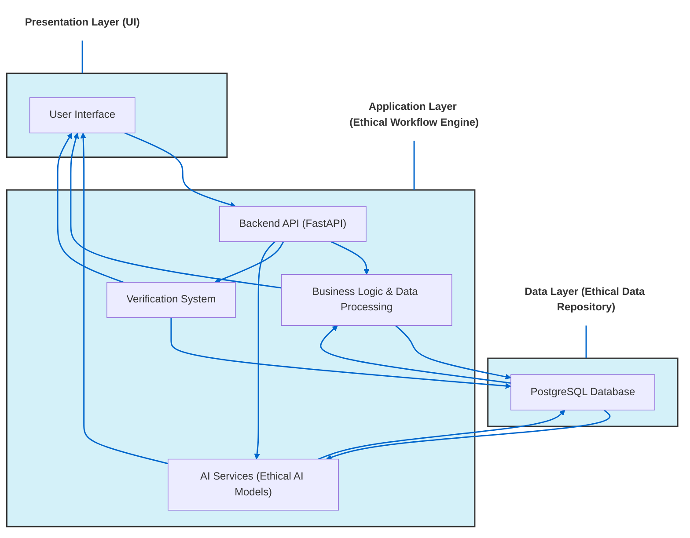

# Onboarding Manual

**Welcome to the ThinkAlike project!**

This comprehensive guide provides a detailed overview of the ThinkAlike project, its revolutionary goals, core values, architectural design, and, most importantly, **how YOU can contribute to building a more ethical and human-centered digital world!**

Whether you are a seasoned developer, a passionate designer, a visionary AI researcher, or simply an individual who believes in a better digital future, this manual will provide you with the knowledge and resources to get started and become a vital part of the ThinkAlike movement.

**Read This Manual Carefully - It is Your Starting Point!** Following these instructions and immersing yourself in the ThinkAlike philosophy is crucial for aligning your contributions with the project's core vision and ensuring we build a truly revolutionary platform, together.

**Project Overview - Building a Humane Digital Future, Together**

ThinkAlike is not just another tech project; it is a **transformative, open-source platform** with a bold mission: to revolutionize human connection in the digital age. We are building a system that utilizes AI – not for manipulation or exploitation – but to **foster authentic human relationships based on shared values, interests, and a commitment to ethical technology.**

**Our Revolutionary Goals:**

* **Discover Yourself (Narrative Mode):** Embark on a journey of self-discovery within ThinkAlike's Narrative Mode, exploring your core values, beliefs, aspirations, and your vision for a better digital future. Create your personal narrative and define your ethical compass within our platform.
* **Connect with Like-Minded Individuals (Matching Mode):** Utilize ThinkAlike's ethically weighted Matching Mode to discover and forge genuine connections with individuals who share your deeply held values and principles. Move beyond superficial interactions and build relationships that matter.
* **Build Meaningful Real-World Relationships (Matching & Community Modes):** Transition online interactions into authentic, meaningful relationships in the real world. ThinkAlike is designed to be a bridge, connecting like-minded individuals not just digitally, but in tangible, real-world communities.
* **Contribute to a Better Future (All Modes & Community):** Become an active participant in a global community dedicated to building ethical AI and responsible technology. Your contributions to ThinkAlike, whether code, design, documentation, or community building, are direct actions towards creating a more humane digital world.
* **Collaborate and Build Decentralized Communities (Community Mode):** Empower the creation of self-governing, value-aligned communities within ThinkAlike's Community Mode. Build new forms of decentralized, democratic organization, powered by technology that always respects user agency and freedom.

**Our Core Objective: High-Performance, Ethical, and User-Centered Technology**

ThinkAlike is not just about lofty ideals; it is about building concrete, high-performing technology that embodies those ideals in every line of code and every UI component. Our core objective is to demonstrate that technology can be:

* **Human-Centered and Empowering:** AI assists, not replaces, human agency. Technology empowers users to make informed choices and control their digital experiences, rather than being manipulated or controlled by algorithms.
* **Ethically Sound and Transparent:** Data is a tool for empowerment, not exploitation. Data workflows are transparent, auditable, and designed to enhance user agency, with UI validation components ensuring ethical data handling practices are rigorously implemented and visible.
* **Architecturally Robust and User-Validated:** The UI serves as a "validation framework component," ensuring that code implementation is directly aligned with real user experience and that architectural design choices are continuously validated through user feedback and data traceability.

ThinkAlike is more than just a platform; it is a **movement**. We are building a global community of contributors and users united by a shared vision: to reclaim the digital realm for humanity, to build technology that serves ethical values, and to forge genuine human connections in an increasingly digital world. Join us, comrade, and become part of the ThinkAlike Revolution!

---

## Table of Contents

1. [Core Goals for MVP Implementation](#1-core-goals-for-mvp-implementation)
2. [Core Values](#2-core-values)
3. [Architectural Overview](#3-architectural-overview)
4. [UI Components](#4-ui-components)
5. [Data Handling](#5-data-handling)
6. [AI Models - Ethical Explainable and User-Centric Artificial Intelligence](#6-ai-models---ethical-explainable-and-user-centric-artificial-intelligence)
7. [Community Links](#7-community-links)

---

## 1. Core Goals for MVP Implementation

This section outlines the ThinkAlike MVP’s driving objectives, showing how ethical principles guide the technology from inception. By anchoring functionality in user empowerment and transparent data handling, it paves the way toward a more humane digital experience.

The ThinkAlike platform’s MVP (Minimum Viable Product) implementation is laser-focused on rigorously testing our core goals across every architectural layer. Our MVP is not just about demonstrating basic functionality; it is about creating an **action-driven ethical workflow framework** that will guide all future development.

Every technological component of our AI data integration plan, even in this early MVP stage, is purpose-built to **empower users with self-awareness and agency** during every interaction. By gathering continuous feedback at every process and component level – from UI/UX responses to backend data validation – user input directly shapes the ongoing evolution of our ethical AI systems.

**ThinkAlike's MVP aims to definitively demonstrate that:**

* **Technology Enhances User Freedom:** ThinkAlike technology empowers users to make truly informed choices, exercise meaningful control over their digital identities and interactions, and experience a sense of liberation within the digital realm, rather than feeling constrained or manipulated.
* **Data is a Tool for Empowerment, Not Exploitation:** ThinkAlike demonstrably utilizes data transparently and ethically, solely as a tool to provide users with valuable insights, enhance their agency, and facilitate value-aligned connections. Data is *not* used for opaque algorithmic manipulation, surveillance capitalism, or purposes that do not directly benefit the user and align with their explicit consent and ethical expectations.
* **UI Validates Ethical Implementation: "Validation Framework Component":** The ThinkAlike User Interface is not merely a visual presentation layer; it serves as a **"Validation Framework Component,"** actively and demonstrably validating the ethical implementation of the entire platform. Through UI components like `DataTraceability`, `APIValidator`, and `CoreValuesValidator`, the UI provides:
  * **Real-time Data Flow Visualization:** Makes data flows transparent and understandable to both users and developers, ensuring accountability and revealing the inner workings of AI-driven features.
  * **Actionable Feedback Loops:** Provides clear and immediate feedback loops to validate data input, AI processing, and API interactions, ensuring data integrity and workflow correctness at every stage.
  * **Ethical Parameter Monitoring:** Visually monitors key ethical parameters and metrics, allowing for continuous ethical auditing and validation of AI behavior and platform-wide adherence to Enlightenment 2.0 principles.

The ThinkAlike MVP is not the final product; it is the crucial foundation upon which we will build a truly revolutionary platform. It is a working demonstration – in code, design, and user experience – of our core values and our unwavering commitment to a more humane digital future. By achieving these MVP goals, we will prove that ethical, transparent, and user-empowering technology is not just a utopian dream, but a tangible reality that we are actively building, together.

---

## 2. Core Values

This section explores the fundamental principles that underpin ThinkAlike’s mission. Emphasizing ethics and humanity in technology, these values shape every decision, ensuring contributors align with the project’s commitment to a people-centered future.

ThinkAlike is not driven by profit, hype, or technological determinism. We are guided by a deeply held set of **core values**, which serve as the ethical compass for every decision we make, every line of code we write, and every feature we design. These values are the bedrock of Enlightenment 2.0 and the soul of the ThinkAlike project:

1. **Human-Centered Approach: Prioritizing Human Dignity and Well-being:**
    At ThinkAlike, humanity comes first. We fundamentally believe that technology must serve human needs, enhance human capabilities, and foster genuine human flourishing. Technology is not an end in itself, but a tool to empower individuals and build a better world for all. Human dignity, agency, and well-being are paramount and will always take precedence over technological advancement or purely economic metrics.

2. **Ethical AI: Responsible, Transparent, and User-Controlled Artificial Intelligence:**
    We are committed to ethical AI development and deployment. AI within ThinkAlike is not intended to replace human agency or make decisions for users. Instead, AI serves as a powerful tool to augment human intelligence, empower informed choices, and facilitate value-driven connections. We are dedicated to building AI systems that are:
    * **Transparent and Explainable:** AI decision-making processes are designed to be understandable and auditable, not opaque "black boxes."
    * **User-Controlled:** Users retain meaningful control over how AI interacts with them, their data, and their digital experiences.
    * **Bias-Mitigated:** We actively work to identify, mitigate, and prevent biases in our AI models and algorithms, striving for fairness and equity in AI-driven features.
    * **Ethically Validated:** All AI implementations undergo rigorous ethical validation and continuous monitoring to ensure alignment with ThinkAlike's core values and ethical guidelines.

3. **Transparency & Traceability: Building Trust Through Openness and Accountability:**
    Trust is the foundation of any ethical and sustainable system. ThinkAlike is built on a foundation of radical transparency and data traceability. We believe that openness fosters accountability, empowers users, and builds genuine trust in technology. This commitment to transparency is manifested in:
    * **Open Source Codebase:** The ThinkAlike codebase is intended to be fully open source (to be finalized based on licensing decisions), allowing for community scrutiny, auditability, and collaborative development.
    * **Public Documentation:** We are committed to providing comprehensive and publicly accessible documentation for all aspects of the project, from architectural design specs to API endpoints to ethical guidelines. This Onboarding Manual is a key part of our commitment to transparent communication.
    * **UI-Driven Data Flow Visualization:** The `DataTraceability` component in the UI provides users with a visual representation of data flows within the platform, making data processing and AI workflows understandable and auditable directly within the user interface.
    * **Verification System for Ethical Auditing:** The Verification System is designed to provide a robust framework for continuous ethical auditing and validation of ThinkAlike's AI implementations, data handling practices, and overall platform behavior, ensuring ongoing accountability and adherence to our ethical principles.

4. **User Empowerment: Digital Sovereignty and Agency in the Digital Realm:**
    Enlightenment 2.0 places **user empowerment** at the heart of digital systems. Users are not passive consumers or data sources; they are **active agents** with a right to control their digital experiences, data, and the technologies that shape their lives. This is about **digital sovereignty** – the right of individuals and communities to govern their own digital destinies.
    * **User Agency and Choice:** Designing technology that maximizes user agency, providing meaningful choices and avoiding manipulative or coercive design patterns.
    * **Data Sovereignty and Privacy:** Empowering users with ownership and control over their personal data, ensuring robust privacy protections and minimizing data extraction.
    * **Decentralized Control and Governance:** Favoring decentralized platforms and governance models that distribute power to users and communities, rather than centralizing it in corporations or institutions.
    * **Participatory Design and Development:** Involving users in the design and development process, ensuring technology is built *with* and *for* the people, not just *for profit*.
    * **Right to Understand and Modify Technology:** Promoting digital literacy and empowering users to understand and, where possible, modify the technologies they use, fostering a culture of technological empowerment, not dependence.

5. **Authenticity: Fostering Genuine Human Connection and Value-Based Relationships:**
    In a digital world often dominated by superficiality and inauthenticity, ThinkAlike is a sanctuary for **genuine human connection.** We believe that technology can and should be used to foster meaningful relationships, build real community, and enhance human well-being, not to promote superficiality, isolation, or inauthentic interactions.
    * **Value-Based Matching (Mode 2):** The Matching Mode algorithm prioritizes connections based on shared values and principles, moving beyond superficial criteria like profile photos or fleeting interests.
    * **Narrative Mode for Self-Expression (Mode 1):** Narrative Mode empowers users to articulate their authentic selves, share their personal stories, and express their core values through their narratives, fostering deeper and more meaningful connections.
    * **Community Mode for Value-Aligned Groups (Mode 3):** Community Mode enables the formation of groups centered around shared values and common purpose, creating digital spaces for genuine belonging and collaborative action.
    * **Discouraging Superficiality and Gamification:** ThinkAlike consciously avoids design patterns and features that incentivize superficiality, social comparison, or the gamification of human connection, prioritizing genuine interaction over fleeting "engagement" metrics.

6. **Inclusivity: Accessible and Ethical Technology for All:**
    Enlightenment 2.0 and ThinkAlike are not exclusive movements; they are for **all of humanity.** We are committed to building technology that is **accessible, inclusive, and beneficial to everyone**, regardless of background, technical expertise, or ability. Inclusivity is reflected in:
    * **Accessibility-Focused Design:** We strive to design ThinkAlike to be accessible to users with disabilities, adhering to accessibility guidelines (WCAG) and ensuring UI components and content are usable by everyone.
    * **Multilingual Support (Future):** We plan to expand ThinkAlike to support multiple languages in the future, breaking down linguistic barriers and fostering global community participation.
    * **Open and Welcoming Community:** We are committed to building a ThinkAlike community that is welcoming, diverse, and inclusive, where all contributors and users feel valued and respected.
    * **Addressing Digital Divides:** We are mindful of digital divides and strive to create a platform that is usable and beneficial even for users with limited bandwidth or less advanced devices (through progressive enhancement and performance optimization).
    * **Ethical Technology for the Common Good:** Our overarching goal is to build ethical technology that serves the common good and contributes to a more just and equitable world for all, not just a privileged few.

---

## 3. Architectural Overview

Here, you’ll see how ThinkAlike’s three-tier structure—UI, application logic, and data—cooperates to deliver robust functionality. Each layer operates seamlessly to maintain transparency, modularity, and ethical workflows, reinforcing user trust at every interaction.

ThinkAlike is built upon a robust and modular three-tier architecture, designed for scalability, maintainability, and ethical implementation. Understanding this architecture is crucial for all contributors to the project.

### The ThinkAlike Three-Tier Architecture



---

## 4. UI Components

This section details the reusable React components that bring ThinkAlike’s vision to life on screen. Through careful design choices, each element promotes clarity, accessibility, and alignment with core ethical standards for every user journey.

The ThinkAlike UI is built using a reusable UI Component Library in React, ensuring a consistent visual style, efficient development, and maintainability. Key UI components include (but are not limited to):

### Layout Components

* **AppLayout:** Provides the main application layout structure, header, sidebar, and content areas.
* **PageContainer:** Reusable container for standard page layouts with consistent padding and margins.
* **Card:** Versatile card component for displaying information in a visually structured manner (used for user profiles, community profiles, etc.).
* **Grid:** Layout component for arranging content in a responsive grid.
* **FlexContainer:** Layout component for flexible content arrangement using Flexbox.

### Input and Form Components

* **TextInput:** Styled text input field with validation and error handling.
* **TextAreaInput:** Styled text area input for larger text input with validation and error handling.
* **SelectDropdown:** Styled dropdown select component with data binding and accessibility features.
* **Checkbox:** Styled checkbox component for boolean input.
* **RadioGroup:** Styled radio button group for single-choice selection.
* **Form:** Reusable form component to manage form state, validation, and submission workflows.
* **Button:** Versatile button component with various styles and states (primary, secondary, danger, loading, etc.).

### Data Display and Visualization Components

* **ProfileCard:** Component for displaying user profiles in a compact card format.
* **UserProfileView:** Component for displaying detailed user profiles.
* **CommunityCard:** Component for displaying community profiles in a card format.
* **CommunityProfileView:** Component for displaying detailed community profiles.
* **DataTraceability:** The Core Transparency Component - Visualizes data flows and algorithm processes using a node-link graph, as detailed in <span style="color:blue">DataTraceability.jsx.md</span>.
* **APIValidator:** Reusable UI component for displaying API request/response validation results and providing feedback on API interactions.
* **DataValidationError:** Reusable UI component for displaying data validation errors in a consistent and user-friendly manner.
* **CoreValuesValidator:** UI component for ethical validation, visually highlighting alignment with core values and potential ethical concerns.
* **LoadingSpinner:** Animated loading spinner component to indicate data loading or processing states.
* **Alert:** Reusable alert component for displaying success, error, warning, and information messages to the user.
* **Badge:** Component for displaying badges or tags to highlight user attributes, community roles, or other relevant information.

### Navigation Components

* **NavigationBar:** Main application navigation bar, providing access to core Modes and platform features.
* **Sidebar:** Optional sidebar component for secondary navigation or contextual menus.
* **LinkButton:** Styled button component that acts as a navigation link.

### AI-Specific UI Components

* **AIWaveformIndicator:** Visually represents AI activity and processing state using a waveform animation (as seen in wireframes).
* **AITriangleIndicator:** A distinct triangle indicator that appears in the UI to highlight AI-driven features and recommendations, ensuring user awareness of AI involvement.
* **NarrativeViewer:** Component for displaying and navigating interactive AI-generated narratives (used in Narrative Mode).

All UI components are designed to be:

* **Reusable and Modular:** Promoting component-based architecture and efficient development.
* **Styled and Themed:** Adhering to the ThinkAlike visual style guide (style_guide.md) for a consistent and professional user interface.
* **Accessible:** Following accessibility best practices (WCAG) to ensure usability for all users, including those with disabilities.
* **Data-Driven:** Designed to be easily data-bound and integrated with the backend API, facilitating dynamic content rendering and data visualization.
* **Ethically Validating:** Reusable UI components like APIValidator and CoreValuesValidator are specifically designed to be integrated into UI workflows to provide data validation feedback, API interaction transparency, and ethical validation cues directly within the user interface.

---

## 5. Data Handling

In this portion, we discuss how ThinkAlike responsibly collects, stores, and manages data. Prioritizing consent, minimal collection, and clear user control, our data handling embodies integrity and cultivates trust across the platform.

ThinkAlike is founded on a deep commitment to ethical data handling and user privacy. We believe that user data is a sacred trust, and we are dedicated to being responsible and transparent stewards of that data. Our core data handling principles are:

* **Data Minimization:** We collect and store only the minimum amount of user data absolutely necessary to provide core platform functionalities and enhance user experience. We avoid collecting data "just because we can" and continuously evaluate our data collection practices to minimize data footprint.
* **User Consent and Control:** User consent is paramount. We will always seek explicit, informed, and granular user consent before collecting or processing any personal data beyond what is strictly essential for basic account functionality. Users have granular control over their data privacy settings, allowing them to manage data visibility, sharing preferences, and data retention. Users are empowered to access, modify, delete, and export their data at any time.
* **Data Security and Privacy by Design:** Data security and user privacy are not afterthoughts; they are core design principles embedded into every layer of the ThinkAlike architecture. We implement robust security measures to protect user data both in transit and at rest, including:
  * End-to-end encryption for data transmission (HTTPS).
  * Secure data storage practices, including database encryption and access control mechanisms.
  * Regular security audits and vulnerability assessments to identify and mitigate potential security risks.
  * Anonymization and pseudonymization techniques for data processing where appropriate to further protect user privacy.
* **Transparency in Data Handling Practices:** We are committed to full transparency in our data handling practices. Users have a right to understand:
  * **What data we collect:** We provide clear and accessible documentation outlining the types of data collected by ThinkAlike.
  * **Why we collect it:** We clearly articulate the purposes for which user data is collected, ensuring users understand the rationale behind our data practices.
  * **How we use it:** We transparently document how user data is processed, used by AI algorithms, and utilized to provide platform functionalities. The DataTraceability component is a key tool for visualizing these data flows directly within the UI.
* **Data Retention Policies:** We implement clear and user-friendly data retention policies, limiting data storage to the shortest time necessary and providing users with control over their data lifecycle.
* **Ethical Data Processing and Algorithmic Fairness:** We are committed to ethical data processing and algorithmic fairness in all AI-driven features. This includes:
  * Rigorous data validation and cleaning processes to ensure data quality and minimize errors.
  * Bias mitigation techniques in AI model development and training to prevent algorithmic bias and promote equitable outcomes for all users.
  * Continuous ethical monitoring and auditing of AI algorithms and data processing workflows through the Verification System to ensure ongoing adherence to our ethical guidelines and to identify and address any unintended negative consequences.
  * User feedback mechanisms to allow users to report potential data privacy concerns or algorithmic bias, ensuring continuous community oversight and ethical improvement of our data handling practices.

(More detailed information on specific data handling procedures, data encryption methods, and data governance policies will be added to a dedicated "Data Handling Policy" document - future enhancement).

---

## 6. AI Models - Ethical Explainable and User-Centric Artificial Intelligence

This section will be added in future updates.

---

## 7. Community Links

- **GitHub Repository:** [https://github.com/EosLumina/--ThinkAlike--](https://github.com/EosLumina/--ThinkAlike--)
- **GitHub Issues:** [https://github.com/EosLumina/--ThinkAlike--/issues](https://github.com/EosLumina/--ThinkAlike--/issues)
- **GitHub Discussions:** [https://github.com/EosLumina/--ThinkAlike--/discussions](https://github.com/EosLumina/--ThinkAlike--/discussions)
- **GitHub Actions:** [https://github.com/EosLumina/--ThinkAlike--/actions](https://github.com/EosLumina/--ThinkAlike--/actions)

---

**Document Details**
- Title: Onboarding Manual
- Type: Core Documentation
- Version: 1.0.0
- Last Updated: 2025-04-06
---
```


