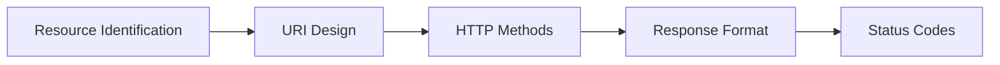
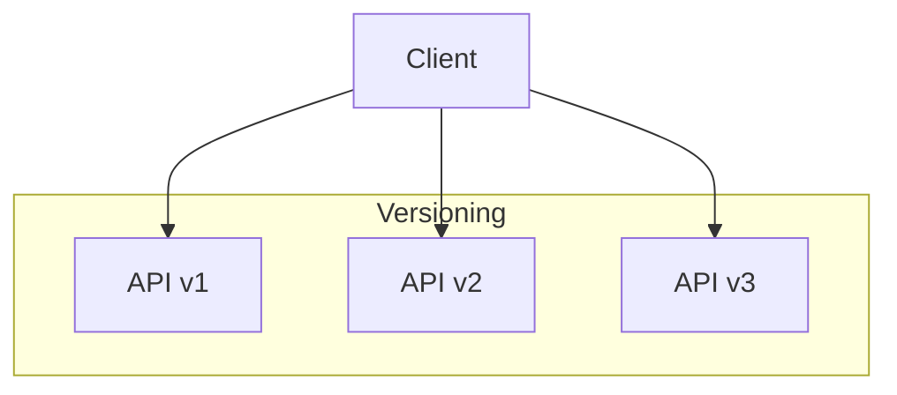
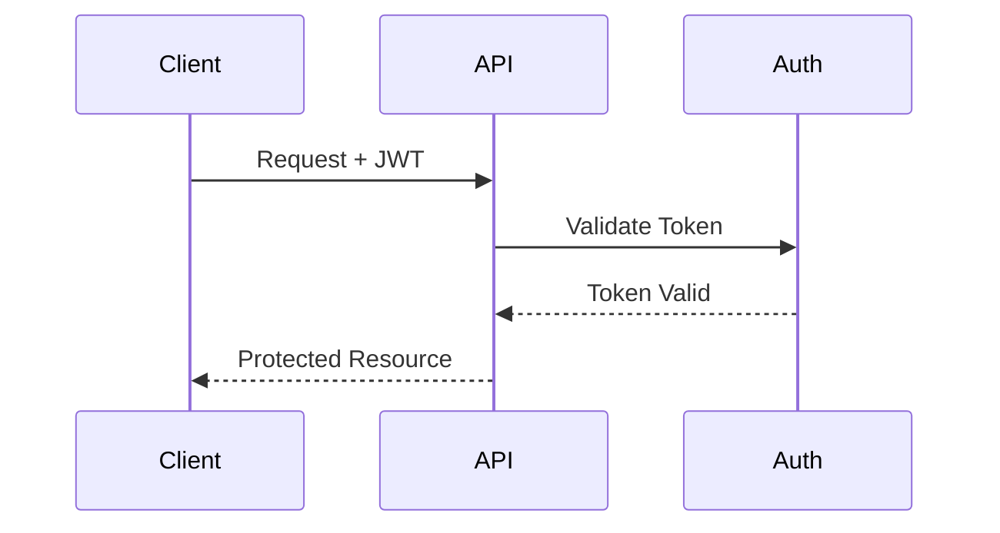

# API Design Guidelines

## 1. Introduction

Defines standards and best practices for designing consistent, maintainable APIs.

## 2. API Design Principles

### 2.1 RESTful Resource Design



### 2.2 Resource Naming

```typescript

// Good Examples
/users
/users/123
/users/123/orders
/orders?status=pending

// Bad Examples
/getUsers
/user_orders/123
/api/v1/get-user-by-id/123

```

## 3. Request/Response Standards

### 3.1 Response Format

```json

{
  "status": "success",
  "data": {
    "id": "uuid",
    "type": "resource",
    "attributes": {}
  },
  "meta": {
    "pagination": {
      "page": 1,
      "total": 100
    }
  }
}

```

## 4. API Versioning

### 4.1 Version Control



## 5. Error Handling

### 5.1 Error Responses

```json

{
  "status": "error",
  "code": "VALIDATION_ERROR",
  "message": "Invalid input provided",
  "details": [
    {
      "field": "email",
      "message": "Must be valid email format"
    }
  ]
}

```

## 6. Security Standards

### 6.1 Authentication Flow



## 7. Documentation Requirements

### 7.1 OpenAPI Specification

```yaml

openapi: 3.0.0
info:
  title: API Documentation
  version: 1.0.0
paths:
  /resource:
    get:
      summary: List resources
      responses:
        '200':
          description: Success

```

## 8. AI Clone Persona Engine (Audiovisual Analysis)

* **Purpose**: To analyze user-provided short video introductions (with explicit consent) to extract relevant

audiovisual features (e.g., speech patterns, general tone, visual style cues — *not* sensitive emotion detection or
biometric identification) that inform the generation and dynamic styling of the user’s **AI Clone**. Aims to create a
more representative and nuanced digital proxy than static images/text, providing "gradual clues" during interaction
flows.

* **Expected Inputs**: User video intro file/stream, potentially user profile data for context. Interaction with a Voice

AI / Speech-to-Text / basic Video Analysis service is likely needed.

* **Processing Logic**: [Details TBD: Could involve extracting features like speech cadence, dominant color palettes,

general energy level inferred from motion/speech, etc. **Must avoid pseudo-scientific analysis like emotion detection
from micro-expressions.** Focus on objective or stylistic elements.] The outputs directly influence the parameters used
to render the AI Clone avatar.

* **Expected Outputs**: Structured data object containing style parameters for the AI Clone renderer (e.g., `{ "hue":

..., "saturation": ..., "brightness": ..., "waveform_pattern": ..., "speech_cadence_factor": ... }`).

* **Integration**: Receives input from video upload process. Outputs data used by the Frontend UI’s AI Clone rendering

component. Interacts with Database to store/retrieve generated parameters.

* **Ethical Considerations**: **Very High.** Requires explicit consent for video analysis. **Strictly avoid**

over-interpretation, pseudo-science, or biometric/emotion detection. Maintain transparency about what is analyzed. Users
must be able to opt-out or manually override their AI Clone style.

## 9. Further Reference

* [RESTful Guidelines](../api/rest_guidelines.md)
* [Security Standards](../security/api_security.md)
* [Testing Guidelines](../testing/api_testing.md)

* --

## Document Details

* Title: API Design Guidelines

* Type: Development Guide

* Version: 1.0.0

## - Last Updated: 2025-04-05

## End of API Design Guidelines

* --

## Document Details

* Title: API Design Guidelines

* Type: Developer Guide

* Version: 1.0.0

## - Last Updated: 2025-04-05

## End of API Design Guidelines
