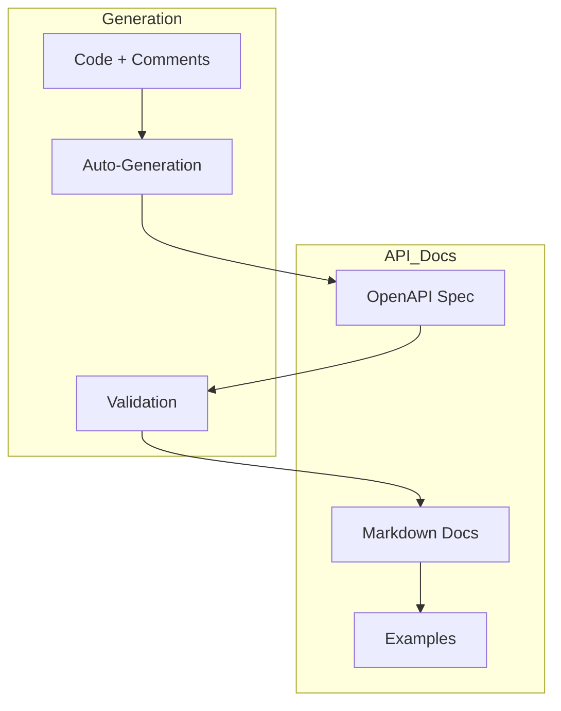

# API Documentation Standard

## 1. Introduction

Defines standards for documenting APIs to ensure clear, consistent, and maintainable documentation.

## 2. OpenAPI Documentation

```yaml

openapi: 3.0.0
info:
  title: API Documentation
  description: Standard API documentation format
paths:
  /resource:
    get:
      summary: List resources
      responses:
        '200':
          description: Success

```

## 3. Documentation Framework

### 3.1 OpenAPI/Swagger

* All REST APIs should be documented using OpenAPI Specification (formerly Swagger)
* FastAPI automatically generates OpenAPI documentation from Python type hints and docstrings
* The API documentation is accessible at `/docs` endpoint in the running application
* Standalone OpenAPI JSON files should be stored in `docs/api/` directory for reference

### 3.2 Markdown Documentation

* Additional context, guides, and examples should be provided in Markdown files
* API overview documents should be stored in `docs/api/` directory
* Complex workflow examples should be included in the developer guides

## 4. Documentation Requirements

Every API endpoint must document the following:

### 4.1 Basic Information

* **Summary:** A short one-line description of what the endpoint does
* **Description:** More detailed explanation including use cases and important notes
* **Endpoint Path:** The URL path with clear parameter placeholders
* **HTTP Method:** GET, POST, PUT, DELETE, PATCH, etc.
* **Tags:** Categorical tags for grouping related endpoints

Example:

```yaml

/users/{user_id}:
  get:
    summary: Get user profile details
    description: Retrieves detailed profile information for a specific user. Requires authentication.
    tags:
      * Users

```

### 4.2 Documentation Flow



## 5. Further Reference

* [OpenAPI Documentation](../api/openapi.md)
* [API Examples](../examples/api_examples.md)
* [FastAPI Documentation](https://fastapi.tiangolo.com/)

* --

## Document Details

* Title: API Documentation Standard

* Type: Development Guide

* Version: 1.0.0

## - Last Updated: 2025-04-05

## End of API Documentation Standard
