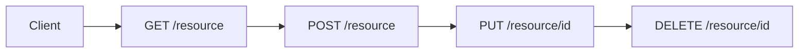
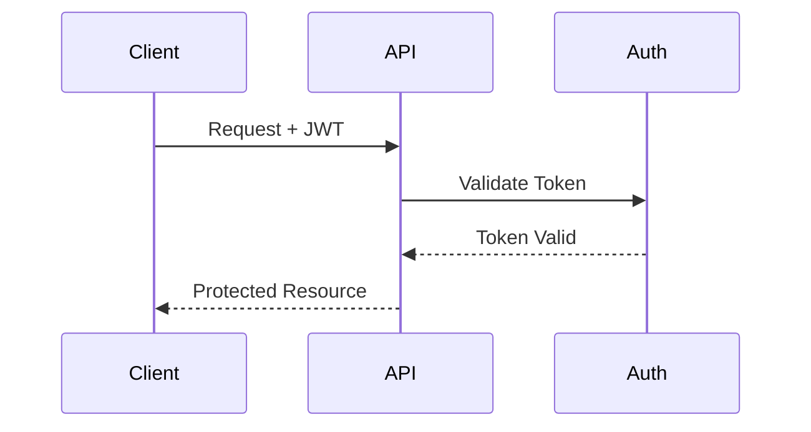

# API Development Standard

## 1. Introduction

This guide outlines the standards and best practices for developing APIs within our platform. It ensures consistent, maintainable, and secure API development across all services.

## 2. API Design Principles

### 2.1 RESTful Guidelines



### 2.2 Response Format

```json
{
  "status": "success",
  "code": 200,
  "data": {
    "id": "uuid",
    "attributes": {}
  },
  "meta": {
    "pagination": {
      "page": 1,
      "total": 100
    }
  }
}
```

## 3. Authentication & Authorization

### 3.1 Authentication Flow



## 4. Error Handling

### 4.1 Error Response Format

```json
{
  "status": "error",
  "code": 400,
  "message": "Invalid input",
  "errors": [{
    "field": "email",
    "message": "Must be valid email"
  }]
}
```

## 5. API Versioning

### 5.1 Version Control

```bash
/api/v1/resources
/api/v2/resources
```

## 6. Rate Limiting

### 6.1 Rate Limit Headers

```http
X-RateLimit-Limit: 100
X-RateLimit-Remaining: 95
X-RateLimit-Reset: 1618884480
```

## 7. Security Requirements

### 7.1 Security Headers

```yaml
Security-Headers:
  - X-Content-Type-Options: nosniff
  - X-Frame-Options: DENY
  - X-XSS-Protection: 1; mode=block
  - Content-Security-Policy: default-src 'self'
```

## 8. Documentation Requirements

### 8.1 OpenAPI Specification

```yaml
openapi: 3.0.0
info:
  title: API Documentation
  version: 1.0.0
paths:
  /resource:
    get:
      summary: List resources
      responses:
        '200':
          description: Success
```

## 9. Testing Requirements

### 9.1 Test Coverage

```python
def test_api_endpoint():
    response = client.get("/api/v1/resource")
    assert response.status_code == 200
    assert "data" in response.json()
```

## 10. Monitoring

### 10.1 Health Check Endpoint

```json
{
  "status": "healthy",
  "version": "1.0.0",
  "services": {
    "database": "up",
    "cache": "up"
  }
}
```

## 11. Further Reference

* [OpenAPI Documentation](../api/openapi.md)
* [Security Guidelines](../security/api_security.md)
* [Testing Standards](../testing/api_testing.md)

---
**Document Details**
- Title: API Development Standard
- Type: Development Guide
- Version: 1.0.0
- Last Updated: 2025-04-05
---
End of API Development Standard
---


