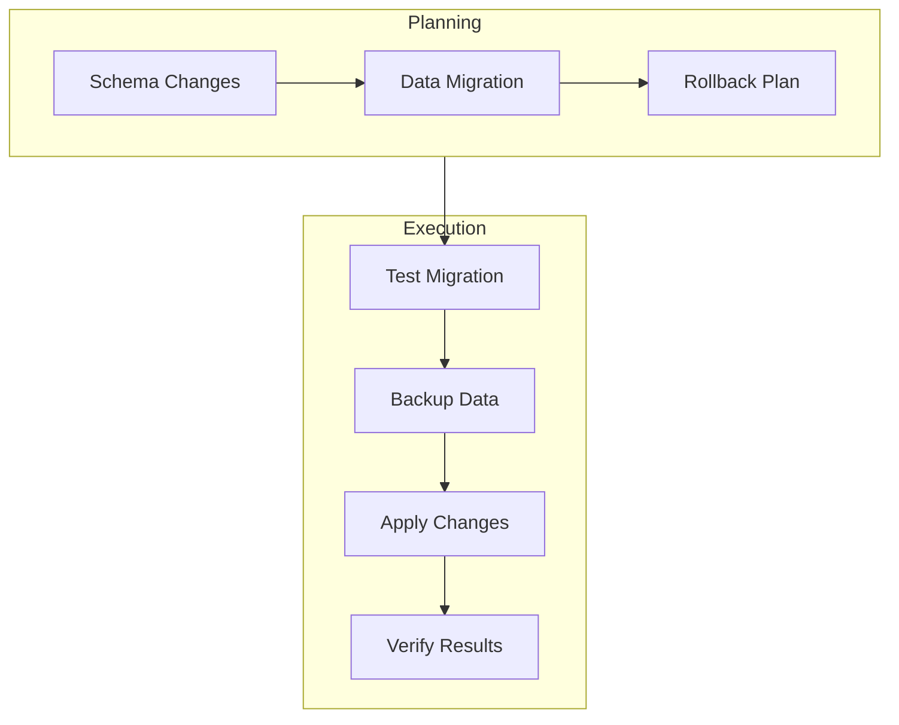

// filepath: C:\--ThinkAlike--\docs\guides\developer_guides\database_migrations_guide.md
# Database Migration Guide

## 1. Introduction

Defines standards and procedures for managing database schema changes and data migrations safely and consistently.

## 2. Migration Strategy

### 2.1 Migration Flow

## 3. Migration Types

### 3.1 Schema Migrations
* Table creation/modification
* Index management
* Constraint changes

### 3.2 Data Migrations
* Data transformation
* Backfilling data
* Data cleanup

## 4. Further Reference

* [Database Guidelines](./database_design_guidelines.md)
* [Deployment Process](./deployment_guidelines.md)
* [Testing Standards](./testing_standards.md)

---
**Document Details**
- Title: Database Migration Guide
- Type: Technical Guide
- Version: 1.0.0
- Last Updated: 2025-04-05
---
End of Database Migration Guide
---

