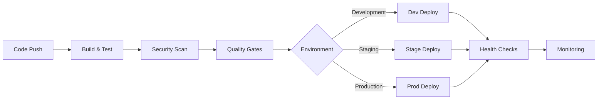
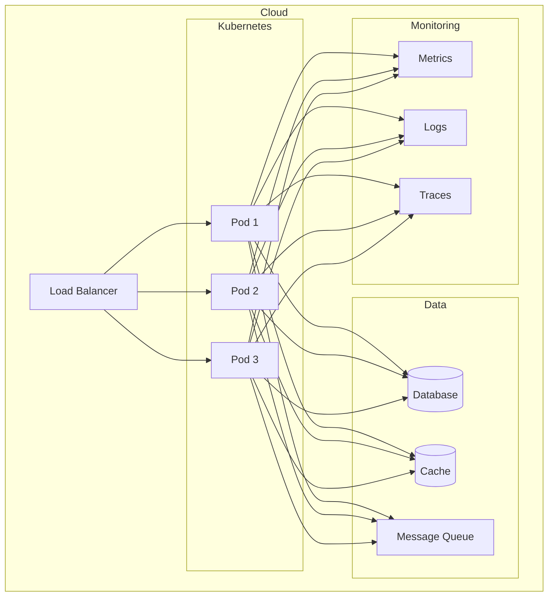

# DevOps and CI/CD Guidelines

## 1. Introduction

Outlines DevOps and CI/CD practices ensuring reliable, secure, and efficient deployment through automated processes.

* --

## 2. CI/CD Pipeline Structure

### 2.1 Pipeline Flow



### 2.2 Infrastructure Architecture



* --

## 3. Version Control Practices

### 3.1 Branching Strategy

Follow GitFlow with these branches:

* `main` - Production code
* `develop` - Integration branch
* `feature/*` - New features
* `bugfix/*` - Bug fixes
* `release/*` - Release preparation
* `hotfix/*` - Production fixes

```bash

# Creating a new feature branch

git checkout develop
git pull
git checkout -b feature/user-authentication

```

### 3.2 Commit Message Standards

```bash

# Format: <type>(<scope>): <description>

feat(auth): implement JWT authentication
fix(api): resolve user lookup timeout
docs(readme): update deployment instructions

```

* --

## 4. Build Process

### 4.1 Build Scripts

```javascript

{
  "scripts": {
    "build": "npm-run-all clean build:* generate-docs",
    "build:ts": "tsc -p tsconfig.prod.json",
    "build:assets": "node scripts/build-assets.js",
    "clean": "rimraf dist"
  }
}

```

### 4.2 Docker Configuration

```dockerfile

FROM node:16-alpine AS builder
WORKDIR /app
COPY package*.json ./
RUN npm ci
COPY . .
RUN npm run build

FROM node:16-alpine
WORKDIR /app
COPY --from=builder /app/dist ./dist
ENV NODE_ENV=production
EXPOSE 3000

```

* --

## 5. Testing Strategy

### 5.1 Test Types

```yaml

steps:
  * task: Npm@1

    inputs:
      command: 'custom'
      customCommand: 'run test:all'
    env:
      NODE_ENV: test

```

### 5.2 Test Configuration

```javascript

module.exports = {
  preset: 'ts-jest',
  testEnvironment: 'node',
  collectCoverage: true,
  coverageThreshold: {
    global: {
      branches: 80,
      functions: 80,
      lines: 80
    }
  }
};

```

* --

## 6. Deployment Process

### 6.1 Kubernetes Deployment

```yaml

apiVersion: apps/v1
kind: Deployment
metadata:
  name: api
spec:
  replicas: 3
  template:
    spec:
      containers:
        * name: api

          image: api:latest
          ports:
            * containerPort: 3000

          resources:
            requests:
              memory: "256Mi"
              cpu: "200m"

```

* --

## 7. Monitoring and Logging

### 7.1 Logging Configuration

```typescript

import winston from 'winston';

export const logger = winston.createLogger({
  level: process.env.LOG_LEVEL || 'info',
  format: winston.format.combine(
    winston.format.timestamp(),
    winston.format.json()
  )
});

```

* --

## 8. Security Practices

### 8.1 Secret Management

```yaml

apiVersion: secrets-store.csi.x-k8s.io/v1
kind: SecretProviderClass
metadata:
  name: azure-kvname
spec:
  provider: azure
  parameters:
    keyvaultName: "kv"
    objects: |
      array:
        * |

          objectName: DatabasePassword
          objectType: secret

```

* --

## 9. Disaster Recovery

### 9.1 Backup Procedures

```bash

# !/bin/bash

TIMESTAMP=$(date +%Y%m%d_%H%M%S)
BACKUP_DIR="/backups"

# Backup database

pg_dump -Fc database > "$BACKUP_DIR/db_$TIMESTAMP.dump"

```

* --

## 10. Documentation

### 10.1 API Documentation

```yaml

openapi: 3.0.0
info:
  title: API Documentation
  version: 1.0.0
servers:
  * url: <https://api.example.com/v>1

```

* --

## 11. Performance Optimization

### 11.1 Load Testing

```javascript

import http from 'k6/http';
import { check, sleep } from 'k6';

export const options = {
  stages: [
    { duration: '5m', target: 100 },
    { duration: '10m', target: 100 },
    { duration: '5m', target: 0 }
  ]
};

```

* --

By following these DevOps and CI/CD guidelines, ThinkAlike ensures reliable, secure, and efficient deployment of our
applications while maintaining high quality standards through automated processes.

* --

## Document Details

* Title: DevOps and CI/CD Guidelines

* Type: Developer Guide

* Version: 1.0.0

## - Last Updated: 2025-04-05

## End of DevOps and CI/CD Guidelines
