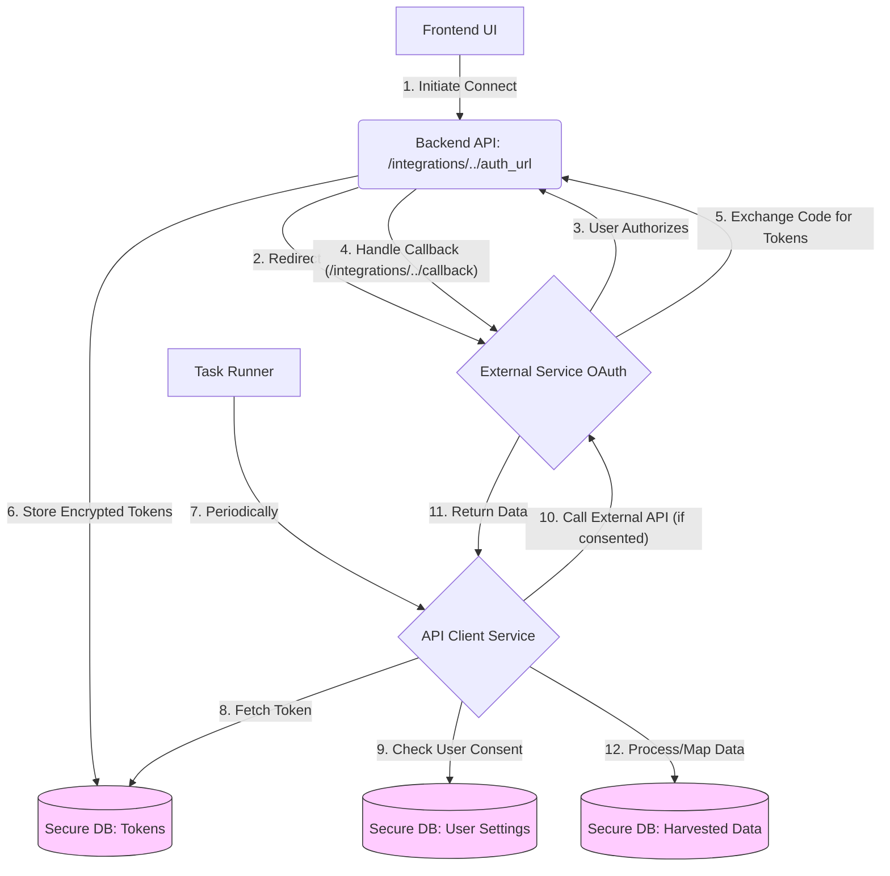

# External API Integration Guide

## 1. Introduction

This guide provides technical instructions and best practices for developers integrating third-party external APIs (like
Goodreads, Spotify, etc.) into the ThinkAlike backend (FastAPI/Python). The goal is to fetch supplementary user data to
enhance matching and recommendations, adhering strictly to the principles outlined in the [Data Integration
Strategy](../../architecture/data_integration_strategy.md).

All integrations must prioritize security, data minimization, user consent enforcement, and robust error handling.

* --

## 2. General Architecture Overview

External API integration typically involves these backend components:

1. **OAuth 2.0 Flow Handler:** API endpoints (`api_endpoints_integrations.md`) to manage the OAuth authorization code

grant flow (or other appropriate flows).

1. **Secure Token Storage:** Database models (`unified_data_model_schema.md`) and logic to securely store (encrypted)

and retrieve user access/refresh tokens for each connected service.

1. **API Client Service:** Reusable Python classes or modules specific to each external API (e.g., `GoodreadsClient`,

`SpotifyClient`) that encapsulate API calls, handle authentication (using stored tokens), manage rate limiting, and
parse responses.

1. **Data Fetching Task Runner:** Asynchronous task execution system (e.g., Celery with Redis/RabbitMQ, FastAPI's

`BackgroundTasks`, or `APScheduler`) to periodically fetch data from external APIs without blocking main application
threads.

1. **Data Processing & Mapping Logic:** Functions to transform raw API data into ThinkAlike's standardized internal

formats or relevant Value Profile insights.

1. **Consent Enforcement Check:** Logic (likely within the Data Fetching or Processing stage) to verify user consent

toggles *before* fetching or using data for specific purposes.

## 3. Implementation Steps & Best Practices

### 3.1 OAuth 2.0 Flow (Authorization Code Grant Recommended)

* **Register Application:** Register ThinkAlike as a developer application with each target service (Goodreads, Spotify,

etc.) to obtain client_id and client_secret. Store these securely (use environment variables or secrets manager, never
commit to code).

* **Initiate Authorization (/auth_url endpoint):**
  * Generate the correct authorization URL for the external service.
  * Include necessary parameters: response_type=code, client_id, redirect_uri (pointing back to your backend callback

endpoint), scope (request minimum necessary permissions), and state (a unique, unguessable value for CSRF protection,
store it in the user's session).
  * Redirect the user's browser to this URL.

* **Handle Callback (/callback endpoint):**
  * Receive the code and state parameters from the external service.
  * Verify State: Compare the received state parameter with the value stored in the user's session. If they don't match,

abort (potential CSRF attack).
  * Exchange Code for Tokens: Make a secure server-to-server POST request to the external service's token endpoint,

providing the code, client_id, client_secret, redirect_uri, and grant_type=authorization_code.
  * Store Tokens: Receive the access_token, refresh_token (if provided), and expires_in values. Store these securely

associated with the ThinkAlike user_id in the database. Encrypt tokens at rest.
  * Redirect the user back to the appropriate page in the frontend UI (e.g., the "Connected Services" panel) with a

success/failure indicator.

### 3.2 Secure Token Storage & Management

* **Database Schema:** Create a table (e.g., user_external_tokens) with columns like user_id, service_name (e.g.,

'goodreads'), encrypted_access_token, encrypted_refresh_token, expires_at (timestamp), scopes_granted (list/string). Add
unique constraints (user_id, service_name).

* **Encryption:** Use a strong, authenticated encryption library (e.g., Python's cryptography library with Fernet) and a

securely managed application-level encryption key (stored via secrets manager/env vars) to encrypt tokens before storing
them in the database. Never store tokens in plaintext.

* **Token Refresh:** Implement logic (likely in the API Client Service or Data Fetching Task Runner) to:
  * Check expires_at before using an access token.
  * If expired or close to expiry, use the refresh_token (if available) to request a new access_token from the external

service's token endpoint (grant_type=refresh_token).
  * Update the stored tokens (new access_token, potentially new refresh_token, new expires_at) in the database.
  * Handle cases where the refresh token also expires or is revoked (requires user re-authentication).

* **Revocation/Deletion:** When a user disconnects a service via the UI, securely delete the corresponding token record

from the database. If the external API supports programmatic token revocation, call that endpoint as well.

### 3.3 Creating API Client Services

* **Structure:** Create a separate Python class or module for each integrated service (e.g.,

services/goodreads_client.py).

* **Responsibilities:**
  * Encapsulate base URL and specific API endpoint paths for the service.
  * Include methods for specific data fetching actions (e.g., get_read_shelf(user_id), get_top_artists(user_id)).
  * Internal logic to retrieve the correct, decrypted access token for the user from secure storage.
  * Handle token refresh logic transparently within the client methods.
  * Make authenticated requests to the external API using the access token (e.g., in Authorization: Bearer <token>

header).
  * Parse the API response (XML, JSON).
  * Implement error handling for API errors (e.g., 4xx, 5xx status codes, rate limiting errors - 429).
  * Implement basic rate limiting awareness (e.g., add delays if 429 errors occur).

* **Libraries:** Use robust HTTP client libraries like httpx (preferred for async FastAPI) or requests.

### 3.4 Data Fetching (Background Tasks)

* **Framework:** Choose an appropriate task queue/scheduler (Celery for complex needs, APScheduler for simpler

scheduling within FastAPI, or FastAPI's built-in BackgroundTasks for fire-and-forget tasks triggered by API calls).

* **Triggering:** Tasks can be triggered periodically (e.g., daily sync) or potentially by user actions (e.g., "Refresh

My Goodreads Data" button).

* **Logic:**
  * Identify users needing data sync for a specific service.
  * For each user, check their consent toggle for data usage. If disabled, skip fetching for that purpose.
  * Instantiate the appropriate API Client Service.
  * Call the client method to fetch the desired data (e.g., goodreads_client.get_read_shelf(user_id)).
  * Pass the retrieved raw data to processing/mapping functions.
  * Handle errors gracefully (log errors, implement retries if appropriate).

### 3.5 Data Processing and Storage

* **Mapping:** Create functions to transform the raw data from external APIs into ThinkAlike's internal representation

(e.g., mapping book genres to internal 'Interest' tags, extracting artist names).

* **Minimization:** Store only the processed insights or essential identifiers needed for matching/recommendations, not

necessarily the entire raw payload, unless required for specific features (and consented to).

* **Database Storage:** Save the processed data into relevant tables (e.g., linking derived 'Interest' tags to the

user's profile, or storing specific items in UserExternalData table). Update last_retrieved timestamps.

### 3.6 Consent Enforcement

* **Critical Check:** Before any background task fetches data or any algorithm uses harvested data for

matching/recommendations, the code must check the user's current consent settings stored in the database (retrieved via
user settings API/service).

* **Implementation:** Pass the user_id and the purpose (e.g., 'matching', 'community_recommendation') to a central

consent checking function that returns true/false based on the user's stored preferences.

## 4. Security Considerations

* **Token Storage:** This is the most critical aspect. Use strong encryption and protect the application's encryption

key diligently.

* **OAuth State Parameter:** Always use and validate the state parameter to prevent CSRF during the OAuth flow.
* **Redirect URI Validation:** Ensure the external service is configured to only redirect to your registered backend

callback URI(s).

* **Input Validation:** Validate the code received in the callback.
* **Error Handling:** Avoid leaking sensitive information (like tokens or client secrets) in logs or error messages.

* **Rate Limiting:** Implement logic to respect external API rate limits to avoid being blocked.
* **Scope Review:** Regularly review if the requested OAuth scopes are still the minimum necessary.

## 5. Adding New Services

Follow the pattern established in Phase 1 & 3:

1. Register app with the new service, get credentials.
2. Implement OAuth flow handlers (auth_url, callback) for the new service.
3. Update token storage to handle the new service_name.
4. Create a new ApiClient class for the service.
5. Define data fetching tasks.
6. Define data processing/mapping logic.
7. Update the "Connected Services" UI panel to list the new service.
8. Update relevant algorithms/features to optionally use the new data source (respecting consent).
9. Add specific ethical considerations and documentation.

By following these steps and prioritizing security and user control, developers can successfully integrate valuable
external data sources into ThinkAlike in an ethical and transparent manner.

* --

## Document Details

* Title: External API Integration Guide

* Type: Developer Guide

* Version: 1.0.0

## - Last Updated: 2025-04-05

## End of External API Integration Guide
