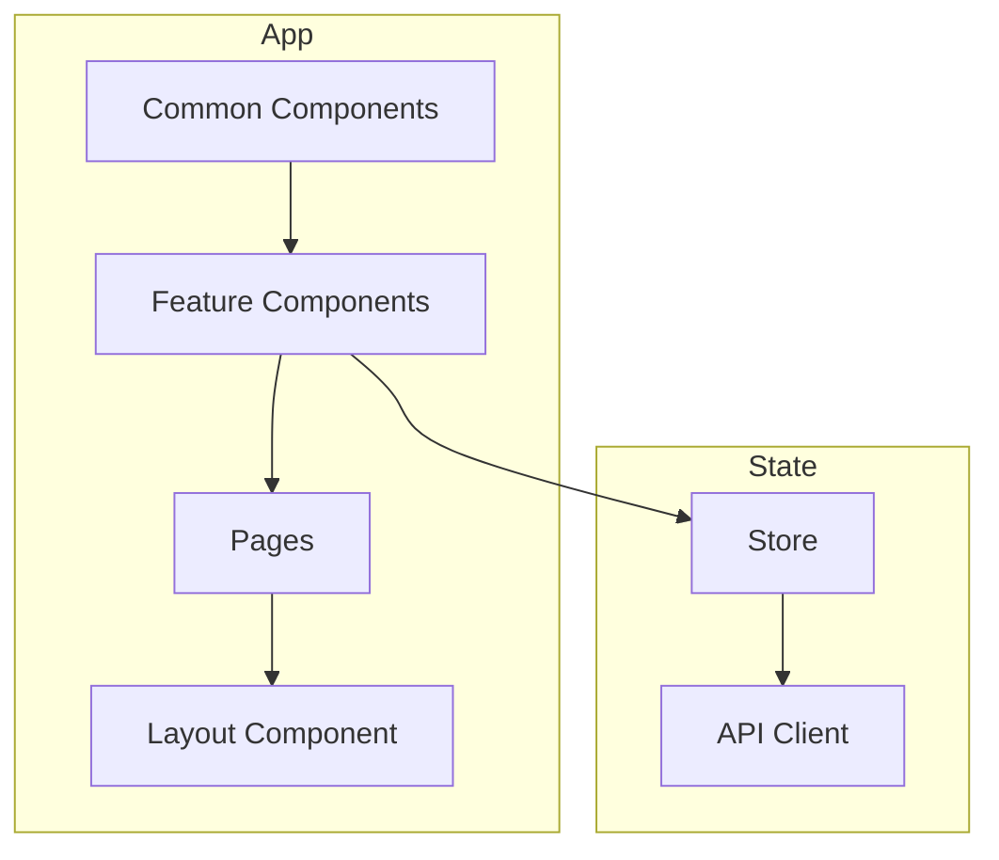

// filepath: C:\--ThinkAlike--\docs\guides\developer_guides\frontend_development_guidelines.md
# Frontend Development Standard

## 1. Introduction

This document outlines frontend development standards and best practices. These guidelines ensure consistent, maintainable, and high-quality user interfaces across our applications.

---

## 2. Project Structure

### 2.1 Directory Structure

```typescript
src/
├── assets/          # Static assets (images, fonts, etc.)
├── components/      # Reusable UI components
│   ├── common/     # Shared components
│   ├── features/   # Feature-specific components
│   └── layouts/    # Layout components
├── hooks/          # Custom React hooks
├── pages/          # Route components
├── services/       # API and external service integrations
├── store/          # State management
├── styles/         # Global styles and theme
├── types/          # TypeScript type definitions
└── utils/          # Utility functions
```

### 2.2 Component Architecture



---

## 3. Component Guidelines

### 3.1 Component Structure

```typescript
interface ComponentProps {
  data: DataType;
  onAction: (id: string) => void;
}

export const Component: React.FC<ComponentProps> = ({ data, onAction }) => {
  return (
    <div className="component">
      {/* Component content */}
    </div>
  );
};
```

---

## 4. State Management

### 4.1 Store Structure

```typescript
interface AppState {
  user: UserState;
  data: DataState;
  ui: UIState;
}

const initialState: AppState = {
  user: null,
  data: [],
  ui: {
    theme: 'light',
    language: 'en'
  }
};
```

---

## 5. Testing Standards

### 5.1 Component Testing

```typescript
describe('Component', () => {
  it('renders correctly', () => {
    render(<Component data={mockData} onAction={mockAction} />);
    expect(screen.getByRole('button')).toBeInTheDocument();
  });
});
```

---

## 6. Performance Guidelines

### 6.1 Code Splitting

```typescript
const LazyComponent = React.lazy(() => import('./LazyComponent'));

function App() {
  return (
    <Suspense fallback={<Loading />}>
      <LazyComponent />
    </Suspense>
  );
}
```

---

## 7. Further Reference

* [React Documentation](https://reactjs.org/)
* [TypeScript Guidelines](../typescript/guidelines.md)
* [Testing Standards](../testing/frontend_testing.md)

---
**Document Details**
- Title: Frontend Development Standard
- Type: Development Guide
- Version: 1.0.0
- Last Updated: 2025-04-05
---
End of Frontend Development Standard
---


