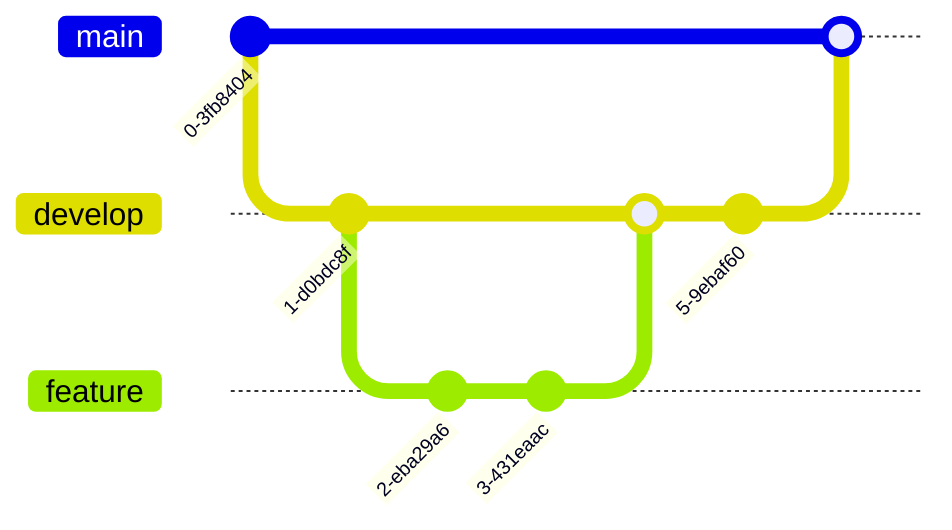

// filepath: C:\--ThinkAlike--\docs\guides\developer_guides\git_workflow.md
# Git Workflow Standard

---

## 1. Introduction

Defines the Git workflow and branching strategy used across the project.



This document outlines the standard Git workflow for the ThinkAlike project. Following a consistent workflow ensures that our codebase remains organized, maintainable, and that team members can collaborate effectively. This guide covers branching strategy, commit guidelines, and best practices for using Git in our development process.

---

## 2. Branching Strategy

ThinkAlike follows a modified version of the GitFlow workflow, adapted to our specific needs.

### 2.1 Main Branch Types

* **`main`**: The production-ready codebase
  * Always deployable
  * Protected branch - no direct commits
  * Merged into only via pull requests from `develop` or hotfix branches
  * Tagged with version numbers for releases

* **`develop`**: The integration branch for features
  * Contains the latest completed features
  * Relatively stable, but not necessarily production-ready
  * Base branch for feature development
  * Protected branch - no direct commits

### 2.2 Supporting Branch Types

* **Feature Branches**: For developing new features
  * Format: `feature/[issue-number]-short-description`
  * Example: `feature/42-user-preferences`
  * Branched from: `develop`
  * Merged back into: `develop`

* **Bugfix Branches**: For fixing non-critical bugs
  * Format: `fix/[issue-number]-short-description`
  * Example: `fix/57-incorrect-timestamp-format`
  * Branched from: `develop`
  * Merged back into: `develop`

* **Hotfix Branches**: For urgent production fixes
  * Format: `hotfix/[issue-number]-short-description`
  * Example: `hotfix/65-login-failure`
  * Branched from: `main`
  * Merged back into: `main` AND `develop`

* **Documentation Branches**: For documentation-only changes
  * Format: `docs/[issue-number]-short-description`
  * Example: `docs/78-api-documentation`
  * Branched from: `develop`
  * Merged back into: `develop`

* **Release Branches**: For preparing releases
  * Format: `release/v[version]`
  * Example: `release/v1.2.0`
  * Branched from: `develop`
  * Merged back into: `main` AND `develop`
  * Only bug fixes, documentation, and release-oriented tasks

---

## 3. Workflow Process

### 3.1 Starting New Work

1. **Update your local repository:**
   ```bash
   git checkout develop
   git pull origin develop
   ```

2. **Create a new branch:**
   ```bash
   git checkout -b feature/42-user-preferences
   ```

3. **Push the branch to remote** (to enable collaboration):
   ```bash
   git push -u origin feature/42-user-preferences
   ```

### 3.2 During Development

1. **Commit regularly** with meaningful messages (see Section 4)

2. **Keep your branch updated** with the latest changes from `develop`:
   ```bash
   git checkout develop
   git pull origin develop
   git checkout feature/42-user-preferences
   git rebase develop
   ```

3. **Push your changes** to the remote repository:
   ```bash
   git push origin feature/42-user-preferences
   ```

   If you've rebased and need to force push:
   ```bash
   git push --force-with-lease origin feature/42-user-preferences
   ```

### 3.3 Completing Work

1. **Ensure all tests pass** locally

2. **Rebase on latest `develop`**:
   ```bash
   git checkout develop
   git pull origin develop
   git checkout feature/42-user-preferences
   git rebase develop
   ```

3. **Create a pull request** (follow the [Pull Request Process](./pull_request_process.md))

4. **Address review feedback** by adding new commits or amending existing ones

5. **Once approved**, merge using GitHub's UI (squash and merge is preferred for feature branches)

6. **Delete the branch** after it's merged:
   ```bash
   git branch -d feature/42-user-preferences  # delete locally
   git push origin --delete feature/42-user-preferences  # delete from remote
   ```

### 3.4 Hotfix Process

1. **Create a hotfix branch from `main`**:
   ```bash
   git checkout main
   git pull origin main
   git checkout -b hotfix/65-login-failure
   ```

2. **Implement the fix** with appropriate tests

3. **Create a pull request** targeting `main`

4. **After approval and merge to `main`**, also merge to `develop`:
   ```bash
   git checkout develop
   git pull origin develop
   git merge origin/main
   git push origin develop
   ```

---

## 4. Commit Guidelines

### 4.1 Commit Message Format

Follow the Conventional Commits specification:

```
<type>[optional scope]: <description>

[optional body]

[optional footer(s)]
```

* **Types**:
  * `feat`: A new feature
  * `fix`: A bug fix
  * `docs`: Documentation changes
  * `style`: Formatting, missing semicolons, etc; no code change
  * `refactor`: Refactoring production code
  * `test`: Adding tests, refactoring tests; no production code change
  * `chore`: Updating build tasks, package configs, etc; no production code change
  * `perf`: Performance improvements
  * `ci`: CI configuration changes
  * `build`: Changes that affect the build system
  * `revert`: Reverting a previous commit

* **Scope**: Optional descriptor for the section of code affected
  * Examples: `auth`, `api`, `ui`, `db`, `matching`

### 4.2 Example Commit Messages

```
feat(user): add user preference settings

- Added API endpoints for managing preferences
- Created database schema for storing preferences
- Added UI components for preference management

Resolves #42
```

```
fix(auth): prevent session timeout during active use

The session was incorrectly expiring even when users were active.
Added heartbeat mechanism to refresh tokens.

Fixes #65
```

### 4.3 Commit Best Practices

* **Make atomic commits**: Each commit should represent a single logical change
* **Commit complete changes**: Don't leave the code in a broken state
* **Reference issues**: Include issue numbers in commit messages where applicable
* **Write in imperative mood**: "Add feature" not "Added feature"
* **Limit the first line**: Keep the summary under 50 characters if possible
* **Separate subject from body** with a blank line
* **Use the body** to explain what and why, not how

---

## 5. Git Best Practices

### 5.1 General Guidelines

* **Don't commit directly to protected branches** (`main`, `develop`)
* **Don't commit generated files** unless absolutely necessary
* **Don't commit configuration with secrets** (use environment variables)
* **Don't commit large binary files** (use Git LFS if necessary)
* **Keep branches short-lived** (merge or discard within 1-2 weeks ideally)

### 5.2 Handling Merge Conflicts

1. **Update your branch** frequently to minimize conflicts
2. **Resolve conflicts** at the feature level, not at merge time
3. Use **visual merge tools** for complex conflicts (VSCode, GitKraken, etc.)
4. When in doubt, **consult the original developer** of the conflicting code

### 5.3 Useful Git Commands

* **View branch status**:
  ```bash
  git status
  ```

* **View commit history**:
  ```bash
  git log --graph --oneline --all --decorate
  ```

* **Discard local changes** to a file:
  ```bash
  git checkout -- filename
  ```

* **Temporarily save changes** without committing:
  ```bash
  git stash
  git stash pop  # to retrieve stashed changes
  ```

* **Amend the last commit**:
  ```bash
  git commit --amend
  ```

* **Interactive rebase** to clean up commits before pushing:
  ```bash
  git rebase -i HEAD~3  # Rebase the last 3 commits
  ```

---

## 6. GitHub Flow Alternative

For smaller changes or simpler projects, we may occasionally use GitHub Flow instead of GitFlow:

1. **Branch from `main`**
2. **Add commits**
3. **Create a pull request**
4. **Review and discuss**
5. **Deploy and test** (via staging environment)
6. **Merge to `main`

This streamlined approach is suitable for hotfixes, simple documentation changes, or when working with external contributors.

---

## 7. Git Hooks

ThinkAlike uses Git hooks to automate quality checks:

* **pre-commit**: Runs linters, formatters, and basic tests
* **commit-msg**: Validates commit message format
* **pre-push**: Runs comprehensive tests

Install the hooks by running:
```bash
npm run install-hooks  # for frontend
pip install pre-commit && pre-commit install  # for backend
```

---

**Document Details**
- Title: Git Workflow Standard
- Type: Development Guide
- Version: 1.0.0
- Last Updated: 2025-04-05
---
End of Git Workflow Standard


