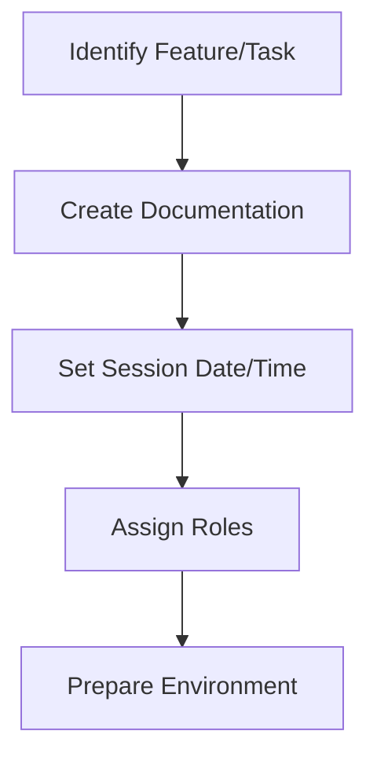

# Swarming Development Methodology

## 1. Introduction

Swarming is ThinkAlike's collaborative coding methodology where contributors work together in real-time on the same task. This document explains how swarming works in practice and how to participate effectively.

## 2. Swarming Principles

Swarming is based on the following principles:

* **Collective Intelligence:** Multiple minds working together create better solutions than individuals working separately.
* **Real-time Collaboration:** Synchronous work with immediate feedback and iteration.
* **Knowledge Sharing:** Built-in mentoring and skill transfer through active participation.
* **Rapid Progress:** Concentrated effort on specific problems leads to faster breakthrough solutions.

## 3. Swarming Process

### 3.1 Preparation

1. **Task Identification:**
   * Clear definition of the feature or issue to be addressed
   * Scope appropriately for 2-4 hour sessions
   * Document requirements and acceptance criteria

2. **Roles Assignment:**
   * **Navigator:** Leads the technical direction (rotates during session)
   * **Driver:** Writes the actual code (rotates every 30 minutes)
   * **Observers:** Actively participate in discussion and problem-solving
   * **Facilitator:** Keeps session on track and productive

3. **Environment Setup:**
   * GitHub Codespaces or similar shared coding environment
   * Voice communication (Discord recommended)
   * Screen sharing

### 3.2 During the Swarm

1. **Check-in:** Brief introduction and goal clarification (5 min)
2. **Planning:** Break down task into smaller steps (10-15 min)
3. **Coding Session:**
   * Driver shares screen and implements code
   * Navigator guides implementation approach
   * Regular rotation of Driver/Navigator roles
   * All participants actively contribute ideas and feedback
4. **Testing:** Implement and run tests as features are completed
5. **Documentation:** Update docs immediately as implementation progresses
6. **Check-out:** Summarize accomplishments and next steps

### 3.3 Post-Swarm

1. **Code Review:** Any code produced during the swarm goes through standard PR process
2. **Knowledge Sharing:** Brief write-up of lessons learned and decisions made
3. **Follow-up Tasks:** Identify any remaining work and assign owners

## 4. Tools and Platforms

### 4.1 Recommended Tooling

* **GitHub Codespaces:** Primary collaborative environment
* **Discord:** Voice communication and coordination
* **Miro/Figma:** For visual collaboration on design aspects
* **Google Docs:** For real-time collaborative documentation

### 4.2 Alternative Setups

* **VS Code Live Share + Discord:** For smaller teams or when Codespaces isn't available
* **Replit + Discord:** For quick prototype sessions

## 5. Best Practices

* **Preparation is key:** All participants should review relevant documentation before the session
* **Stay focused:** Minimize distractions during the swarm
* **Inclusive participation:** Ensure everyone has opportunities to contribute
* **Documentation during development:** Update documentation as you code
* **Test-driven approach:** Write tests before or alongside implementation
* **Timeboxing:** Set clear time limits for discussion before making decisions

## 6. AI-Assisted Swarming

ThinkAlike embraces AI tools as "participants" in the swarm:

* **Code Generation:** GitHub Copilot or similar tools for implementation assistance
* **Documentation:** AI tools can help draft or improve documentation
* **Testing:** AI assistance with generating test cases
* **Problem Solving:** Using AI to explore solution alternatives

The key principle is that AI tools assist human decision-making but don't replace it. All AI-generated content should be reviewed and approved by the human participants.

## 7. Getting Started with Swarming

1. **Join the Discord:** Connect with the ThinkAlike community
2. **Review the Schedule:** Check upcoming swarm sessions in the #swarming-schedule channel
3. **Prepare:** Read the task description and related documentation
4. **Participate:** Join the voice channel at the scheduled time
5. **Follow Up:** Help with any post-swarm tasks or review

---
**Document Details**
- Title: Swarming Development Methodology
- Type: Developer Guide
- Version: 1.0.0
- Last Updated: 2025-05-10
---
