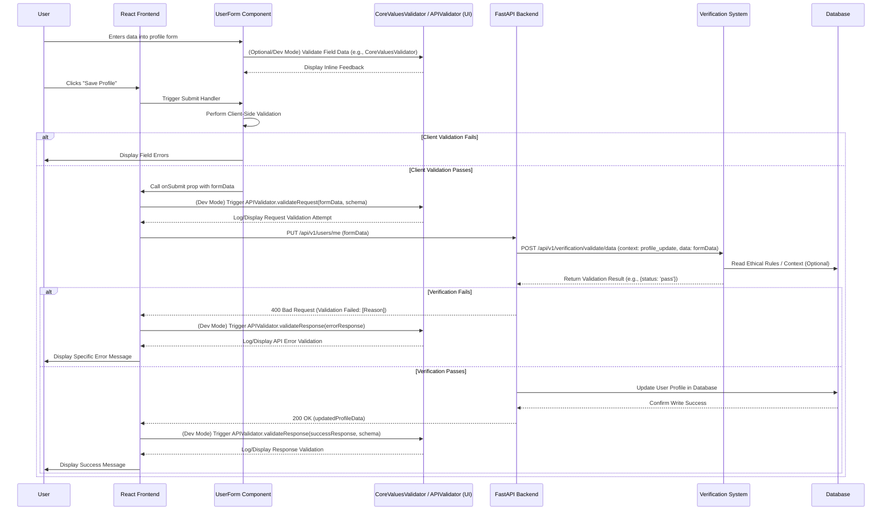

# Design Document: Ui Component Testing Framework

---

## 1. Introduction: UI as a Real-Time Validation Engine

This document outlines the design philosophy and structure of the **UI Component Testing Framework** for the ThinkAlike project. Central to this framework is the principle of **"UI as a Testing Tool,"** where UI components transcend their traditional role as passive presentation elements to become active participants in the validation process. They serve as real-time instruments for verifying data handling, code implementation quality, ethical compliance, system performance, and accessibility standards.

This approach ensures that testing is not a separate, isolated phase but a continuous, transparent, data-driven process deeply integrated into the user experience and the entire development workflow. It aims to provide immediate, actionable feedback to developers and testers, fostering a culture of quality and ethical awareness. This framework operationalizes the strategy detailed in the [ThinkAlike Testing and Validation Plan](testing_and_validation_plan.md).

---

## 2. Core Principles of the UI Testing Framework

*   **UI as Test Engine:** UI components are intentionally designed with hooks and capabilities to *generate* test data, *trigger* validation checks, and *display* results, effectively acting as dynamic test harnesses within the application itself.
*   **Real-Time Feedback:** Validation outcomes (e.g., data integrity checks, ethical alignment scores, performance metrics, accessibility violations) are visualized directly within the UI during development and testing phases, providing immediate, contextual feedback.
*   **Data-Driven & Contextual Validation:** Testing leverages real or realistic user interaction data, API responses, and application states. Validation checks are contextual, understanding the specific workflow or data being processed.
*   **User-Centric Validation:** The framework prioritizes validating the system from the end-user's perspective, focusing on usability, clarity, accessibility, and ethical empowerment, ensuring the technology truly serves human needs.
*   **Transparency:** The testing processes, the data used, and the results obtained are made visible and understandable through UI elements, demystifying quality assurance and fostering trust.
*   **Holistic Testing:** Integrates functional, performance, accessibility, security, and ethical validation into a unified framework accessible via the UI.
*   **Reusability & Modularity:** Leverages dedicated, reusable UI components (like `APIValidator`, `CoreValuesValidator`) designed specifically for testing and validation tasks.

---

## 3. Test Categories Definition (Leveraging UI Components)

The framework organizes testing into key categories, detailing how UI components facilitate validation within each:

### 3.1 Usability Tests

*   **Objective:** Ensure components and workflows are intuitive, efficient, discoverable, and easy to navigate for the target user personas.
*   **UI as Testing Tool:**
    *   **Interaction Logging Components:** Wrappers or hooks around interactive elements (buttons, forms, links) can automatically log user interaction sequences, timings (time-on-task), and error occurrences during specific test scenarios. This data can be visualized in a UI testing dashboard.
    *   **In-UI Feedback Collectors:** Simple UI widgets (e.g., embedded rating scales, quick polls, comment boxes) can be conditionally rendered during UAT or specific test modes to gather direct user feedback immediately after task completion.
    *   **Workflow Visualization (`DataTraceability` Adaptation):** The `DataTraceability` component can be adapted to visualize the *actual path* a user took through a workflow during a usability test, comparing it against the intended or optimal path, visually highlighting deviations or points of friction.
*   **Generated Data:** Quantitative metrics (task completion rates, time, error counts), qualitative user feedback, user flow diagrams.

### 3.2 Accessibility Tests

*   **Objective:** Guarantee UI components and overall application adhere to accessibility standards (e.g., WCAG 2.1 AA/AAA), ensuring usability for people with diverse abilities.
*   **UI as Testing Tool:**
    *   **Live Accessibility Audit Display (`AccessibilityHelper` Component):** A dedicated UI panel or overlay (visible in dev/test mode) integrates with libraries like `axe-core` to run audits on the currently rendered view. It lists violations directly in the UI, potentially highlighting the offending elements on the page.
    *   **Focus Order Visualization:** A testing mode activated via the UI can visually overlay numbers or arrows on focusable elements to illustrate the keyboard navigation order, making it easy to spot illogical sequences.
    *   **Color Contrast Simulation/Check:** UI tools within the test framework could simulate different types of color blindness or dynamically check contrast ratios of rendered elements against WCAG standards, displaying warnings directly.
    *   **Screen Reader Preview (Conceptual):** A UI panel could display the text content as a screen reader might announce it, helping developers check semantic structure and ARIA attribute effectiveness.
*   **Generated Data:** WCAG violation reports linked to specific UI elements, focus order maps, contrast ratio warnings.

### 3.3 Code Performance Tests (Frontend/Interaction Focus)

*   **Objective:** Measure and optimize the responsiveness, rendering speed, memory footprint, and overall efficiency of UI components and frontend interactions.
*   **UI as Testing Tool:**
    *   **Real-time Performance Metrics Dashboard:** A UI overlay or panel displaying key metrics like Component Render Time (using React Profiler API), JavaScript execution time for specific functions, Frames Per Second (FPS) during animations or interactions, and potentially memory usage snapshots.
    *   **Component Stress Test Triggers:** UI buttons or controls (in dev/test mode) to deliberately trigger high-frequency re-renders, large data loads, or complex animations on specific components to observe performance under pressure, with results reflected in the metrics dashboard.
    *   **Network Latency Simulation:** UI controls to simulate different network conditions (e.g., Slow 3G) to test the UI's responsiveness and handling of slow API calls (visualized via `APIValidator` timings).
*   **Generated Data:** Time-series charts of render times/FPS, memory usage graphs, identification of slow components or functions.

### 3.4 Ethical Compliance Tests

*   **Objective:** Validate adherence to ThinkAlike's [Ethical Guidelines](../../core/ethics/ethical_guidelines/ethical_guidelines.md), focusing on transparency, user control, data minimization, fairness, and bias mitigation within the UI/UX and associated workflows.
*   **UI as Testing Tool:**
    *   **`CoreValuesValidator` Integration:** This dedicated component is embedded at critical points in test workflows or developer tools. It receives contextual data (e.g., data used for a recommendation, parameters of an API call) and visually reports alignment scores/statuses against defined ethical principles.
    *   **`DataTraceability.jsx` for Audit:** Used extensively in testing modes to visually trace the flow of data for a specific workflow initiated via the UI. Testers verify that only necessary data is accessed/processed and that the flow matches ethical documentation.
    *   **Consent Flow Validation UI:** Test harnesses simulate user consent flows. The UI components related to consent (checkboxes, explanations, links to policies) are checked for clarity, granularity, and functionality (ensuring state changes correctly and persists). The UI state reflecting consent is asserted upon.
    *   **Bias Check Visualization:** Test modes can feed specific data segments (e.g., profiles from different demographics) through UI-triggered AI functions (like matching). The results, potentially visualized alongside fairness metrics (calculated by the backend Verification System but displayed via UI components like `CoreValuesValidator`), help identify potential biases manifested in the UI output.
*   **Generated Data:** Ethical alignment reports/scores, data flow diagrams for audit, consent state verification, bias indicator flags.

---

## 4. UI as a Testing Tool: Implementation Strategy

Key strategies for enabling the UI to function as a testing tool:

*   **Conditional Logic & Environment Variables:** Most testing-specific UI elements and logic are conditionally rendered or activated based on environment variables (`process.env.NODE_ENV === 'development'`), feature flags, or specific user roles/permissions. This ensures testing tools don't impact production users.
*   **Wrapper Components & Custom Hooks:** Encapsulate testing logic (e.g., performance timing, interaction logging, accessibility checks) within reusable wrapper components (Higher-Order Components - HOCs) or custom React Hooks. This keeps the core application components clean.
    *   *Example Hook:* `usePerformanceMonitor(componentName)` could track render times for the wrapped component.
    *   *Example HOC:* `withInteractionTracking(WrappedComponent)` could log clicks and input changes within the component.
*   **Global State for Test Data/Results:** Utilize React Context or a state management library (Zustand, Redux) to manage the state of test scenarios, provide mock data or API responses during tests, and collect results/metrics from various UI validation components scattered across the application.
*   **Dedicated Testing UI Components:** Create a library of specific, reusable components designed solely for displaying test information and validation results within the UI (e.g., `APIValidator`, `CoreValuesValidator`, `PerformanceChart`, `AccessibilityViolationList`, `EthicalScoreGauge`). These components consume data from the test state/context.
*   **Integration API for Automation Tools:** Design the UI testing framework so that external E2E tools (Cypress, Playwright) can interact with it. This might involve:
    *   Exposing specific functions on the `window` object (in dev mode only) to trigger test modes or retrieve validation data.
    *   Using specific `data-testid` attributes that automation tools can reliably select to interact with testing components or assert on their state.
    *   Having UI components dispatch events that test runners can listen for.

---

## 5. Actionable Testing Data

To make UI-driven testing effective, the data used and generated must be actionable:

*   **Contextual Data:** Tests should operate on data relevant to the specific user flow or component state being validated, not just generic placeholders. Leverage realistic data derived from [User Personas](../../use_cases/user_persona_profiles.md) and scenarios.
*   **User-Defined Data Sets:** Integrate with the [Customizable UI Tests](customizable_ui_tests.md) feature to allow testers to input specific data sets, edge cases, or demographic profiles directly via the UI, enabling targeted validation.
*   **Clear Correlation:** Test results displayed in the UI must be clearly correlated to the specific action, component, or data point being tested. Visual highlighting or clear labeling is essential.
*   **Visual & Quantitative Mix:** Present results using both visual aids (charts, diagrams, color-coding) for quick comprehension and quantitative data (metrics, scores, logs) for detailed analysis.
*   **Actionable Recommendations:** Where possible, failed assertions (especially ethical or accessibility checks) displayed in the UI should link to relevant documentation or suggest specific remediation steps.

---

## 6. Deliverable

The output of this design is not just code, but a system:

1.  **This Documentation (`UI_Testing_Framework.md`):** Defines the philosophy and structure.
2.  **Set of Reusable Testing UI Components:** Implementations of components like `APIValidator`, `CoreValuesValidator`, `AccessibilityHelper`, `PerformanceMonitorOverlay`, etc., with their own detailed specifications (linked from here).
3.  **Integration Guidelines:** Documentation within the main [Developer Guide](developerguide_matchingalgorithm.md) (or similar) explaining, for example, how to use tracking hooks and how to make components test-aware.
4.  **Example Usage:** Concrete examples demonstrating how to use the framework to test different scenarios across the defined categories.

By implementing this framework, ThinkAlike aims to build a uniquely transparent, robust, and ethically validated platform where quality assurance is an intrinsic part of the user and developer experience.

---



---
**Document Details**
- Title: Design Document: Ui Component Testing Framework
- Type: Developer Guide
- Version: 1.0.0
- Last Updated: 2025-04-05
---
End of Design Document: Ui Component Testing Framework
---

# Practical Guide: Using the UI as Validation Framework

**Version:** 1.0
**Date:** March 26, 2025

---

## 1. Introduction

This guide provides practical examples demonstrating how developers should utilize ThinkAlike's specific **validation-focused UI components** during development and testing. These components are central to the **"UI as Validation Framework"** concept, embedding ethical guidelines, data schema checks, API contract adherence, and other rules directly into the application flow. They provide immediate, contextual feedback, accelerating development and ensuring the final product aligns with ThinkAlike's core principles.

Refer to the individual component specification documents in [`docs/components/ui_components/`](../../components/ui_components/) for detailed props, APIs, and implementation notes for each validation component mentioned here.

---

## 2. Example: Using `CoreValuesValidator` for Content Moderation Hints

* **Purpose:** To provide real-time feedback to users (and developers during testing) about whether their input aligns with community content guidelines or ethical principles *before* submission.
* **Component Spec:** [`docs/components/ui_components/CoreValuesValidator.md`](../../components/ui_components/CoreValuesValidator.md)
* **Scenario:** A user is writing a post in a Mode 3 Community Forum. We want to subtly check for potential violations of hate speech or overly aggressive language rules defined in the [`Ethical Guidelines`](../../core/ethics/ethical_guidelines.md).

* **Conceptual React Implementation:**

    ```jsx
    import React, { useState, useCallback, useMemo } from 'react';
    import CoreValuesValidator from '../../components/ui_components/CoreValuesValidator'; // Adjust import path
    import { ethicalRules } from '../../config/ethicsConfig'; // Assume rules are defined here

    function CommunityPostForm({ onSubmit }) {
      const [postContent, setPostContent] = useState('');
      const [validationStatus, setValidationStatus] = useState({ isValid: true, concerns: [] });

      // Define the specific rules to apply for this context
      const relevantRules = useMemo(() => [
        ethicalRules.content.noHateSpeech,
        ethicalRules.content.civilityTone
      ], []);

      // Callback to receive validation results from the component
      const handleValidationResult = useCallback((isValidResult, issues) => {
        setValidationStatus({ isValid: isValidResult, concerns: issues || [] });
      }, []);

      const handleSubmit = (event) => {
        event.preventDefault();
        if (validationStatus.isValid) {
          onSubmit(postContent);
          setPostContent(''); // Clear form on successful submit
          setValidationStatus({ isValid: true, concerns: [] }); // Reset validation
        } else {
          alert('Please review your post content based on the guidelines.');
        }
      };

      return (
        <form onSubmit={handleSubmit}>
          <label htmlFor="postContentInput">New Post:</label>
          <textarea
            id="postContentInput"
            value={postContent}
            onChange={(e) => setPostContent(e.target.value)}
            rows={8}
            aria-invalid={!validationStatus.isValid}
            aria-describedby="postValidationFeedback"
          />

          {/* Embed the validator - potentially debounced */}
          <CoreValuesValidator
            textToValidate={postContent}
            rules={relevantRules}
            onValidationResult={handleValidationResult}
            displayMode="compact" // Show only status/icons unless hovered/clicked
            debounceTimeout={750} // Validate slightly after user stops typing
          />

          {/* Display feedback based on validator's result */}
          <div id="postValidationFeedback" style={{ marginTop: '5px', minHeight: '20px' }}>
            {!validationStatus.isValid && validationStatus.concerns.length > 0 && (
              <span style={{ color: 'orange', fontSize: '0.9em' }}>
                {/* Use a specific warning icon */} ⚠️ Potential Guideline Issues: {validationStatus.concerns.join('; ')}
              </span>
            )}
            {/* Optionally show positive feedback when valid after typing */}
            {validationStatus.isValid && postContent.length > 10 && (
               <span style={{ color: 'green', fontSize: '0.9em' }}>✅ Looks good.</span>
            )}
          </div>

          <button type="submit" disabled={!validationStatus.isValid || postContent.trim().length === 0}>
            Submit Post
          </button>
        </form>
      );
    }

    export default CommunityPostForm;
    ```

* **Explanation:** The `CoreValuesValidator` is embedded directly within the form. As the user types (debounced), it validates the `postContent` against specific `ethicalRules`. The results (`isValid`, `issues`) are fed back to the parent form via the `onValidationResult` callback. The parent form then updates its state to display appropriate UI feedback (warnings, status messages) and controls the submit button's disabled state based on validation success. This provides an immediate, in-context ethical check.

---

## 3. Example: Using `APIValidator` in Development/Debug Mode

* **Purpose:** To transparently show developers the details of API requests and responses during development, helping to debug communication issues and validate data against schemas.
* **Component Spec:** [`docs/components/ui_components/APIValidator.md`](../../components/ui_components/APIValidator.md)
* **Scenario:** A developer is working on the user profile update feature and wants to see the exact payload sent to the backend and the response received, including validation status against an expected schema.

* **Conceptual Implementation (API Client Wrapper & Global Log):**

  * **API Client Wrapper (`apiClient.js` or similar):**

        ```javascript
        import axios from 'axios';
        import { apiValidationLogStore } from './stores/apiValidationLogStore'; // Example Zustand/Context store
        // import { schemas } from './config/apiSchemas'; // Assume schemas are available

        const apiClient = axios.create({
          baseURL: process.env.REACT_APP_BACKEND_URL || 'http://localhost:8000/api/v1',
          // Other Axios config...
        });

        // Add interceptors ONLY in development mode
        if (process.env.NODE_ENV === 'development') {
          apiClient.interceptors.request.use(request => {
            const callData = {
              type: 'request',
              id: Date.now() + Math.random(), // Simple unique ID for the call
              timestamp: new Date().toISOString(),
              endpoint: request.url,
              method: request.method?.toUpperCase(),
              requestPayload: request.data,
              // Find relevant schema if available based on url/method
              // schema: schemas[request.url]?.[request.method?.toUpperCase()]?.request,
              status: 'pending'
            };
            apiValidationLogStore.getState().addLog(callData); // Add to global log store
            request.meta = { callId: callData.id }; // Pass ID to response interceptor
            return request;
          });

          apiClient.interceptors.response.use(response => {
             const startTime = response.config.meta?.startTime || Date.now(); // Need to set startTime in request interceptor ideally
             const duration = Date.now() - startTime;
             const callData = {
               type: 'response',
               id: response.config.meta?.callId,
               timestamp: new Date().toISOString(),
               endpoint: response.config.url,
               method: response.config.method?.toUpperCase(),
               responseStatus: response.status,
               responseBody: response.data,
               durationMs: duration,
               // Find relevant schema
               // schema: schemas[response.config.url]?.[response.config.method?.toUpperCase()]?.response,
               status: 'success' // Or determine based on status code / response validation
             };
             // Perform frontend validation if needed:
             // callData.frontendValidationStatus = validateData(response.data, callData.schema);
             apiValidationLogStore.getState().updateLog(callData.id, callData); // Update log store
             return response;
          }, error => {
             const startTime = error.config?.meta?.startTime || Date.now();
             const duration = Date.now() - startTime;
             const callData = {
               type: 'response',
               id: error.config?.meta?.callId,
               timestamp: new Date().toISOString(),
               endpoint: error.config?.url,
               method: error.config?.method?.toUpperCase(),
               responseStatus: error.response?.status,
               responseBody: error.response?.data || { error: error.message },
               durationMs: duration,
               // Find relevant schema
               // schema: schemas[error.config.url]?.[error.config.method?.toUpperCase()]?.errorResponse,
               status: 'error'
             };
             apiValidationLogStore.getState().updateLog(callData.id, callData);
             return Promise.reject(error);
          });
        }

        export default apiClient;
        ```

  * **Global Validator Display (`DeveloperToolsPanel.jsx`):**

        ```jsx
        import React from 'react';
        import APIValidator from '../../components/ui_components/APIValidator'; // Adjust path
        import { useApiValidationLogStore } from './stores/apiValidationLogStore'; // Example Zustand hook

        function DeveloperToolsPanel() {
          const apiLogs = useApiValidationLogStore(state => state.logs);

          // Only render in development
          if (process.env.NODE_ENV !== 'development') {
            return null;
          }

          return (
            <div className="dev-tools-panel" style={{ border: '2px solid red', position: 'fixed', bottom: 0, right: 0, maxHeight: '300px', overflowY: 'auto', background: 'lightgray', zIndex: 9999 }}>
              <h3>API Call Log (Dev Mode)</h3>
              {apiLogs.length === 0 && <p>No API calls logged yet.</p>}
              {apiLogs.slice(-10).reverse().map(log => ( // Show last 10, newest first
                 // The APIValidator component now takes structured log data
                 <APIValidator key={log.id} apiCallData={log} />
              ))}
            </div>
          );
        }

        export default DeveloperToolsPanel;

        // Include <DeveloperToolsPanel /> somewhere in your main App layout
        ```

* **Explanation:** This setup uses Axios interceptors (a common pattern) to automatically capture request/response data *only* in development mode. It stores this log data in a global state (e.g., using Zustand or React Context). A dedicated `DeveloperToolsPanel` component subscribes to this store and renders each log entry using the `APIValidator` component, providing a live feed of API interactions for the developer. The `APIValidator` itself focuses purely on displaying the structured `apiCallData` it receives.

---

## 4. Example: Using `DataTraceability` for AI Recommendation Insight

* **Purpose:** To provide users with transparency into *why* a specific recommendation (e.g., a potential match in Mode 2, a suggested community in Mode 3) was made by an AI model.
* **Component Spec:** [`docs/components/ui_components/DataTraceability.md`](../../components/ui_components/DataTraceability.md)
* **Scenario:** A user sees a suggested community ("Ethical Tech Collaborators") in Mode 3 and wants to understand which of their profile values or activities led to this suggestion.

* **Conceptual React Implementation:**

    ```jsx
    import React, { useState } from 'react';
    import DataTraceability from '../../components/ui_components/DataTraceability'; // Adjust path
    import apiClient from './services/apiClient'; // Your API client instance

    function CommunityRecommendation({ recommendation }) {
      const [showTrace, setShowTrace] = useState(false);
      const [traceData, setTraceData] = useState(null);
      const [isLoadingTrace, setIsLoadingTrace] = useState(false);

      const fetchTraceability = async () => {
        if (traceData) { // Toggle if already loaded
          setShowTrace(!showTrace);
          return;
        }
        setIsLoadingTrace(true);
        try {
          // Assume API endpoint provides traceability data for a specific recommendation ID
          const response = await apiClient.get(`/recommendations/community/${recommendation.id}/trace`);
          setTraceData(response.data); // Expects graphData format for the component
          setShowTrace(true);
        } catch (error) {
          console.error("Failed to fetch traceability data:", error);
          alert("Could not load traceability information.");
        } finally {
          setIsLoadingTrace(false);
        }
      };

      return (
        <div className="community-card">
          <h3>{recommendation.name}</h3>
          <p>{recommendation.description}</p>
          <p>Reason: {recommendation.reason || 'Based on your profile'}</p>
          <button onClick={fetchTraceability} disabled={isLoadingTrace}>
            {isLoadingTrace ? 'Loading...' : (showTrace ? 'Hide Details' : 'Why was this recommended?')}
          </button>

          {showTrace && traceData && (
            <div className="traceability-details" style={{ marginTop: '10px', border: '1px solid #ccc', padding: '10px' }}>
              <h4>Data Traceability:</h4>
              <DataTraceability
                  graphData={traceData} // Pass the fetched graph data
                  visualizationConfig={{ /* Optional custom config */ }}
              />
               {/* Link to detailed usage examples */}
               <p><small>See examples: [`docs/guides/examples/DataTraceability_Usage_Examples.md`](../../guides/examples/DataTraceability_Usage_Examples.md)</small></p>
            </div>
          )}
        </div>
      );
    }

    export default CommunityRecommendation;
    ```

* **Explanation:** This component displays a community recommendation. A button allows the user to fetch and view the traceability data *on demand*. When clicked, it calls a hypothetical backend endpoint (`/recommendations/.../trace`) that returns data specifically formatted for the `DataTraceability` component (nodes representing user values/activities, edges representing influence, potentially weighted). The `DataTraceability` component then renders this graph, making the AI's reasoning transparent to the user.

---

These examples illustrate how ThinkAlike's validation-focused UI components can be practically integrated into the development workflow to enforce standards, provide feedback, and enhance transparency, truly embodying the "UI as Validation Framework" principle. Remember to consult the specific component documentation for detailed props and usage.

