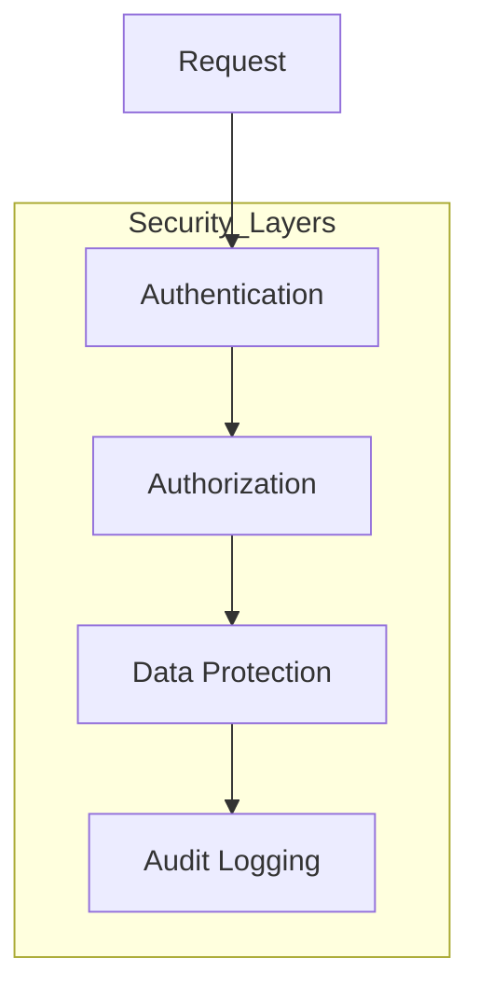

# Security Standard

## 1. Introduction

Defines security requirements and practices across the platform.



---

## 1. Introduction

This document outlines the security standards and best practices for the ThinkAlike project. Security is a fundamental aspect of our development process, not an afterthought. These guidelines ensure that we build secure applications that protect user data, maintain privacy, and prevent unauthorized access. All team members are responsible for applying these security practices in their work.

---

## 2. Security Principles

### 2.1 Core Security Principles

* **Defense in Depth**: Implement multiple layers of security controls

* **Least Privilege**: Grant only the minimum necessary access

* **Secure by Default**: Systems should be secure in their default configuration

* **Fail Securely**: Errors should not compromise security

* **Keep It Simple**: Complexity increases security risk

* **Privacy by Design**: Consider privacy implications from the start

### 2.2 Security Responsibilities

* **All Developers**: Follow secure coding practices

* **Security Team**: Provide guidance and review

* **DevOps**: Secure infrastructure and deployments

* **Product Management**: Prioritize security requirements

* **QA**: Include security testing in test plans

---

## 3. Authentication and Authorization

### 3.1 User Authentication

* **Password Requirements**:

  * Minimum 10 characters

  * Encourage passphrases

  * Check against common password lists

  * Implement account lockout after failed attempts

  * Support multi-factor authentication (MFA)

```python

# Example password validation

def validate_password(password):
    """Validate password against security requirements."""
    errors = []

    if len(password) < 10:
        errors.append("Password must be at least 10 characters")

    if password.lower() in COMMON_PASSWORDS:
        errors.append("This password is too common and easily guessed")

    # Check password strength (entropy)

    if calculate_entropy(password) < 50:
        errors.append("Password is not strong enough")

    return len(errors) == 0, errors

```

### 3.2 Authentication Implementation

* Use secure, industry-standard authentication protocols

* Store passwords using strong adaptive hashing functions (Argon2, bcrypt)

* Implement secure session management

* Set secure, SameSite cookies

* Use HTTPS for all authentication traffic

```python

# Example password hashing with Argon2

from argon2 import PasswordHasher

ph = PasswordHasher(
    time_cost=3,     # Number of iterations

    memory_cost=64 * 1024,  # 64MB memory usage

    parallelism=4,   # Degree of parallelism

    hash_len=32,     # Hash length

    salt_len=16      # Salt length

)

def hash_password(password):
    """Hash password using Argon2."""
    return ph.hash(password)

def verify_password(stored_hash, password):
    """Verify password against stored hash."""
    try:
        ph.verify(stored_hash, password)
        return True
    except:
        return False

```

### 3.3 Token-Based Authentication

* Use short-lived JWT or similar tokens

* Include only necessary claims in tokens

* Sign tokens with strong algorithms (e.g., RS256)

* Implement token refresh mechanisms

* Never store sensitive data in tokens

```javascript
// Example JWT implementation
const jwt = require('jsonwebtoken');
const fs = require('fs');

// Load RSA private key (keep this secure!)
const privateKey = fs.readFileSync('private.key');

function generateTokens(userId) {
  // Access token - short lived
  const accessToken = jwt.sign(
    {
      sub: userId,
      type: 'access'
    },
    privateKey,
    {
      algorithm: 'RS256',
      expiresIn: '15m'  // Short expiration
    }
  );

  // Refresh token - longer lived
  const refreshToken = jwt.sign(
    {
      sub: userId,
      type: 'refresh'
    },
    privateKey,
    {
      algorithm: 'RS256',
      expiresIn: '7d'
    }
  );

  return { accessToken, refreshToken };
}

```

### 3.4 Authorization

* Implement Role-Based Access Control (RBAC)

* Apply the principle of least privilege

* Use permission-based authorization for fine-grained control

* Validate authorization on both client and server

* Implement API rate limiting

```python

# Example permission-based authorization

class Permission(enum.Enum):
    READ_PUBLIC = "read:public"
    READ_PRIVATE = "read:private"
    WRITE_OWN = "write:own"
    WRITE_ANY = "write:any"
    ADMIN = "admin"

# Role definitions with permissions

ROLES = {
    "guest": [Permission.READ_PUBLIC],
    "user": [Permission.READ_PUBLIC, Permission.READ_PRIVATE, Permission.WRITE_OWN],
    "moderator": [Permission.READ_PUBLIC, Permission.READ_PRIVATE,
                  Permission.WRITE_OWN, Permission.WRITE_ANY],
    "admin": [Permission.READ_PUBLIC, Permission.READ_PRIVATE,
               Permission.WRITE_OWN, Permission.WRITE_ANY, Permission.ADMIN]
}

def check_permission(user, required_permission):
    """Check if user has the required permission."""
    if not user or not user.role:
        return False

    user_permissions = ROLES.get(user.role, [])
    return required_permission in user_permissions

```

---

## 4. Secure Coding Practices

### 4.1 Input Validation

* Validate all input data (API parameters, form fields, URLs, etc.)

* Use a whitelist approach (accept known good) rather than blacklist

* Validate on both client and server sides

* Use strong typing whenever possible

* Sanitize data before display or storage

```python

# Example input validation

from pydantic import BaseModel, EmailStr, validator
from typing import List, Optional

class UserRegistration(BaseModel):
    username: str
    email: EmailStr
    password: str
    first_name: str
    last_name: str
    age: Optional[int] = None

    @validator('username')
    def username_valid(cls, v):
        if not v.isalnum() or len(v) < 3 or len(v) > 30:
            raise ValueError('Username must be 3-30 alphanumeric characters')
        return v

    @validator('password')
    def password_strong(cls, v):
        # Call password validation logic

        is_valid, errors = validate_password(v)
        if not is_valid:
            raise ValueError(errors[0])
        return v

```

### 4.2 Output Encoding

* Encode output based on the context (HTML, CSS, JavaScript, etc.)

* Use template engines with automatic escaping

* Apply specific encoding for special contexts (e.g., URL encoding)

* Never render raw HTML from untrusted sources

```javascript
// React example with proper output encoding
const UserProfile = ({ userData }) => {
  // React automatically escapes values to prevent XSS
  return (
    <div className="profile">
      <h2>{userData.name}</h2>
      <p>{userData.bio}</p>

      {/* For HTML content, use safe approaches */}
      <div
        className="formatted-content"
        // Dangerous - only use with trusted, sanitized content
        dangerouslySetInnerHTML={{
          __html: sanitizeHtml(userData.htmlContent, {
            allowedTags: ['p', 'b', 'i', 'em', 'strong', 'a'],
            allowedAttributes: {
              'a': ['href']
            },
            // Only allow http/https URLs
            allowedSchemes: [ 'http', 'https' ]
          })
        }}
      />
    </div>
  );
};

```

### 4.3 SQL Injection Prevention

* Use parameterized queries or prepared statements

* Never concatenate user input into SQL strings

* Use ORM frameworks with proper parameter binding

* Apply least privilege database accounts

```python

# Example using SQLAlchemy ORM (safe)

def get_user(username):
    return db.session.query(User).filter(User.username == username).first()

# Example using parameterized query (safe)

def get_user_raw(username):
    cursor = connection.cursor()
    cursor.execute("SELECT * FROM users WHERE username = %s", (username,))
    return cursor.fetchone()

# NEVER DO THIS (unsafe)

def get_user_unsafe(username):
    cursor = connection.cursor()
    # VULNERABLE TO SQL INJECTION!

    cursor.execute(f"SELECT * FROM users WHERE username = '{username}'")
    return cursor.fetchone()

```

### 4.4 Cross-Site Scripting (XSS) Prevention

* Validate and sanitize all user input

* Apply context-appropriate output encoding

* Implement Content Security Policy (CSP)

* Use modern frameworks with built-in XSS protections

* Apply the principle of least privilege for JavaScript

```html
<!-- Example Content Security Policy header -->
<meta http-equiv="Content-Security-Policy" content="
  default-src 'self';
  script-src 'self' https://trusted-cdn.example.com;
  style-src 'self' https://trusted-cdn.example.com;
  img-src 'self' https://trusted-cdn.example.com data:;
  connect-src 'self' https://api.thinkalike.com;
  font-src 'self' https://trusted-cdn.example.com;
  frame-src 'none';
  object-src 'none'
">

```

### 4.5 Cross-Site Request Forgery (CSRF) Protection

* Use CSRF tokens for state-changing operations

* Verify the origin and referer headers

* Implement SameSite cookie attribute

* Use proper session management

```python

# Example CSRF protection in Flask

from flask_wtf.csrf import CSRFProtect

app = Flask(__name__)
app.config['SECRET_KEY'] = os.environ.get('SECRET_KEY')
csrf = CSRFProtect(app)

@app.route('/profile/update', methods=['POST'])
@csrf.protected
def update_profile():
    # The request has been CSRF protected

    # Process the form data

    return jsonify(success=True)

```

---

## 5. Data Protection

### 5.1 Sensitive Data Handling

* Identify and classify sensitive data

* Minimize collection of sensitive data

* Apply appropriate protection based on sensitivity

* Implement data access audit logging

* Define data retention policies

### 5.2 Encryption at Rest

* Encrypt databases containing sensitive information

* Use strong encryption algorithms (AES-256, ChaCha20)

* Store encryption keys separately from encrypted data

* Implement secure key management

* Encrypt backups

```python

# Example field-level encryption for sensitive data

from cryptography.fernet import Fernet

class EncryptedField:
    def __init__(self, key_provider):
        self.key_provider = key_provider

    def encrypt(self, plaintext):
        if plaintext is None:
            return None

        key = self.key_provider.get_current_key()
        f = Fernet(key)
        return f.encrypt(plaintext.encode()).decode()

    def decrypt(self, ciphertext):
        if ciphertext is None:
            return None

        key = self.key_provider.get_key_for_ciphertext(ciphertext)
        f = Fernet(key)
        return f.decrypt(ciphertext.encode()).decode()

```

### 5.3 Encryption in Transit

* Use TLS/SSL for all communications

* Configure modern TLS protocols (TLS 1.2+)

* Use strong cipher suites

* Implement proper certificate management

* Apply HTTP security headers

```nginx

# Example Nginx TLS configuration

server {
    listen 443 ssl http2;
    server_name api.thinkalike.com;

    # TLS configuration

    ssl_certificate /etc/letsencrypt/live/api.thinkalike.com/fullchain.pem;
    ssl_certificate_key /etc/letsencrypt/live/api.thinkalike.com/privkey.pem;

    # Modern TLS configuration

    ssl_protocols TLSv1.2 TLSv1.3;
    ssl_ciphers 'ECDHE-ECDSA-AES128-GCM-SHA256:ECDHE-RSA-AES128-GCM-SHA256:ECDHE-ECDSA-AES256-GCM-SHA384:ECDHE-RSA-AES256-GCM-SHA384:DHE-RSA-AES128-GCM-SHA256:DHE-RSA-AES256-GCM-SHA384';
    ssl_prefer_server_ciphers on;

    # HSTS

    add_header Strict-Transport-Security "max-age=63072000; includeSubDomains; preload";

    # Other security headers

    add_header X-Content-Type-Options "nosniff";
    add_header X-Frame-Options "DENY";
    add_header X-XSS-Protection "1; mode=block";
    add_header Content-Security-Policy "default-src 'self'";

    # ...rest of configuration

}

```

### 5.4 Secure File Handling

* Validate file uploads (type, size, content)

* Store uploaded files outside the web root

* Use randomized filenames

* Scan uploads for malware

* Implement proper access controls for files

```python

# Example secure file upload validation

def validate_file_upload(file):
    # Check file size

    if file.size > MAX_UPLOAD_SIZE:
        raise SecurityException("File too large")

    # Check file extension

    filename = file.filename
    if not allowed_file_extension(filename):
        raise SecurityException("File type not allowed")

    # Check file content (magic bytes)

    content_type = magic.from_buffer(file.read(1024), mime=True)
    file.seek(0)  # Reset file pointer

    if content_type not in ALLOWED_CONTENT_TYPES:
        raise SecurityException(f"File content type {content_type} not allowed")

    # Generate secure filename

    secure_filename = str(uuid.uuid4()) + os.path.splitext(filename)[1]

    return secure_filename

```

---

## 6. Infrastructure Security

### 6.1 Cloud Security

* Follow cloud provider security best practices

* Use infrastructure as code (IaC) with security scanning

* Implement proper network segmentation

* Enable logging and monitoring

* Apply security groups and access controls

```terraform

# Example secure AWS configuration using Terraform

resource "aws_security_group" "api_sg" {
  name        = "api-security-group"
  description = "Security group for API servers"
  vpc_id      = aws_vpc.main.id

  # Allow HTTPS only

  ingress {
    from_port   = 443
    to_port     = 443
    protocol    = "tcp"
    cidr_blocks = ["0.0.0.0/0"]
  }

  # Restrict SSH access to VPN IP range only

  ingress {
    from_port   = 22
    to_port     = 22
    protocol    = "tcp"
    cidr_blocks = [var.vpn_cidr_block]
  }

  egress {
    from_port   = 0
    to_port     = 0
    protocol    = "-1"
    cidr_blocks = ["0.0.0.0/0"]
  }

  tags = {
    Name = "api-security-group-${var.environment}"
  }
}

# S3 bucket with encryption

resource "aws_s3_bucket" "data_bucket" {
  bucket = "thinkalike-data-${var.environment}"
  acl    = "private"

  # Enable server-side encryption

  server_side_encryption_configuration {
    rule {
      apply_server_side_encryption_by_default {
        sse_algorithm = "AES256"
      }
    }
  }

  # Block public access

  block_public_acls       = true
  block_public_policy     = true
  ignore_public_acls      = true
  restrict_public_buckets = true

  versioning {
    enabled = true
  }
}

```

### 6.2 Container Security

* Use minimal base images

* Scan container images for vulnerabilities

* Run containers as non-root users

* Apply resource limits

* Implement network policies

```dockerfile

# Example secure Dockerfile

FROM python:3.10-slim AS builder

WORKDIR /app

# Install dependencies

COPY requirements.txt .
RUN pip wheel --no-cache-dir --no-deps --wheel-dir /app/wheels -r requirements.txt

# Final stage

FROM python:3.10-slim

# Create non-root user

RUN groupadd -g 1000 appuser && \
    useradd -r -u 1000 -g appuser appuser

WORKDIR /app

# Install dependencies

COPY --from=builder /app/wheels /wheels
COPY --from=builder /app/requirements.txt .
RUN pip install --no-cache /wheels/*

# Copy application code

COPY . .

# Set permissions

RUN chown -R appuser:appuser /app
USER appuser

# Set security-related environment variables

ENV PYTHONUNBUFFERED=1 \
    PYTHONDONTWRITEBYTECODE=1 \
    PIP_NO_CACHE_DIR=off \
    PIP_DISABLE_PIP_VERSION_CHECK=on

# Run the application

CMD ["gunicorn", "--bind", "0.0.0.0:8000", "--workers", "3", "app.wsgi:application"]

```

### 6.3 Network Security

* Implement network segmentation

* Use Web Application Firewalls (WAF)

* Apply proper firewall rules

* Monitor for suspicious traffic

* Implement DDoS protection

```yaml

# Example Kubernetes Network Policy

apiVersion: networking.k8s.io/v1
kind: NetworkPolicy
metadata:
  name: api-network-policy
  namespace: production
spec:
  podSelector:
    matchLabels:
      app: api
  policyTypes:

  * Ingress

  * Egress
  ingress:

  * from:

    * namespaceSelector:
        matchLabels:
          name: frontend
    ports:

    * protocol: TCP
      port: 8000

  * from:

    * namespaceSelector:
        matchLabels:
          name: monitoring
    ports:

    * protocol: TCP
      port: 9090  # Metrics endpoint

  egress:

  * to:

    * namespaceSelector:
        matchLabels:
          name: database
    ports:

    * protocol: TCP
      port: 5432

  * to:

    * namespaceSelector:
        matchLabels:
          name: redis
    ports:

    * protocol: TCP
      port: 6379

```

---

## 7. Security Testing and Monitoring

### 7.1 Security Testing

* Integrate security testing into the CI/CD pipeline

* Perform static application security testing (SAST)

* Implement dynamic application security testing (DAST)

* Conduct regular penetration testing

* Run dependency vulnerability scanning

```yaml

# Example GitHub Action for security scanning

name: Security Scan

on:
  push:
    branches: [ main, develop ]
  pull_request:
    branches: [ main, develop ]
  schedule:

    * cron: '0 0 * * 0'  # Weekly scan

jobs:
  security-scan:
    runs-on: ubuntu-latest
    steps:

      * uses: actions/checkout@v3

      * name: Run SAST (Semgrep)
        uses: returntocorp/semgrep-action@v1
        with:
          config: p/owasp-top-ten

      * name: Check for dependency vulnerabilities
        run: |
          npm install
          npm audit --audit-level=high

      * name: Run container security scan
        uses: aquasecurity/trivy-action@master
        with:
          image-ref: 'thinkalike/api:latest'
          format: 'sarif'
          output: 'trivy-results.sarif'

      * name: Upload scan results
        uses: github/codeql-action/upload-sarif@v1
        with:
          sarif_file: 'trivy-results.sarif'

```

### 7.2 Security Monitoring

* Implement centralized logging

* Set up security information and event management (SIEM)

* Monitor for suspicious activities

* Create alerts for security events

* Perform regular log reviews

```yaml

# Example Prometheus Alert Rules

groups:

* name: SecurityAlerts
  rules:

  * alert: HighLoginFailureRate
    expr: rate(login_failures_total[5m]) > 10
    for: 5m
    labels:
      severity: warning
    annotations:
      summary: High login failure rate
      description: "{{ $labels.instance }} has high login failure rate: {{ $value }}"

  * alert: UnauthorizedAccessAttempts
    expr: rate(unauthorized_access_attempts_total[5m]) > 5
    for: 3m
    labels:
      severity: critical
    annotations:
      summary: Unauthorized access attempts detected
      description: "{{ $labels.instance }} has unauthorized access attempts: {{ $value }}"

  * alert: AbnormalDatabaseAccess
    expr: rate(database_query_count{is_admin_query="true"}[5m]) > 100
    for: 5m
    labels:
      severity: critical
    annotations:
      summary: Abnormal rate of admin database queries
      description: "High rate of admin queries detected: {{ $value }}"

```

### 7.3 Incident Response

* Develop an incident response plan

* Define roles and responsibilities

* Document investigation procedures

* Implement communication protocols

* Conduct post-incident reviews

---

## 8. Secure Development Lifecycle

### 8.1 Security Requirements

* Include security requirements in feature planning

* Perform threat modeling for new features

* Consider security implications of design decisions

* Document security assumptions and constraints

### 8.2 Security Reviews

* Conduct security-focused code reviews

* Perform architecture security reviews

* Include security testing in QA processes

* Get sign-off for security-sensitive changes

### 8.3 Training and Awareness

* Provide regular security training for developers

* Keep team updated on security trends and threats

* Share security lessons learned

* Celebrate security improvements

### 8.4 Third-Party Components

* Evaluate security of third-party libraries

* Keep dependencies updated

* Monitor for security vulnerabilities

* Have a vulnerability remediation process

```python

# Example pre-commit hook to check dependencies

# !/usr/bin/env python3

import subprocess
import sys

def check_dependencies():
    """Check for known vulnerabilities in dependencies."""
    print("Checking dependencies for security vulnerabilities...")

    try:
        # For Python projects

        result = subprocess.run(
            ["safety", "check", "--full-report"],
            capture_output=True, text=True
        )

        # For Node.js projects

        # result = subprocess.run(

        #    ["npm", "audit"],

        #    capture_output=True, text=True

        # )

        if result.returncode != 0:
            print("\n⚠️ Security vulnerabilities found:")
            print(result.stdout)
            return False

        print("✅ No known vulnerabilities found")
        return True

    except Exception as e:
        print(f"Error checking dependencies: {str(e)}")
        return False

if not check_dependencies():
    sys.exit(1)

```

---

## 9. Compliance and Privacy

### 9.1 Regulatory Compliance

* Identify applicable regulations (GDPR, CCPA, HIPAA, etc.)

* Map security controls to compliance requirements

* Maintain documentation of compliance measures

* Conduct regular compliance reviews

### 9.2 Privacy Considerations

* Implement privacy by design

* Provide clear user privacy controls

* Minimize data collection and retention

* Implement data anonymization where appropriate

* Support data subject access requests

### 9.3 Audit Trails

* Log security-relevant events

* Ensure log integrity

* Implement proper log retention

* Make logs searchable for investigations

```python

# Example security audit logging

import logging
from datetime import datetime
import json

# Setup secure audit logger

audit_logger = logging.getLogger('security_audit')
audit_logger.setLevel(logging.INFO)

# Ensure logs go to a secure location

secure_handler = logging.FileHandler('/var/log/thinkalike/security_audit.log')
audit_logger.addHandler(secure_handler)

def log_security_event(event_type, user_id, resource_id=None, status="success", details=None):
    """Log security-relevant events."""
    event = {
        "timestamp": datetime.utcnow().isoformat(),
        "event_type": event_type,
        "user_id": user_id,
        "resource_id": resource_id,
        "status": status,
        "ip_address": get_client_ip(),
        "user_agent": get_user_agent(),
        "details": details or {}
    }

    audit_logger.info(json.dumps(event))

# Example usage

def change_user_role(admin_user, target_user_id, new_role):
    # Check permissions

    if not admin_user.has_permission('admin:users'):
        log_security_event(
            event_type="role_change_attempt",
            user_id=admin_user.id,
            resource_id=target_user_id,
            status="failure",
            details={"reason": "insufficient_permissions"}
        )
        raise PermissionDenied("You don't have permission to change user roles")

    # Perform the change

    user = User.objects.get(id=target_user_id)
    old_role = user.role
    user.role = new_role
    user.save()

    # Log the successful change

    log_security_event(
        event_type="role_change",
        user_id=admin_user.id,
        resource_id=target_user_id,
        status="success",
        details={
            "old_role": old_role,
            "new_role": new_role
        }
    )

    return user

```

---

## 10. Mobile Application Security

### 10.1 Mobile-Specific Concerns

* Secure data storage on mobile devices

* Implement certificate pinning

* Apply app transport security

* Protect against reverse engineering

* Secure API keys and credentials

### 10.2 Mobile Authentication

* Support biometric authentication

* Implement secure session management

* Provide secure password entry

* Consider device trust evaluation

```swift
// Example iOS secure data storage using Keychain
import Security

class SecureStorage {
    static func saveSecureData(_ data: Data, key: String) -> Bool {
        let query: [String: Any] = [
            kSecClass as String: kSecClassGenericPassword,
            kSecAttrAccount as String: key,
            kSecValueData as String: data,
            kSecAttrAccessible as String: kSecAttrAccessibleWhenUnlockedThisDeviceOnly
        ]

        // Delete any existing item
        SecItemDelete(query as CFDictionary)

        // Add the new item
        let status = SecItemAdd(query as CFDictionary, nil)
        return status == errSecSuccess
    }

    static func loadSecureData(key: String) -> Data? {
        let query: [String: Any] = [
            kSecClass as String: kSecClassGenericPassword,
            kSecAttrAccount as String: key,
            kSecReturnData as String: true,
            kSecMatchLimit as String: kSecMatchLimitOne
        ]

        var dataTypeRef: AnyObject?
        let status = SecItemCopyMatching(query as CFDictionary, &dataTypeRef)

        if status == errSecSuccess {
            return dataTypeRef as? Data
        } else {
            return nil
        }
    }
}

```

---

## 11. Security Documentation

### 11.1 Security Architecture

* Document security architecture and controls

* Maintain data flow diagrams with security controls

* Document trust boundaries

* Describe authentication and authorization mechanisms

### 11.2 Security Procedures

* Document incident response procedures

* Maintain security testing methodologies

* Create secure configuration guides

* Develop security checklists for deployments

### 11.3 Risk Management

* Maintain a risk register

* Document risk assessment methodology

* Record risk treatment decisions

* Track security debt

---

**Document Details**

* Title: Security Standard

* Type: Development Guide

* Version: 1.0.0

* Last Updated: 2025-04-05

---

End of Security Standard

---
