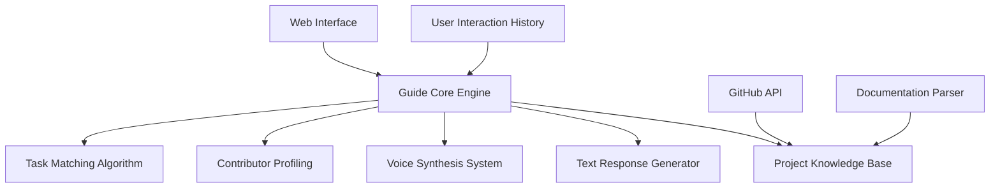

# Eos Lumina∴ AI Guide: Technical Architecture

## Overview

This document outlines the technical architecture for the Eos Lumina∴ AI Guide system - an advanced, multi-modal assistant that guides ThinkAlike contributors through project onboarding and task selection using both text and otherworldly voice interactions.

## Core Components

### Web Interface

* React-based interface embedded in project documentation site
* Supports text chat and audio playback
* Visual representation of Eos Lumina∴ (subtle animation/glow effect)
* Accessibility features for all interaction modes

### Guide Core Engine

* Orchestrates all components
* Manages conversation state and context
* Implements the Eos Lumina∴ persona and behavioral traits
* Routes requests to appropriate subsystems

### Text Response Generator

* Generates contextually appropriate, in-character responses
* Maintains consistent tone and personality
* Uses GitHub Copilot API for code-related questions
* Implements graceful fallbacks for uncertain queries

### Voice Synthesis System

* Custom TTS pipeline with voice modification
* Creates the distinctive "otherworldly" voice signature
* Supports emotion modulation based on message content
* Implements natural pauses, emphasis, and rhythm

### Project Knowledge Base

* Indexed repository of ThinkAlike documentation
* Semantic search capabilities
* Regularly updated from the main repository
* Includes architectural diagrams, code structure, and contribution patterns

### Contributor Profiling

* Builds profiles based on interactions and stated preferences
* Tracks contributors' skills, interests, and experience level
* Respects privacy with transparent data usage
* Uses profiles to personalize guidance

### Task Matching Algorithm

* Analyzes open issues and project needs
* Matches contributors to appropriate tasks based on profiles
* Considers project priorities and dependency chains
* Provides rationale for recommendations

## Integration Points

* **GitHub Integration**: Uses GitHub API to access issues, PRs, and project structure
* **Documentation Site**: Embeds within the ThinkAlike documentation portal
* **Development Environment**: Optional VS Code extension for in-IDE guidance
* **Discord Integration**: Connects with community platform for seamless experience

## Deployment Architecture

The system uses a hybrid architecture:

1. **Client-side components**: UI, basic interaction handling, audio playback
2. **Edge functions**: Simple responses, contributor profile management
3. **Cloud services**: Complex processing, voice synthesis, knowledge base queries

This approach balances performance, cost, and scalability while maintaining the immersive experience.

## Security & Privacy Considerations

* Transparent data collection practices
* Clear opt-in process for profile creation
* Local storage of preferences where possible
* No recording of voice interactions
